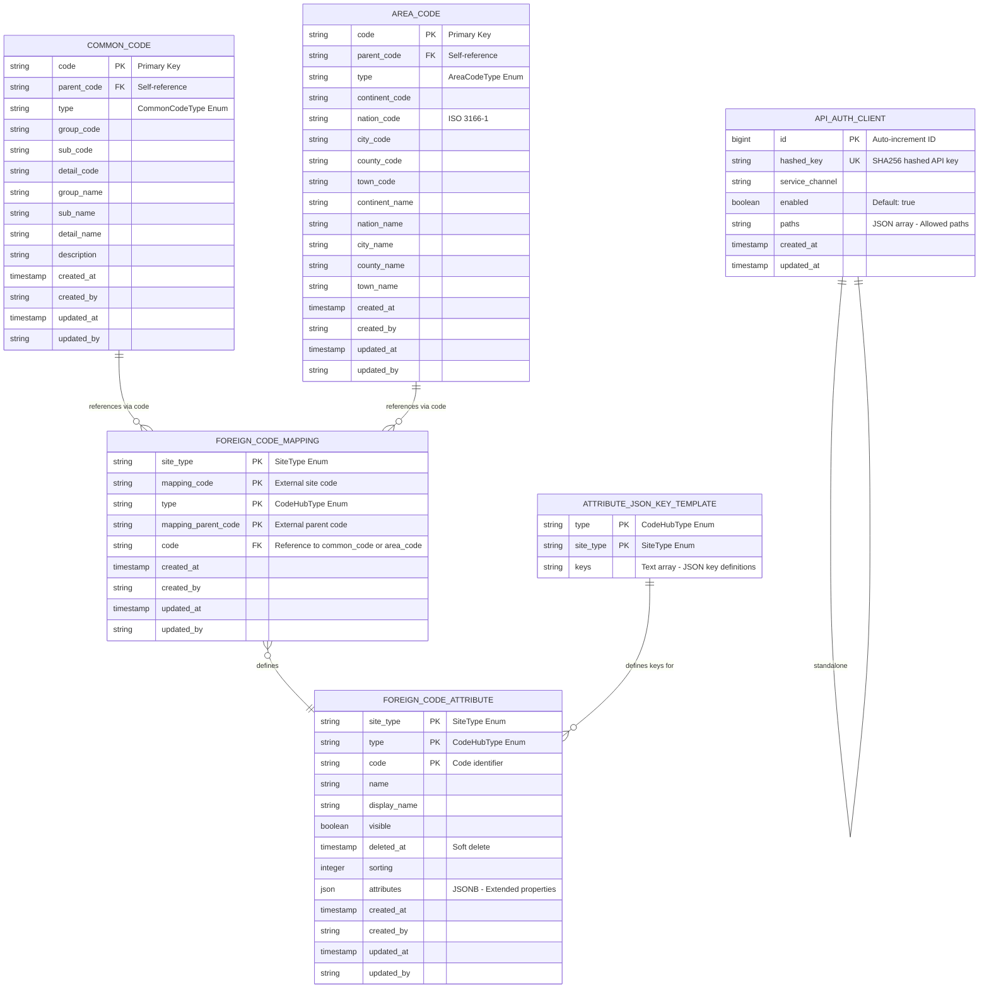

# 코드허브(code-hub) 데이터 모델

> 잡코리아 & 알바몬 공고/이력서에서 사용하는 공통코드로 재정의한 공통코드

## **ER 다이어그램**



---

## **관계도 설명**

### **1. Common Code와 Foreign Code Mapping**

- **common_code** 테이블의 코드들이 외부 사이트의 코드와 매핑됩니다
- 예: 잡코리아의 "언어" 코드 "001"이 내부 `LANGUAGE` 코드 "EN"으로 매핑

### **2. Area Code와 Foreign Code Mapping**

- **area_code** 테이블의 지역 정보도 외부 사이트와 매핑될 수 있습니다
- 예: 알바몬의 지역 코드와 잡코리아의 지역 코드를 통합 관리

### **3. Foreign Code Attribute**

- **foreign_code_mapping**으로 매핑된 코드의 추가 정보를 저장합니다
- 각 사이트별로 다른 속성을 가질 수 있습니다
- JSONB 타입의 `attributes`로 유연한 확장성 제공

### **4. Attribute JSON Key Template**

- **foreign_code_attribute**의 `attributes` 컬럼에서 사용할 JSON 키들을 정의합니다
- 데이터베이스 트리거 `trg_fix_attr`가 템플릿에 정의된 키들을 자동으로 추가

---

## **주요 설계 특징**

### **다계층 구조 (Hierarchical Structure)**

- **Common Code**: 3단계 계층 (그룹 > 서브 > 상세)
- **Area Code**: 5단계 계층 (대륙 > 국가 > 시/도 > 시/군/구 > 읍/면/동)

### **확장 가능한 속성 (Flexible Attributes)**

- JSONB 타입의 `attributes` 컬럼으로 새로운 속성 추가 시 스키마 변경 불필요
- `attribute_json_key_template` 테이블로 데이터 무결성 보장

### **외부 코드 통합 (External Code Integration)**

- 4개 사이트(잡코리아, 알바몬, 클릭, 게임잡)의 코드를 중앙에서 관리
- 복합 기본 키로 외부 코드의 고유성 보장

---

## **테이블 정의**

### **Table 1: `code.common_code`**

**설명:** 공고 공통 코드 테이블 **엔티티:** `CommonCodeEntity` **용도:** 우대전공, 지하철 호선, 언어, 자격증, 산업, 직무, 직급 등 공통 분류 코드를 계층 구조(그룹 > 서브 > 상세)로 관리

| **컬럼명** | **데이터 타입** | **NOT NULL** | **기본값** | **PK** | **설명** |
| --- | --- | --- | --- | --- | --- |
| code | VARCHAR(126) | YES | - | YES | 코드 (group_code + sub_code + detail_code 조합) |
| parent_code | VARCHAR(126) | NO | - | NO | 상위 코드 (필요한 경우만) |
| type | VARCHAR(126) | YES | - | NO | 코드 타입 (Enum: `CommonCodeType`) |
| group_code | VARCHAR(3) | NO | - | NO | 그룹코드 (1DEPTH) |
| sub_code | VARCHAR(3) | NO | - | NO | 서브코드 (2DEPTH) |
| detail_code | VARCHAR(4) | NO | - | NO | 상세코드 (3DEPTH) |
| group_name | VARCHAR(126) | NO | - | NO | 그룹코드명 |
| sub_name | VARCHAR(126) | NO | - | NO | 서브코드명 |
| detail_name | VARCHAR(126) | NO | - | NO | 상세코드명 |
| description | VARCHAR(126) | NO | - | NO | 설명 |
| created_at | TIMESTAMPTZ | YES | CURRENT_TIMESTAMP | NO | 등록 일시 |
| created_by | VARCHAR(50) | NO | - | NO | 등록자 |
| updated_at | TIMESTAMPTZ | YES | CURRENT_TIMESTAMP | NO | 수정 일시 |
| updated_by | VARCHAR(50) | NO | - | NO | 수정자 |

**인덱스:**

- `idx_common_type_code` ON (type, code) - 타입과 코드로 빠른 조회

---

### **Table 2: `code.area_code`**

**설명:** 지역 코드 테이블 (5 Depth 계층 구조: 대륙 > 국가 > 시/도 > 시/군/구 > 읍/면/동) **엔티티:** `AreaCodeEntity` **용도:** 지역 관련 코드를 5단계 계층으로 관리. 국가 코드는 ISO 3166-1 2자리 표준 준수

| **컬럼명** | **데이터 타입** | **NOT NULL** | **기본값** | **PK** | **설명** |
| --- | --- | --- | --- | --- | --- |
| code | VARCHAR(126) | YES | - | YES | 코드 |
| parent_code | VARCHAR(126) | NO | - | NO | 상위 코드 |
| type | VARCHAR(126) | YES | - | NO | 코드 타입 (Enum: `AreaCodeType`) |
| continent_code | VARCHAR(2) | YES | - | NO | 대륙 코드 |
| nation_code | VARCHAR(2) | YES | - | NO | 국가 코드 (ISO 3166-1 2자리 표준) |
| city_code | VARCHAR(2) | YES | - | NO | 시/도 코드 |
| county_code | VARCHAR(2) | YES | - | NO | 시/군/구 코드 |
| town_code | VARCHAR(3) | YES | - | NO | 읍/면/동 & 가(법정동) 코드 |
| continent_name | VARCHAR(126) | YES | - | NO | 대륙 이름 |
| nation_name | VARCHAR(126) | YES | - | NO | 국가 이름 |
| city_name | VARCHAR(126) | YES | - | NO | 시/도 이름 |
| county_name | VARCHAR(126) | YES | - | NO | 시/군/구 이름 |
| town_name | VARCHAR(126) | YES | - | NO | 읍/면/동 & 가(법정동) 이름 |
| created_at | TIMESTAMPTZ | YES | CURRENT_TIMESTAMP | NO | 등록 일시 |
| created_by | VARCHAR(50) | NO | - | NO | 등록자 |
| updated_at | TIMESTAMPTZ | YES | CURRENT_TIMESTAMP | NO | 수정 일시 |
| updated_by | VARCHAR(50) | NO | - | NO | 수정자 |

**인덱스:**

- `idx_area_type_code` ON (type, code) - 타입과 코드로 빠른 조회

---

### **Table 3: `code.foreign_code_mapping`**

**설명:** 외부 코드 매핑 테이블 - 외부 사이트 코드를 내부 공통 코드에 매핑 **엔티티:** `ForeignCodeMappingEntity` **용도:** 잡코리아, 알바몬, 클릭, 게임잡 등 외부 사이트의 코드를 내부 `common_code` 또는 `area_code`에 매핑

| **컬럼명** | **데이터 타입** | **NOT NULL** | **기본값** | **PK** | **설명** |
| --- | --- | --- | --- | --- | --- |
| site_type | VARCHAR(126) | YES | - | YES | 사이트 종류 (Enum: `SiteType`) |
| mapping_code | VARCHAR(126) | YES | - | YES | 원본 사이트 코드 (AS-IS) |
| type | VARCHAR(126) | YES | - | YES | 코드 타입 (Enum: `CodeHubType` - CommonCodeType 또는 AreaCodeType) |
| mapping_parent_code | VARCHAR(126) | YES | '' (빈 문자열) | YES | 원본 사이트 상위 코드 (AS-IS) |
| code | VARCHAR(126) | YES | - | NO | 매핑 대상 내부 코드 (common_code.code 또는 area_code.code 참조) |
| created_at | TIMESTAMPTZ | YES | CURRENT_TIMESTAMP | NO | 등록 일시 |
| created_by | VARCHAR(50) | NO | - | NO | 등록자 |
| updated_at | TIMESTAMPTZ | YES | CURRENT_TIMESTAMP | NO | 수정 일시 |
| updated_by | VARCHAR(50) | NO | - | NO | 수정자 |

**인덱스:**

- `idx_fcm_type_site_code` ON (type, site_type, code) - 타입, 사이트, 코드로 매핑 조회

**복합 기본 키:** `(site_type, mapping_code, type, mapping_parent_code)` - 외부 코드의 고유성 보장

---

### **Table 4: `code.foreign_code_attribute`**

**설명:** 외부 코드 속성 테이블 - 사이트별 코드 속성 정보 (JSON 기반 확장 속성 포함) **엔티티:** `ForeignCodeAttributeEntity` **용도:** 각 사이트에서 제공하는 코드의 추가 정보를 저장. JSONB 타입의 `attributes` 컬럼으로 유연한 확장성 제공

| **컬럼명** | **데이터 타입** | **NOT NULL** | **기본값** | **PK** | **설명** |
| --- | --- | --- | --- | --- | --- |
| site_type | VARCHAR(126) | YES | - | YES | 사이트 종류 (Enum: `SiteType`) |
| type | VARCHAR(126) | YES | - | YES | 코드 타입 (Enum: `CodeHubType`) |
| code | VARCHAR(126) | YES | - | YES | 코드 |
| name | VARCHAR(126) | NO | - | NO | 코드 이름 |
| display_name | VARCHAR(126) | NO | - | NO | 노출용 이름 |
| visible | BOOLEAN | NO | - | NO | 노출 여부 |
| deleted_at | TIMESTAMPTZ | NO | - | NO | 삭제 일시 (소프트 삭제) |
| sorting | INTEGER | NO | - | NO | 소팅 순서 |
| attributes | JSONB | NO | - | NO | 확장 속성 (siteType + type 단위로 JSON 스키마 동일) |
| created_at | TIMESTAMPTZ | YES | CURRENT_TIMESTAMP | NO | 등록 일시 |
| created_by | VARCHAR(50) | NO | - | NO | 등록자 |
| updated_at | TIMESTAMPTZ | YES | CURRENT_TIMESTAMP | NO | 수정 일시 |
| updated_by | VARCHAR(50) | NO | - | NO | 수정자 |

**인덱스:**

- `idx_fca_type_site_code_sort` ON (type, site_type, code, sorting) - 사이트별 정렬 조회
- `idx_fca_type_code_sort` ON (type, code, sorting) - 코드별 정렬 조회

**복합 기본 키:** `(site_type, type, code)` - 사이트, 타입, 코드의 고유성 보장

**트리거:**

- `trg_fix_attr` (BEFORE INSERT OR UPDATE) - `attribute_json_key_template`에 정의된 키가 `attributes` JSON에 없으면 자동으로 null 값으로 추가

---

### **Table 5: `code.attribute_json_key_template`**

**설명:** 속성 JSON 키 템플릿 테이블 - `foreign_code_attribute.attributes`의 JSON 키 스키마를 정의 **엔티티:** `AttributeJsonKeyTemplateEntity` **용도:** 각 코드 타입과 사이트 조합에 대해 `attributes` JSONB 컬럼에 포함되어야 할 키들을 정의

| **컬럼명** | **데이터 타입** | **NOT NULL** | **기본값** | **PK** | **설명** |
| --- | --- | --- | --- | --- | --- |
| type | TEXT | YES | - | YES | 코드 타입 (Enum: `CodeHubType`) |
| site_type | TEXT | YES | - | YES | 사이트 종류 (Enum: `SiteType`) |
| keys | TEXT[] | YES | - | NO | JSON 키 배열 (예: `{deletedAt,sorting,visible}`) |

**복합 기본 키:** `(type, site_type)` - 코드 타입과 사이트의 고유성 보장

---

### **Table 6: `code.api_auth_client`**

**설명:** API 인증 클라이언트 테이블 **엔티티:** `ApiAuthClientEntity` **용도:** API 키 기반의 클라이언트 인증 및 접근 제어 관리

| **컬럼명** | **데이터 타입** | **NOT NULL** | **기본값** | **PK** | **설명** |
| --- | --- | --- | --- | --- | --- |
| id | BIGSERIAL | YES | AUTO_INCREMENT | YES | 고유 ID |
| hashed_key | VARCHAR(128) | YES | - | UNIQUE | SHA256 해시된 API 키 |
| service_channel | VARCHAR(32) | YES | - | NO | 서비스 채널명 |
| enabled | BOOLEAN | YES | TRUE | NO | 활성화 여부 |
| paths | TEXT | YES | - | NO | 허용 경로 목록 (JSON 배열 문자열) |
| created_at | TIMESTAMP | YES | NOW() | NO | 등록 일시 |
| updated_at | TIMESTAMP | YES | NOW() | NO | 수정 일시 |

**인덱스:**

- `idx_api_auth_client_hashed_key` ON (hashed_key) - API 키 검증 시 빠른 조회

---

## **Enum 정의**

### **Enum: `CommonCodeType`**

**패키지:** `jobkoreacorp.client.common.code.protocol.enums.CommonCodeType` **사용 테이블:** `common_code.type` **인터페이스:** `CodeHubType`, `DisplayEnum` **설명:** 공통 코드의 분류 타입. 30개 이상의 코드 타입을 정의하여 유연한 분류 제공

| **Enum Value** | **설명 (text)** |
| --- | --- |
| PREFERENCE_MAJOR | 우대전공 |
| SUBWAY_LINE | 지하철 호선 |
| SUBWAY_STATION | 지하철 역 |
| UNIVERSITY | 대학 |
| UNIVERSITY_CAMPUS | 대학 캠퍼스 |
| BENEFIT | 복리후생 |
| PREFERRED | 우대조건 |
| LANGUAGE | 언어 |
| LANGUAGE_EXAM | 언어시험 |
| LANGUAGE_EXAM_CRITERIA | 시험등급 |
| SOFT_SKILL | 소프트 스킬 |
| HARD_SKILL | 하드 스킬 |
| MBTI | MBTI |
| VISA_GROUP | 비자그룹 |
| VISA | 비자 |
| LICENSE_CATEGORY | 자격증 카테고리 |
| LICENSE | 자격증 |
| INDUSTRY_CATEGORY | 산업 카테고리 |
| INDUSTRY_SUBCATEGORY | 산업 서브카테고리 |
| INDUSTRY | 산업 |
| JOB_CLASSIFICATION_CATEGORY | 직무 카테고리 |
| JOB_CLASSIFICATION_SUBCATEGORY | 직무 서브카테고리 |
| JOB_CLASSIFICATION | 직무 |
| JOB_INDUSTRY_CATEGORY | 업직종 카테고리 |
| JOB_INDUSTRY | 업직종 |
| BRAND | 브랜드 |
| DESIGNATION | 직책 |
| EDUCATION_LEVEL | 학력 |
| EDUCATION_INSTITUTE | 교육기관 |
| HIGH_SCHOOL | 고등학교 |
| POSITION_GRADE | 직급 |
| POSITION_TITLE | 직책 |

---

### **Enum: `AreaCodeType`**

**패키지:** `jobkoreacorp.client.common.code.protocol.enums.AreaCodeType` **사용 테이블:** `area_code.type` **인터페이스:** `CodeHubType`, `DisplayEnum` **설명:** 지역 코드의 계층 타입. 5단계 계층 구조를 나타냄

| **Enum Value** | **설명 (text)** |
| --- | --- |
| CONTINENT | 대륙 |
| NATION | 국가 |
| CITY | 시/도 |
| COUNTY | 시/군/구 |
| TOWN | 읍/면/동 |

---

### **Enum: `SiteType`**

**패키지:** `jobkoreacorp.client.common.code.protocol.enums.SiteType` **사용 테이블:** `foreign_code_mapping.site_type`, `foreign_code_attribute.site_type`, `attribute_json_key_template.site_type` **인터페이스:** `DisplayEnum` **설명:** 외부 코드가 제공되는 사이트 종류

| **Enum Value** | **설명 (text)** |
| --- | --- |
| ALL | 전체 |
| JOBKOREA | 잡코리아 |
| ALBAMON | 알바몬 |
| KLIK | 클릭 |
| GAMEJOB | 게임잡 |

---

### **Interface: `CodeHubType`**

**패키지:** `jobkoreacorp.client.common.code.protocol.enums.CodeHubType` **사용 테이블:** `foreign_code_mapping.type`, `foreign_code_attribute.type`, `attribute_json_key_template.type` **설명:** `CommonCodeType`과 `AreaCodeType`의 공통 인터페이스. DB에는 String으로 저장되며, `CodeHubTypeAttributeConverter`를 통해 적절한 Enum 타입으로 변환됨

---

## **속성 JSON 키 참조**

`foreign_code_attribute.attributes` JSONB 컬럼에 저장되는 JSON의 키들은 `attribute_json_key_template` 테이블에 의해 정의됩니다. 아래 표는 각 코드 타입과 사이트 조합별로 예상되는 JSON 키들을 나열합니다.

| **type** | **site_type** | **attributes JSON Keys** |
| --- | --- | --- |
| BENEFIT | ALBAMON | categoryCode, categoryName |
| BENEFIT | JOBKOREA | categoryCode, categoryName, recommended |
| CITY | ALBAMON | katecX, katecY, latitude, longitude, searchKeywords |
| CITY | JOBKOREA | abbreviationName |
| CONTINENT | JOBKOREA | abbreviationName |
| COUNTY | ALBAMON | cityAbbreviationName, countyAbbreviationName, katecX, katecY, latitude, longitude, searchKeywords |
| HARD_SKILL | ALBAMON | displayName, isDefaultRecommended, isMinorRestricted, synonyms |
| HARD_SKILL | JOBKOREA | displayName, synonyms |
| INDUSTRY | JOBKOREA | baseKeyword |
| INDUSTRY_CATEGORY | JOBKOREA | GNBSorting |
| INDUSTRY_SUBCATEGORY | JOBKOREA | subcontract |
| JOB_CLASSIFICATION | JOBKOREA | baseKeyword |
| JOB_CLASSIFICATION_CATEGORY | JOBKOREA | GNBSorting |
| JOB_CLASSIFICATION_SUBCATEGORY | JOBKOREA | subcontract |
| JOB_INDUSTRY | ALBAMON | freelancer, useSimpleJobPosting, youthRestricted |
| JOB_INDUSTRY_CATEGORY | ALBAMON | freelancer, useSimpleJobPosting, youthRestricted |
| LANGUAGE | KLIK | englishName |
| LANGUAGE_EXAM | JOBKOREA | allowExceedScore, criteriaType, maxScore, minScore, selectableMinScore, unitScore |
| LANGUAGE_EXAM_CRITERIA | JOBKOREA | sequence |
| LICENSE | JOBKOREA | issuer |
| MBTI | ALBAMON | isDefaultRecommended, isMinorRestricted, resuemSkillName, skillName |
| NATION | ALBAMON | continentName, nationName |
| NATION | JOBKOREA | abbreviationName |
| PREFERENCE_MAJOR | JOBKOREA | foreignParentCode |
| PREFERRED | JOBKOREA | categoryCode, categoryName |
| SOFT_SKILL | ALBAMON | isDefaultRecommended, isMinorRestricted, resuemSkillName, skillName |
| SUBWAY_LINE | ALBAMON | areaCode |
| SUBWAY_LINE | JOBKOREA | abbreviationName, areaCode |
| SUBWAY_STATION | ALBAMON | katecX, katecY, latitude, longitude, searchKeyword, transferAvailable |
| SUBWAY_STATION | JOBKOREA | katecX, katecY, transferAvailable |
| TOWN | ALBAMON | katecX, katecY, latitude, longitude, townGroupName |
| UNIVERSITY | JOBKOREA | cyberUniversity, foreignUniversity |
| UNIVERSITY_CAMPUS | ALBAMON | countryCode, institutionType, katecX, katecY, latitude, longitude, townCode |
| UNIVERSITY_CAMPUS | JOBKOREA | countryCode, institutionType, operationStatus, primary, townCode |

---

## **사용 사례**

### **1. 공통 코드 조회**

```sql
-- 하드 스킬의 모든 코드 조회
SELECT *
FROM code.common_code
WHERE type ='HARD_SKILL';
```

### **2. 외부 코드 매핑**

```sql
-- 잡코리아의 특정 코드를 내부 코드로 변환
SELECT c.code,c.detail_name
FROM code.foreign_code_mapping fcm 
JOIN code.common_codecON fcm.code =c.code
WHERE fcm.site_type ='JOBKOREA'AND fcm.mapping_code ='001'AND fcm.type ='HARD_SKILL';
```

### **3. 사이트별 속성 조회**

```sql
-- 잡코리아의 지하철 역 정보를 좌표와 함께 조회
SELECT code,name, display_name, attributes->>'katecX'as katecX, attributes->>'katecY'as katecY, attributes->>'transferAvailable' as transferAvailable
FROM code.foreign_code_attribute
WHERE site_type ='JOBKOREA'AND type ='SUBWAY_STATION';
```

### **4. 지역 계층 조회**

```sql
-- 서울의 모든 시/군/구 조회
SELECT county_code, county_name
FROM code.area_code
WHERE type ='COUNTY'AND nation_code ='KR'AND city_name ='서울시';
```

---