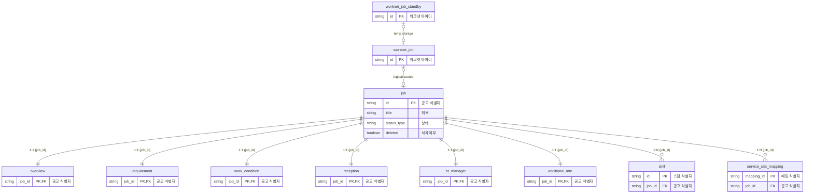

# 공고허브(job-hub) 데이터 모델

> 잡코리아 & 알바몬 Legacy 공고의 주요 속성을 공통 속성으로 재정의 하여 적재한 데이터

## ERD

## **1. 테이블 목록**

| **테이블명** | **설명** | **관련 Entity 클래스** |
| --- | --- | --- |
| `job` | 공고 기본 정보 | `JobEntity` |
| `overview` | 공고 개요 (상세 요강, 모집 분야 등) | `OverviewEntity` |
| `requirement` | 자격 요건 (학력, 경력, 성별 등) | `RequirementEntity` |
| `work_condition` | 근무 조건 (근무지, 시간, 급여 등) | `WorkConditionEntity` |
| `reception` | 접수 안내 (접수 방법, 서류 등) | `ReceptionEntity` |
| `hr_manager` | 채용 담당자 정보 | `HrManagerEntity` |
| `skill` | 공고 관련 스킬 정보 | `SkillEntity` |
| `additional_info` | 추가 정보 (키워드, 사전 인터뷰 등) | `AdditionalInfoEntity` |
| `service_site_mapping` | 서비스 사이트(잡코리아, 알바몬 등) 매핑 정보 | `ServiceSiteMappingEntity` |
| `worknet_job` | 워크넷 수집 공고 정보 | `WorknetJobEntity` |
| `worknet_job_standby` | 워크넷 수집 공고 임시 저장 | `WorknetJobStandbyEntity` |

---

## **2. 상세 테이블 명세**

### **2.1. `job` (공고)**

공고의 핵심 식별 정보 및 상태를 관리합니다.

| **컬럼명** | **설명** | **데이터 타입** | **Enum / 비고** |
| --- | --- | --- | --- |
| `id` | 공고 식별자 | `VARCHAR(126)` | PK |
| `title` | 제목 | `VARCHAR(250)` |  |
| `status_type` | 공고 상태 | `VARCHAR(126)` | `StatusType` |
| `deleted` | 삭제 여부 | `BOOLEAN` | 기본값: `false` |
| `user_ref_key` | 원본 사용자 참조 키 | `VARCHAR(126)` |  |
| `posting_type` | 공고 형태 | `VARCHAR(126)` | `PostingType` |
| `job_posting_id` | JobPosting ID | `VARCHAR(126)` | 비즈센터용 |
| `workspace_id` | Workspace ID | `VARCHAR(126)` | 비즈센터용 |
| `origin_user_ref_key` | Origin 멤버 회원번호 | `VARCHAR(126)` |  |
| `posting_start_at` | 게재 시작 일시 | `TIMESTAMPTZ` |  |
| `posting_end_at` | 게재 종료 일시 | `TIMESTAMPTZ` |  |
| `posting_company_name` | 게시 회사명 | `VARCHAR(126)` |  |
| `posted_immediately` | 즉시 게시 여부 | `BOOLEAN` |  |
| `first_posted_at` | 최초 게시 일시 | `TIMESTAMPTZ` |  |
| `created_at` | 생성 일시 | `TIMESTAMPTZ` |  |
| `created_by` | 생성자 | `VARCHAR(50)` |  |
| `updated_at` | 수정 일시 | `TIMESTAMPTZ` |  |
| `updated_by` | 수정자 | `VARCHAR(50)` |  |

### **2.2. `overview` (개요)**

공고의 상세 요강 및 모집 분류 정보를 관리합니다.

| **컬럼명** | **설명** | **데이터 타입** | **Enum / 비고** |
| --- | --- | --- | --- |
| `job_id` | 공고 식별자 | `VARCHAR(126)` | PK, FK(`job.id`) |
| `descriptions` | 상세 요강 | `JSONB` |  |
| `logos` | 로고 정보 | `JSONB` |  |
| `job_classification_codes` | 직무 코드 | `VARCHAR[]` |  |
| `industry_codes` | 산업 코드 | `VARCHAR[]` |  |
| `job_industry_codes` | 업직종 코드 | `VARCHAR[]` |  |
| `job_classification_keyword_codes` | 직무 키워드 코드 | `VARCHAR[]` |  |
| `industry_keyword_codes` | 산업 키워드 코드 | `VARCHAR[]` |  |
| `employment_types` | 고용 형태 | `VARCHAR[]` | `EmploymentType` |
| `employment_options` | 고용 형태 옵션 | `JSONB` |  |
| `always_hire` | 상시 채용 여부 | `BOOLEAN` |  |
| `close_on_hire` | 채용 시 마감 여부 | `BOOLEAN` |  |
| `application_start_at` | 지원 시작 일시 | `TIMESTAMPTZ` |  |
| `application_end_at` | 지원 종료 일시 | `TIMESTAMPTZ` |  |
| `work_fields` | 모집 분야/포지션 | `VARCHAR[]` |  |
| `vacancy` | 모집 인원 | `VARCHAR(126)` |  |
| `recruitment_option_types` | 채용 옵션 유형 | `VARCHAR[]` | `RecruitmentOptionType` |
| `designation_codes` | 직급/직책 코드 | `VARCHAR[]` |  |

### **2.3. `requirement` (자격 요건)**

지원자가 갖추어야 할 자격 요건을 관리합니다.

| **컬럼명** | **설명** | **데이터 타입** | **Enum / 비고** |
| --- | --- | --- | --- |
| `job_id` | 공고 식별자 | `VARCHAR(126)` | PK, FK(`job.id`) |
| `education_code` | 최종 학력 코드 | `VARCHAR(126)` |  |
| `graduation_type` | 졸업 예정 여부 | `VARCHAR(126)` | `GraduationType` |
| `gender` | 성별 | `VARCHAR(126)` | `GenderType` |
| `age_range` | 연령 제한 | `INT4RANGE` |  |
| `license_codes` | 자격증 코드 | `VARCHAR[]` |  |
| `visa_codes` | 비자 코드 | `VARCHAR[]` |  |
| `career_types` | 경력 종류 | `VARCHAR[]` | `CareerType` |
| `careers` | 상세 경력 정보 | `JSONB` |  |
| `language_codes` | 언어 코드 | `VARCHAR[]` |  |
| `languages` | 언어 정보 | `JSONB` |  |
| `language_exam_codes` | 어학 시험 코드 | `VARCHAR[]` |  |
| `language_exams` | 어학 시험 정보 | `JSONB` |  |
| `preference_codes` | 우대 조건 코드 | `VARCHAR[]` |  |
| `preference_major_codes` | 우대 전공 코드 | `VARCHAR[]` |  |

### **2.4. `work_condition` (근무 조건)**

근무지 정보, 근무 시간, 급여 등의 조건을 관리합니다.

| **컬럼명** | **설명** | **데이터 타입** | **Enum / 비고** |
| --- | --- | --- | --- |
| `job_id` | 공고 식별자 | `VARCHAR(126)` | PK, FK(`job.id`) |
| `company_name` | 근무 기업명 | `VARCHAR(126)` |  |
| `company_name_exposable` | 기업명 노출 여부 | `BOOLEAN` |  |
| `location_area_codes` | 근무지 지역 코드 | `VARCHAR[]` |  |
| `location_attributes` | 근무지 위치 정보 | `JSONB` |  |
| `outsourcing_attribute` | 아웃소싱 정보 | `JSONB` |  |
| `station_codes` | 인근 역 코드 | `VARCHAR[]` |  |
| `nearby_subway_attributes` | 인근 지하철 정보 | `JSONB` |  |
| `university_codes` | 인근 대학 코드 | `VARCHAR[]` |  |
| `nearby_university_attributes` | 인근 대학 정보 | `JSONB` |  |
| `work_week_type` | 근무 요일 타입 | `VARCHAR(126)` | `WorkWeekType` |
| `selected_day_of_weeks` | 선택한 근무 요일 | `VARCHAR[]` | `DayOfWeek` |
| `work_week_description` | 근무 요일 직접 입력 | `VARCHAR(126)` |  |
| `work_hours_description` | 근무 시간 직접 입력 | `VARCHAR(126)` |  |
| `break_time` | 휴게 시간 (분) | `INTEGER` |  |
| `work_term_type` | 근무 기간 타입 | `VARCHAR(126)` | `WorkTermType` |
| `short_term_range` | 단기 근무 기간 | `DATERANGE` |  |
| `work_schedule_option_types` | 근무 일정 옵션 | `VARCHAR[]` | `WorkScheduleOptionType` |
| `work_hours_ranges` | 근무 시간 범위 | `JSONB` |  |
| `pay_type` | 급여 타입 | `VARCHAR(126)` | `PayType` |
| `pay_range` | 급여 범위 | `INT4RANGE` |  |
| `pay_option_types` | 급여 옵션 종류 | `VARCHAR[]` | `PayOptionType` |
| `benefit_codes` | 복리후생 코드 | `VARCHAR[]` |  |

### **2.5. `reception` (접수 안내)**

공고 지원 방법 및 필요 서류를 관리합니다.

| **컬럼명** | **설명** | **데이터 타입** | **Enum / 비고** |
| --- | --- | --- | --- |
| `job_id` | 공고 식별자 | `VARCHAR(126)` | PK, FK(`job.id`) |
| `reception_types` | 접수 방법 | `VARCHAR[]` | `ReceptionType` |
| `reception_options` | 접수 방법 옵션 | `JSONB` |  |
| `resume_documents` | 이력서 문서 | `JSONB` |  |
| `submission_document_types` | 제출 서류 종류 | `VARCHAR[]` | `SubmissionDocumentType` |

### **2.6. `hr_manager` (채용 담당자)**

채용을 담당하는 관리자 정보를 관리합니다.

| **컬럼명** | **설명** | **데이터 타입** | **Enum / 비고** |
| --- | --- | --- | --- |
| `job_id` | 공고 식별자 | `VARCHAR(126)` | PK, FK(`job.id`) |
| `name` | 담당자 이름 | `VARCHAR(126)` |  |
| `department` | 부서명 | `VARCHAR(126)` |  |
| `phone_number` | 전화번호 | `VARCHAR(126)` |  |
| `phone_extension_number` | 전화번호(내선) | `VARCHAR(126)` |  |
| `mobile_number` | 핸드폰번호 | `VARCHAR(126)` |  |
| `mobile_extension_number` | 핸드폰번호(내선) | `VARCHAR(126)` |  |
| `fax` | 팩스번호 | `VARCHAR(126)` |  |
| `email` | 이메일 | `VARCHAR(126)` |  |
| `name_exposable` | 이름 노출 여부 | `BOOLEAN` |  |
| `phone_number_exposable` | 전화번호 노출 여부 | `BOOLEAN` |  |
| `mobile_number_exposable` | 핸드폰번호 노출 여부 | `BOOLEAN` |  |
| `email_exposable` | 이메일 노출 여부 | `BOOLEAN` |  |

### **2.7. `skill` (스킬)**

공고와 관련된 요구 스킬을 관리합니다.

| **컬럼명** | **설명** | **데이터 타입** | **Enum / 비고** |
| --- | --- | --- | --- |
| `id` | 스킬 식별자 | `VARCHAR(126)` | PK, TSID |
| `job_id` | 공고 식별자 | `VARCHAR(126)` | FK(`job.id`) |
| `type` | 스킬 종류 | `VARCHAR(126)` | `SkillType` |
| `code` | 스킬 코드 | `VARCHAR(126)` |  |

### **2.8. `additional_info` (추가 정보)**

공고 노출 지역, 키워드, 사전 인터뷰 등의 추가 정보를 관리합니다.

| **컬럼명** | **설명** | **데이터 타입** | **Enum / 비고** |
| --- | --- | --- | --- |
| `job_id` | 공고 식별자 | `VARCHAR(126)` | PK, FK(`job.id`) |
| `display_area_codes` | 노출 지역 코드 | `VARCHAR[]` |  |
| `keywords` | 키워드 정보 | `JSONB` |  |
| `pre_interviews` | 사전 인터뷰 질문 | `JSONB` |  |

### **2.9. `service_site_mapping` (서비스 사이트 매핑)**

외부 서비스 사이트와 공고 플랫폼 공고 간의 매핑 정보를 관리합니다.

| **컬럼명** | **설명** | **데이터 타입** | **Enum / 비고** |
| --- | --- | --- | --- |
| `mapping_id` | 매핑 식별자 | `VARCHAR(126)` | PK, TSID |
| `job_id` | 공고 식별자 | `VARCHAR(126)` | FK(`job.id`) |
| `service_site_type` | 서비스 사이트 종류 | `VARCHAR(126)` | `ServiceSiteType` |
| `job_ref_key` | 외부 사이트 참조 키 | `VARCHAR(126)` | UK(with site_type) |
| `created_at` | 생성 일시 | `TIMESTAMPTZ` |  |

### **2.10. `worknet_job` / `worknet_job_standby` (워크넷 공고)**

워크넷에서 수집된 공고 정보를 관리합니다.

| **컬럼명** | **설명** | **데이터 타입** | **비고** |
| --- | --- | --- | --- |
| `id` | 워크넷 아이디 | `VARCHAR(126)` | PK |
| `title` | 제목 | `VARCHAR` |  |
| `posting_company_name` | 회사명 | `VARCHAR(126)` |  |
| `business_registration_number` | 사업자등록번호 | `VARCHAR(126)` |  |
| `industry_name` | 산업명 | `VARCHAR(126)` |  |
| `pay_type_name` | 임금형태명 | `VARCHAR(126)` |  |
| `formatted_pay` | 임금(원) | `VARCHAR(126)` |  |
| `pay_from` | 임금 범위 시작 | `INTEGER` |  |
| `pay_to` | 임금 범위 종료 | `INTEGER` |  |
| `area_name` | 근무지역명 | `VARCHAR(126)` |  |
| `work_week_type_name` | 근무시간 유형명 | `VARCHAR(126)` |  |
| `minimum_education_name` | 최소 학력명 | `VARCHAR(126)` |  |
| `career_type_name` | 경력조건명 | `VARCHAR(126)` |  |
| `posting_end_at` | 게시 종료 일시 | `TIMESTAMPTZ` |  |
| `address` | 주소 | `VARCHAR(200)` |  |

---

## **3. Enum 값 상세 정의**

### **3.1. 공고 관련 Enum**

### **`StatusType` (공고 상태)**

| **값** | **설명** |
| --- | --- |
| `READY` | 대기 |
| `PAUSE` | 일시정지 |
| `POSTING` | 게재중 |
| `CLOSE` | 마감 |

### **`PostingType` (공고 형태)**

| **값** | **설명** |
| --- | --- |
| `GENERAL` | 일반 공고 |
| `HEAD_HUNTING` | 헤드헌팅 |
| `AGENT` | 채용대행 |
| `ONEPICK` | 원픽 |

### **`ServiceSiteType` (서비스 사이트 종류)**

| **값** | **설명** |
| --- | --- |
| `ALBAMON` | 알바몬 |
| `JOBKOREA` | 잡코리아 |

### **3.2. 모집 및 고용 관련 Enum**

### **`EmploymentType` (고용 형태)**

| **값** | **설명** |
| --- | --- |
| `PERMANENT` | 정규직 |
| `CONTRACT` | 계약직 |
| `INTERN` | 인턴 |
| `DISPATCH` | 파견직 |
| `SUBCONTRACT` | 도급 |
| `FREELANCER` | 프리랜서 |
| `PART_TIME` | 아르바이트 |
| `TRAINEE` | 연수생/교육생 |
| `MILITARY` | 병역특례 |
| `COMMISSION` | 위촉직 |

### **`RecruitmentOptionType` (채용 옵션)**

| **값** | **설명** |
| --- | --- |
| `BEGINNER_AVAILABLE` | 초보 가능 |
| `WORK_WITH_FRIENDS` | 친구와 함께 근무 가능 |
| `REMOTE_WORK_AVAILABLE` | 재택 가능 |
| `FOREIGNER_APPLICATION_AVAILABLE` | 외국인 지원 가능 |

### **3.3. 자격 요건 관련 Enum**

### **`GraduationType` (졸업 형태)**

| **값** | **설명** |
| --- | --- |
| `NONE` | 없음 |
| `GRADUATED` | 졸업 |
| `EXPECTED_GRADUATION` | 졸업 예정 |

### **`GenderType` (성별)**

| **값** | **설명** |
| --- | --- |
| `NONE` | 없음 |
| `MALE` | 남자 |
| `FEMALE` | 여자 |
| `ANY` | 무관 |

### **`CareerType` (경력 종류)**

| **값** | **설명** |
| --- | --- |
| `NEWBIE` | 신입 |
| `EXPERIENCED` | 경력 |
| `ANY` | 무관 |

### **3.4. 근무 조건 관련 Enum**

### **`WorkWeekType` (근무 요일 형태)**

| **값** | **설명** |
| --- | --- |
| `NONE` | 없음 |
| `MON_TO_SUN` | 월~일 |
| `MON_TO_SAT` | 월~토 |
| `MON_TO_FRI` | 월~금 |
| `WEEKEND_ONLY` | 주말 |
| `ONE_DAY_PER_WEEK` | 주1일 |
| `TWO_DAY_PER_WEEK` | 주2일 |
| `THREE_DAY_PER_WEEK` | 주3일 |
| `FOUR_DAY_PER_WEEK` | 주4일 |
| `FIVE_DAY_PER_WEEK` | 주5일 |
| `SIX_DAY_PER_WEEK` | 주6일 |
| `BIWEEKLY_OFF` | 격주휴무 |
| `ALTERNATE_DAY` | 격일근무 |

### **`WorkTermType` (근무 기간 형태)**

| **값** | **설명** |
| --- | --- |
| `NONE` | 없음 |
| `ANY` | 무관 |
| `ONE_DAY` | 하루 |
| `LESS_THAN_ONE_WEEK` | 1주일 이하 |
| `ONE_WEEK_TO_THREE_MONTH` | 1주일 ~ 3개월 |
| `ONE_MONTH_TO_THREE_MONTH` | 1개월 ~ 3개월 |
| `THREE_MONTH_TO_SIX_MONTH` | 3개월 ~ 6개월 |
| `SIX_MONTH_TO_ONE_YEAR` | 6개월 ~ 1년 |
| `MORE_THAN_ONE_YEAR` | 1년 이상 |

### **`WorkScheduleOptionType` (근무 스케줄 옵션)**

| **값** | **설명** |
| --- | --- |
| `FLEXIBLE_WORK` | 유연근무 가능 (탄력근무) |
| `WORK_WEEK_NEGOTIABLE` | 근무요일 협의 가능 |
| `WORK_TERM_NEGOTIABLE` | 근무기간 협의 가능 |
| `WORK_HOURS_NEGOTIABLE` | 근무시간 협의 가능 |

### **`PayType` (급여 형태)**

| **값** | **설명** |
| --- | --- |
| `NONE` | 없음 |
| `ANNUALLY_SALARY` | 연봉 |
| `MONTHLY_SALARY` | 월급 |
| `WEEKLY_WAGE` | 주급 |
| `DAILY_WAGE` | 일급 |
| `HOURLY_WAGE` | 시급 |
| `PER_TASK` | 건별 |
| `COMPANY_POLICY` | 회사 내규에 따름 |

### **`PayOptionType` (급여 옵션)**

| **값** | **설명** |
| --- | --- |
| `NEGOTIABLE` | 협의 가능 |
| `PAY_ON_THE_DAY` | 당일 지급 |
| `WEEKLY_WAGE_AVAILABLE` | 주급 가능 |
| `MEAL_ALLOWANCE_INCLUDED` | 식대별도지급 |
| `DECIDED_AFTER_INTERVIEW` | 면접 후 결정 |
| `PROBATION_PERIOD` | 수습기간있음 |

### **3.5. 접수 및 기타 Enum**

### **`ReceptionType` (접수 방법)**

| **값** | **설명** |
| --- | --- |
| `NONE` | 없음 |
| `ONLINE` | 온라인 |
| `HOMEPAGE` | 홈페이지 |
| `MAIL` | 우편 |
| `VISIT` | 방문 |
| `EMAIL` | 이메일 |
| `FAX` | 팩스 |
| `SMS` | 문자 |
| `PHONE` | 전화 |

### **`SubmissionDocumentType` (제출 서류)**

| **값** | **설명** |
| --- | --- |
| `ATTITUDE_TEST` | 인적성검사 |
| `PORTFOLIO` | 포트폴리오 |
| `ENGLISH_RESUME` | 영문이력서 |
| `KOREAN_RESUME` | 국문이력서 |

### **`SkillType` (스킬 형태)**

| **값** | **설명** |
| --- | --- |
| `SOFT` | 소프트 스킬 |
| `HARD` | 하드 스킬 |