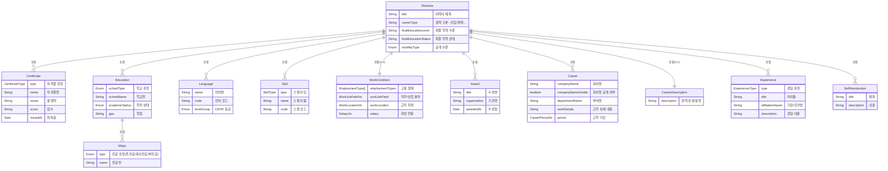
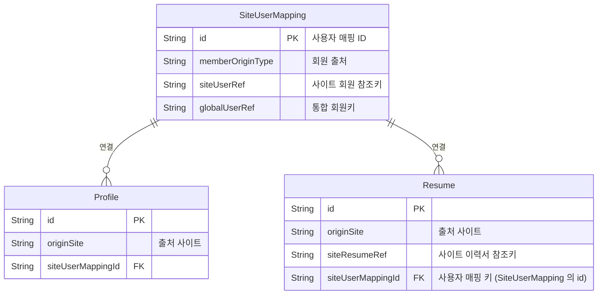

# 이력서허브(resume-hub) 데이터 모델

> 잡코리아 & 알바몬 Legacy 이력서의 주요 속성을 공통 속성으로 재정의 하여 적재한 데이터

# 전체 구조 다이어그램

---

## 주요 엔티티 상세

### 0. Profile (사용자 프로필)

사용자의 기본 프로필 정보를 저장합니다. Resume과 별도로 관리되며, 같은 사용자의 여러 이력서가 하나의 프로필을 공유합니다.

| 필드명 | 항목 | 자료형 | 설명 |
| --- | --- | --- | --- |
| originSite | 출처 사이트 | OriginSite | \* UNKNOWN: 정의되지 않음 \* ALBAMON: 알바몬 \* JOBKOREA: 잡코리아 |
| name | 이름 | String | 이름(암호화) |
| gender | 성별 | GenderType | \* UNKNOWN: 미상 \* MALE: 남성 \* FEMALE: 여성 \* OTHER: 기타 |
| birthday | 생년월일 | Date | 생년월일 |
| address | 주소 | String | 주소 정보 |
| area_code | 거주지 코드 | String | 거주지코드 |
| hiringAdvantages | 취업 우대사항 | HiringAdvantageType\[\] | \* DISABILITY: 장애 \* NATIONAL_MERIT: 국가보훈 \* EMPLOYMENT_PROTECTION: 취업보호대상 \* EMPLOYMENT_SUBSIDY: 고용지원금대상 \* MILITARY_COMPLETED: 군필 \* MILITARY_NOT_COMPLETED: 미필 \* MILITARY_EXEMPTED: 면제 |
| jobSearchStatus | 구직 희망 상태 | JobSearchStatus\[\] | \* ACTIVE:적극구직중 \* SEEKING: 구직중 \* PASSIVE: 관심있음 \* INACTIVE: 구직의사없음 \* NONE: 선택안함 |

---

### 1. Resume (이력서)

이력서의 기본 정보를 담는 중심 엔티티입니다.

| 필드명 | 항목 | 자료형 | 설명 |
| --- | --- | --- | --- |
| originSite | 출처 사이트 | OriginSite | 이력서 원본 사이트 (잡코리아, 사람인 등) |
| siteResumeRef | 사이트 이력서 참조키 | String | 원본 사이트의 이력서 식별키 |
| title | 제목 | String | 이력서 제목 |
| visibilityType | 공개 상태 | ResumeVisibilityType | \* PRIVATE: 비공개 \* PUBLIC: 공개 \* HEADHUNTER_ONLY: 헤드헌터 공개

이력서의 실제 공개상태와는 다름 아래 문서 참조
[잡코리아/알바몬  공개 이력서 대상 정책](https://www.notion.so/2d8b52ac8da18026a169fe930dd9dc10?pvs=21)  |
| careerType | 경력 구분 | CareerType | \* NONE: 정의 되지 않음 \* NEW_COMER: 신입 \* EXPERIENCED: 경력 |
| finalEducationLevel | 최종 학력 수준 | SchoolType | 최종 학력 (고졸/대졸/대학원 등) |
| finalEducationStatus | 최종 학력 상태 | AcademicStatus | 졸업/재학/중퇴 등 |
| mainFlag | 메인 이력서 여부 | boolean | true: 메인(기본)이력서 |
| completeStatus | 이력서 완성 상태 | String | NONE("미완성 또는 정의 되지 않음")
BASIC_INFO_COMPLETED("기본 이력서 등록 완료(학력, 경력)")
SKILL_SET_COMPLETED("역량정보 등록 완료(보유기술,자격증)")
COMPLETED("작성완료") |
| createdAt | 생성일시 | Instant | 이력서 최초 작성일시 |
| updatedAt | 수정일시 | Instant | 이력서 수정일시 |
| userUpdatedAt | 회원정보 수정일시 | Instant | 이력서의 회원정보가 수정된 일시 |
| deletedAt | 삭제일시 |  | Not Null = 삭제됨 |

---

### 2. Certificate (자격증)

자격증 및 어학시험 정보를 저장합니다.

| 필드명 | 항목 | 자료형 | 설명 |
| --- | --- | --- | --- |
| type | 자격증 유형 | CertificateType | 자격증 또는 어학시험 구분 |
| name | 자격증명 | String | 자격증 이름 |
| code | 자격증 코드 | CommonCodeType#LICENSE | 자격증 표준 코드 |
| issuer | 발행처 | String | 자격증 발급 기관 |
| score | 점수 | String | 획득 점수 |
| scoreCriteriaCode | 등급 코드 | CommonCodeType#LANGUAGE_EXAM_CRITERIA | 점수 기준 코드 |
| scoreType | 점수 유형 | CertificateScoreType | \* NONE: 없음 \* SCORE: 점수 \* GRADE: 등급 \* PASS: 취득 |
| issuedAt | 취득일 | Date | 취득 일자 |

---

### 3. Education (학력)

학력 정보를 저장합니다.

| 필드명 | 항목 | 자료형 | 설명 |
| --- | --- | --- | --- |
| schoolType | 학교 유형 | SchoolType | \* NONE: 없음 \* ELEMENTARY_SCHOOL: 초등학교 \* MIDDLE_SCHOOL: 중학교 \* HIGH_SCHOOL: 고등학교 \* ASSOCIATE: 전문대 \* BACHELOR: 4년제 대학 \* GRADUATE: 대학원 |
| degreeProgramType | 학위 유형 | DegreeProgramType | \* NONE: 없음 \* MASTER: 석사 \* DOCTORATE: 박사 \* INTEGRATED: 석박사 통합 과정 |
| academicStatus | 학적 상태 | AcademicStatus | \* NONE: 없음, \* ENROLLED: 재학중 \* LEAVE_OF_ABSENCE: 휴학 \* DROPPED_OUT: 중퇴 \* COMPLETED: 수료 \* EXPECTED_GRADUATION: 졸업예정 \* GRADUATED: 졸업 |
| educationPath | 학위 경로 | EducationPath | \* NONE: 없음 \* REGULAR: 일반과정 \* GED: 검정고시 \* TRANSFER: 편입 |
| schoolName | 학교명 | String | 학교 이름 |
| schoolCode | 학교 코드 | CommonCodeType#UNIVERSITY_CAMPUS CommonCodeType#HIGH_SCHOOL | 학교 표준 코드 |
| startedOn | 입학일 | Date | 입학 일자 |
| endedOn | 졸업일 | Date | 졸업 일자 |
| researchTopic | 프로젝트/논문 | String | 졸업 논문/프로젝트 주제 |
| gpa | 학점 | String | 평점 |
| gpaScale | 총점 | String | 만점 기준 (예: 4.5) |

---

### 4. Major (전공)

학력의 전공 정보를 저장합니다. **Education과 1:N 관계**로, 하나의 학력에 여러 전공(주전공, 복수전공, 부전공)이 있을 수 있습니다.

| 필드명 | 항목 | 자료형 | 설명 |
| --- | --- | --- | --- |
| type | 전공 유형 | MajorType | \* NONE: 없음 \* PRIMARY: 주전공 \* MINOR: 부전공 \* DOUBLE: 복수 전공 \* SECOND: 이중 전공 |
| name | 전공명 | String | 전공 이름 |
| code | 전공 코드 | CommonCodeType#PREFERENCE_MAJOR | 전공 표준 코드 |

---

### 5. Language (어학)

어학 능력 정보를 저장합니다.

| 필드명 | 항목 | 자료형 | 설명 |
| --- | --- | --- | --- |
| name | 언어명 | String | 언어 이름 |
| code | 언어 코드 | CommonCodeType#LANGUAGE | 언어 표준 코드 |
| levelGroup | CEFR 등급 | LanguageProficiencyLevelGroup | 언어 숙련도 등급 \* A: 개인적 일상대화 \* B: 전문분야 \* C: 복잡한 주제) |
| trainingExperience | 어학 연수 경험 | LanguageTrainingExperience | \* NONE: 알수없음 \* HAS_EXPERIENCE: 경험 있음 \* NO_EXPERIENCE: 경험 없음 |
| trainingExperienceDescription | 연수 경험 설명 | String | 어학 연수 상세 내용 |

---

### 6. Skill (스킬)

보유 스킬 및 기술 정보를 저장합니다.

| 필드명 | 항목 | 자료형 | 설명 |
| --- | --- | --- | --- |
| type | 스킬 타입 | SkillType | \* NONE: 없음 \* SOFT: 소프트 스킬 \* HARD: 하드 스킬 \* MBTI: MBTI |
| name | 스킬 이름 | String | 스킬명 |
| code | 스킬 코드 | CommonCodeType#SOFT_SKILL CommonCodeType#HARD_SKILL | SkillType에 따른 코드값 |

---

### 7. WorkCondition (희망 근무 조건)

희망하는 근무 조건 정보를 저장합니다.

| 필드명 | 항목 | 자료형 | 설명 |
| --- | --- | --- | --- |
| employmentTypes | 고용 형태 | EmploymentType\[\] | 정규직/계약직/인턴 등 (복수 선택 가능) \* UNKNOWN: 정의되지 않음 \* PERMANENT: 정규직 \* CONTRACT: 계약직 \* INTERN: 인턴 \* DISPATCH: 파견직 \* SUBCONTRACT: 도급 \* FREELANCER: 프리랜서 \* PART_TIME: 아르바이트 \* TRAINEE: 연수생/교육생 \* MILITARY: 병역 특례 \* COMMISSION: 위촉직 \* HEADHUNTING: 헤드헌팅 |
| workJobField | 직무/산업 분야 | WorkJobFieldVo (객체) | 희망 직무 및 산업 분야 (상세 내용은 아래 참조) |
| workLocation | 근무 지역 | WorkLocationVo (객체) | 희망 근무 지역 (상세 내용은 아래 참조) |
| workSchedule | 근무 스케줄 | WorkScheduleVo (JSON) | 근무 시간 관련 정보 (상세 내용은 아래 참조) |
| salary | 희망 연봉 | SalaryVo (객체) | 희망 연봉 정보 (상세 내용은 아래 참조) |

### 7.1. WorkJobFieldVo (직무/산업 분야 상세)

| 필드명 | 항목 | 자료형 | 설명 |
| --- | --- | --- | --- |
| .industryCodes | 산업 코드 | CommonCodeType#INDUSTRY_SUBCATEGORY | 산업 분류 코드 목록 |
| .industryKeywordCodes | 산업 키워드 코드 | CommonCodeType#INDUSTRY | 산업 키워드 코드 목록 |
| .jobClassificationCodes | 직무 코드 | CommonCodeType#JOB_CLASSIFICATION_SUBCATEGORY | 직무 분류 코드 목록 |
| .jobKeywordCodes | 직무 키워드 코드 | CommonCodeType#JOB_CLASSIFICATION | 직무 키워드 코드 목록 |
| .jobIndustryCodes | 업직종 코드 | CommonCodeType#JOB_INDUSTRY | 업직종 분류 코드 목록 (잡코리아 등) |
| .careerJobIndustryCodes | 경력 업직종 코드 | CommonCodeType#JOB_INDUSTRY | 경력 관련 업직종 코드 목록 |

### 7.2. WorkLocationVo (근무 지역 상세)

| 필드명 | 항목 | 자료형 | 설명 |
| --- | --- | --- | --- |
| .countyCodes | 구/군 코드 | AreaCodeType#COUNTY | 희망 근무 지역 코드 목록 (구/군 단위) |
| .workArrangementType | 근무 형태 | WorkArrangementType | \* ANY: 무관 \* REMOTE: 원격근무(재택) \* ON_SITE: 내근(현장근무) \* HYBRID: 하이브리드(부분재택) |

### 7.3. WorkScheduleVo (근무 스케줄 상세)

| 필드명 | 항목 | 자료형 | 설명 |
| --- | --- | --- | --- |
| .periodType | 근무 기간 | WorkPeriodType | \* NONE: 없음 \* ANY: 무관 \* ONE_DAY: 하루 \* LESS_THAN_ONE_WEEK: 1주일 이하 \* ONE_WEEK_TO_ONE_MONTH: 1주일 \~ 1개월 \* ONE_WEEK_TO_THREE_MONTH: 1주일 \~ 3개월 \* ONE_MONTH_TO_THREE_MONTH: 1개월 \~ 3개월 \* THREE_MONTH_TO_SIX_MONTH: 3개월 \~ 6개월 \* SIX_MONTH_TO_ONE_YEAR: 6개월 \~ 1년 \* MORE_THAN_ONE_YEAR: 1년 이상 |
| .schedules | 스케줄 목록 | WorkWeekScheduleVo\[\] | 주간 근무 스케줄 목록 (복수 가능) |

### 7.4. WorkWeekScheduleVo (주간 스케줄 상세)

| 필드명 | 항목 | 자료형 | 설명 |
| --- | --- | --- | --- |
| .weekType | 주간 근무 유형 | WorkWeekType | \* NONE: 없음 \* ANY: 무관 \* MON_TO_SUN: 월\~일 \* MON_TO_SAT: 월\~토 \* MON_TO_FRI: 월\~금 \* WEEKEND_ONLY: 주말 \* ONE_DAY_PER_WEEK: 주1일 \* TWO_DAY_PER_WEEK: 주2일 \* THREE_DAY_PER_WEEK: 주3일 \* FOUR_DAY_PER_WEEK: 주4일 \* FIVE_DAY_PER_WEEK: 주5일 \* SIX_DAY_PER_WEEK: 주6일 \* BIWEEKLY_OFF: 격주휴무 \* ALTERNATE_DAY: 격일근무 |
| .timeType | 근무 시간 유형 | WorkTimeType | \* NONE: 없음 \* ANY: 무관 \* MORNING_PART_TIME: 오전 파트타임(06:00\~12:00) \* AFTERNOON_PART_TIME: 오후 파트타임(12:00\~18:00) \* EVENING_PART_TIME: 저녁 파트타임(18:00\~24:00) \* DAWN_PART_TIME: 새벽 파트타임(00:00\~06:00) \* MORNING_AFTERNOON_PART_TIME: 오전\~오후 파트타임 \* AFTERNOON_EVENING_PART_TIME: 오후\~저녁 파트타임 \* EVENING_DAWN_PART_TIME: 저녁\~새벽 파트타임 \* DAWN_MORNING_PART_TIME: 새벽\~오전 파트타임 \* FULL_TIME: 풀타임(8시간이상) |
| .dayOfWeeks | 요일 목록 | DayOfWeekType\[\] | \* MONDAY: 월 \* TUESDAY: 화 \* WEDNESDAY: 수 \* THURSDAY: 목 \* FRIDAY: 금 \* SATURDAY: 토 \* SUNDAY: 일 |

### 7.5. SalaryVo (급여 정보 상세)

| 필드명 | 항목 | 자료형 | 설명 |
| --- | --- | --- | --- |
| .type | 급여 유형 | SalaryType | \* NONE: 정의되지 않음 \* HOURLY: 시급 \* DAILY: 일급 \* WEEKLY: 주급 \* MONTHLY: 월급 \* ANNUAL: 연봉 \* PER_PROJECT: 건별 \* NEGOTIABLE: 협의 |
| .salary | 급여 금액 | Number | 급여 금액 (소수점 2자리까지) |
| .currency | 통화 코드 | String | 통화 코드 (ISO 4217 표준) 예: KRW, USD, EUR |

---

### 8. Award (수상)

수상 이력 정보를 저장합니다.

| 필드명 | 항목 | 자료형 | 설명 |
| --- | --- | --- | --- |
| title | 수상명 | String | 수상 제목 |
| organization | 기관명 | String | 수여 기관 |
| description | 수상 내용 | String | 수상 상세 내용 |
| awardedAt | 수상일 | Date | 수상 일자 |

---

### 9. Career (경력)

경력 정보를 저장합니다.

| 필드명 | 항목 | 자료형 | 설명 |
| --- | --- | --- | --- |
| companyName | 회사명 | String | 회사 이름 |
| companyNameVisible | 회사명 공개 여부 | Boolean | 회사명 공개/비공개 |
| businessRegistrationNumber | 사업자등록번호 | String | 사업자 등록 번호 |
| departmentName | 부서명 | String | 소속 부서 |
| workDetails | 근무 상세 내용 | String | 담당 업무 및 상세 내용 |
| period | 근무 기간 | CareerPeriodVo (객체) | 입사일 및 퇴사일 (상세 내용은 아래 참조) |
| jobClassificationCodes | 직무 코드 | CommonCodeType#JOB_CLASSIFICATION_SUBCATEGORY | 직무 분류 코드 목록 |
| jobKeywordCodes | 직무 키워드 코드 | CommonCodeType#JOB_CLASSIFICATION | 직무 키워드 코드 목록 |
| positionGradeCode | 직급 코드 | CommonCodeType#POSITION_GRADE | 직급 표준 코드 |
| positionTitleCode | 직책 코드 | CommonCodeType#POSITION_TITLE | 직책 표준 코드 |
| salary | 급여 | [SalaryVo](https://www.notion.so/resume-hub-302b52ac8da1809380d9cec2ef5bd365?pvs=21) (객체) | 상세 참조 |

### 9.1. CareerPeriodVo (경력 기간 상세)

| 필드명 | 항목 | 자료형 | 설명 |
| --- | --- | --- | --- |
| .type | 기간 유형 | CareerPeriodType | 근무 기간 표현 방식: \* RANGE: 기간 \* JOIN_DATE_PLUS_WORK_DAYS: 입사일+근무일수 |
| .period | 근무 기간 | Range | PostgreSQL DATERANGE 타입으로 저장되는 입사일\~퇴사일 범위 |
| .daysWorked | 근무일수 | Integer | 총 근무 일수 (자동 계산됨) |
| .employmentStatus | 재직 상태 | EmploymentStatus | 현재 재직 중인지 여부: \* NONE: 해당없음 \* EMPLOYED: 재직 \* RESIGNED: 퇴사 \* ON_LEAVE: 휴직 |

---

### 10. CareerDescription (경력 설명)

경력과 별도로 관리되는 경력 상세 설명입니다.

| 필드명 | 항목 | 자료형 | 설명 |
| --- | --- | --- | --- |
| description | 내용 | String | 경력 상세 설명 |

---

### 11. Experience (경험)

기타 경험 정보를 저장합니다. (인턴십, 대외활동, 해외연수, 봉사활동 등)

| 필드명 | 항목 | 자료형 | 설명 |
| --- | --- | --- | --- |
| type | 경험 유형 | ExperienceType | \* NONE: 선택 안함 \* WORKED_OVERSEAS: 해외근무 경험 \* OVERSEAS: 해외활동 \* TRAINING: 교육/연수 \* INTERNSHIP: 인턴 \* PART_TIME: 아르바이트 \* CLUB: 동아리/동호회 \* VOLUNTEERING: 자원 봉사 \* SOCIAL: 사회 활동 \* CAMPUS: 교내 활동 \* ETC: 기타 |
| title | 타이틀 | String | 경험 제목 |
| affiliationName | 기관/국가명 | String | 관련 기관 또는 국가명 |
| affiliationCode | 기관/국가 코드 | AreaCodeType#NATION | 기관/국가 표준 코드 |
| description | 경험 내용 | String | 경험 상세 내용 |
| startedOn | 시작일 | String | 시작 날짜 (년, 년월, 년월일 가변 형식) |
| endedOn | 종료일 | String | 종료 날짜 (년, 년월, 년월일 가변 형식) |

---

### 12. SelfIntroduction (자기소개서)

자기소개서 항목을 저장합니다.

| 필드명 | 항목 | 자료형 | 설명 |
| --- | --- | --- | --- |
| title | 제목 | String | 질문 제목 |
| description | 내용 | String | 답변 내용 |

---

## 엔티티 간 관계

### 관계 유형 설명

- **1:N (일대다)**: 하나의 이력서가 여러 개의 자격증, 경력 등을 가질 수 있습니다.
- **1:1 (일대일)**: Resume-WorkCondition, Resume-CareerDescription이 1:1 관계입니다. (DDL에서 resume_id에 UNIQUE 제약조건 있음)
- **M:N (다대다)**: 현재 모델에서는 직접적인 M:N 관계는 없습니다.

### 상세 관계 목록

| 부모 엔티티 | 관계 | 자식 엔티티 | 설명 |
| --- | --- | --- | --- |
| SiteUserMapping | 1:N | Profile | 하나의 사용자 매핑은 여러 개의 프로필을 가질 수 있음 (사이트별로 다를 수 있음) |
| SiteUserMapping | 1:N | Resume | 하나의 사용자 매핑은 여러 개의 이력서를 가질 수 있음 |
| Resume | 1:N | Certificate | 하나의 이력서는 여러 개의 자격증을 가질 수 있음 |
| Resume | 1:N | Education | 하나의 이력서는 여러 개의 학력을 가질 수 있음 |
| Education | 1:N | Major | 하나의 학력은 여러 개의 전공(주/복수/부전공)을 가질 수 있음 |
| Resume | 1:N | Language | 하나의 이력서는 여러 개의 어학 정보를 가질 수 있음 |
| Resume | 1:N | Skill | 하나의 이력서는 여러 개의 스킬을 가질 수 있음 |
| Resume | 1:1 | WorkCondition | 하나의 이력서는 하나의 희망 근무 조건을 가질 수 있음 |
| Resume | 1:N | Award | 하나의 이력서는 여러 개의 수상 이력을 가질 수 있음 |
| Resume | 1:N | Career | 하나의 이력서는 여러 개의 경력을 가질 수 있음 |
| Resume | 1:1 | CareerDescription | 하나의 이력서는 하나의 경력 설명을 가질 수 있음 |
| Resume | 1:N | Experience | 하나의 이력서는 여러 개의 경험을 가질 수 있음 |
| Resume | 1:N | SelfIntroduction | 하나의 이력서는 여러 개의 자기소개서 항목을 가질 수 있음 |

### 핵심 관계 설명

1. **SiteUserMapping (사용자 매핑)**
- 이력서 플래폼과 대상 사이트(잡코리아, 알바몬 등)의 사용자를 연결하는 매핑 정보입니다.
- `memberOriginType`과 `siteUserRef`로 외부 사이트의 사용자를 식별합니다.
- `memberOriginType` 의 기본적으로 잡코리아 및 알바몬은 통합회원이지만(JOBKOREACORP) Social 회원의경우 통합이 아닌 각 사이트 회원으로 분류 됩니다.
- `globalUserRef`로 통합 회원 시스템과 연결됩니다.
1. **Profile (프로필)과 Resume (이력서)의 관계**
- 같은 사용자가 여러 개의 이력서를 만들 수 있습니다.
- Profile은 사용자의 기본 정보(성별, 생년월일 등)를 담고 있으며, 이력서와는 독립적으로 관리됩니다.
- `siteUserMappingId` 필드를 통해 Profile과 Resume이 같은 사용자의 정보임을 알 수 있습니다.
1. **Resume (이력서) - 이력서 세부 정보의 중심**
- 모든 세부 정보는 Resume을 기준으로 연결됩니다.
- `resumeId` 필드를 통해 각 세부 정보가 어떤 이력서에 속하는지 식별합니다.
1. **Education (학력) - Major (전공)**
- 학력과 전공은 별도 관리되며, 하나의 학력에 여러 전공이 있을 수 있습니다.
- 예: 컴퓨터공학(주전공), 경영학(복수전공)
1. **외래키 (Foreign Key) 정리**
- `siteUserMappingId`: Profile과 Resume이 SiteUserMapping과 연결되는 외래키
- `resumeId`: 대부분의 이력서 세부 정보가 Resume과 연결되는 외래키
- `educationId`: Major 엔티티가 Education과 연결되는 외래키

---

## 데이터 자료형 참고

| 자료형 | 설명 | 예시 |
| --- | --- | --- |
| String | 문자열 | "홍길동", "서울대학교" |
| Integer | 정수 | 1, 2, 3 |
| Boolean | 참/거짓 | true, false |
| Instant | 날짜/시간 | 2025-11-10T10:30:00Z |
| Enum | 미리 정의된 값 중 하나 | GRADUATED (졸업), IN_PROGRESS (재학중) |
| `T[]` | 목록 (배열) | \["Java", "Python", "JavaScript"\] |
| Vo (Value Object) | 복합 객체 | 연봉 정보 (금액 + 통화 단위) |

---

## 주요 비즈니스 규칙

1. **이력서 공개 설정**
- `visibilityType` 필드로 이력서 공개/비공개 제어
1. **경력 구분**
- `careerType`으로 신입/경력 구분
- Career 엔티티에 실제 경력 정보 저장
1. **삭제 관리**
- `deletedAt` 필드로 소프트 삭제 (실제 삭제하지 않고 삭제 시각 기록)
1. **정렬 순서**
- 대부분의 엔티티에 `sortOrder` 필드가 있어 사용자가 원하는 순서대로 정렬 가능
- 예외: Skill, Major 엔티티에는 sortOrder 필드 없음
1. **날짜 표현 유연성**
- 입학일, 졸업일, 수상일 등은 년/년월/년월일 등 다양한 형식 지원
- 예: "2020", "2020-03", "2020-03-15"

---

이 문서는 이력서 시스템의 데이터 구조를 이해하기 위한 참고 자료입니다.