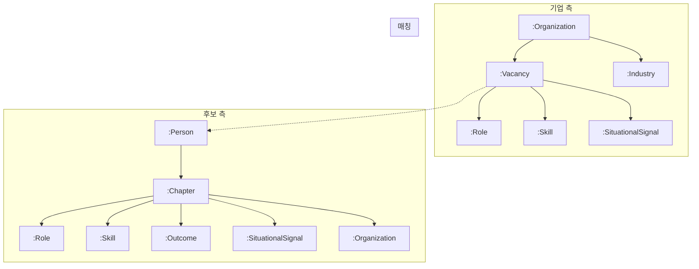

# Ontology Schema — 기업-인재 매칭을 위한 Knowledge Graph 설계

## 이 문서가 다루는 것

채용 도메인에서 **기업(Company)**과 **인재(Candidate)**의 맥락 정보를 구조화하고, 이를 Graph 기반으로 매칭하는 온톨로지 스키마입니다. 단순한 스킬 키워드 매칭을 넘어, "이 후보가 이 기업의 현재 상황에 적합한가?"를 판단할 수 있는 구조를 정의합니다.

---

## 핵심 개념 요약

```
┌─────────────────────┐          ┌─────────────────────┐
│   CompanyContext     │          │  CandidateContext    │
│                      │          │                      │
│  - 기업 프로필       │          │  - 경력 (Experience) │
│  - 성장 단계         │          │  - 역할 성장 궤적    │
│  - 채용 포지션       │  매칭    │  - 상황 경험 라벨    │
│  - 운영 방식         │◄────────►│  - 성과 (Outcome)    │
│  - 조직 긴장 상태    │          │  - 도메인 전문성     │
└─────────────────────┘          └─────────────────────┘
            │                              │
            └──────────┐  ┌────────────────┘
                       ▼  ▼
              ┌──────────────────┐
              │ MappingFeatures  │
              │                  │
              │  5개 피처 스코어  │
              │  + confidence    │
              │  + evidence 근거 │
              └──────────────────┘
```

- **CompanyContext**: 기업의 성장 단계, 채용 맥락, 운영 방식 등을 구조화 (JD, NICE 기업정보, 크롤링 등에서 추출)
- **CandidateContext**: 후보의 경력을 Chapter 단위로 분해하고, 각 Chapter에서 역할/성과/상황 경험을 추출 (이력서에서 추출)
- **MappingFeatures**: 위 두 Context를 비교하여 5개 적합도 피처를 산출
- **Graph Schema**: 위 데이터를 Neo4j 그래프로 표현하여 탐색 기반 매칭을 지원

---

## 스키마 문서 구조 (`schema/v10/`)

| # | 파일 | 내용 | 핵심 질문 |
|---|------|------|-----------|
| 01 | `01_company_context.md` | 기업 맥락 정의 | 이 기업은 지금 어떤 상황인가? |
| 02 | `02_candidate_context.md` | 후보 맥락 정의 | 이 후보는 어떤 경험을 해왔는가? |
| 02 | `02_v4_amendments.md` | 스키마 보완 이력 | v4 이후 어떤 보완이 이루어졌는가? |
| 03 | `03_mapping_features.md` | 매칭 피처 계산 로직 | 기업-후보가 얼마나 적합한가? |
| 04 | `04_graph_schema.md` | Neo4j 그래프 스키마 | 그래프로 어떻게 표현하는가? |
| 05 | `05_evaluation_strategy.md` | GraphRAG vs Vector 비교 실험 | GraphRAG가 정말 효과적인가? |
| 06 | `06_crawling_strategy.md` | 기업 크롤링 전략 | 추가 데이터를 어떻게 수집하는가? |

---

## 1. CompanyContext — 기업 맥락 (`01_company_context.md`)

기업의 현재 상태를 **후보와 무관하게 독립적으로** 생성합니다.

### 주요 구성 요소

| 구성 요소 | 설명 | 데이터 소스 |
|-----------|------|-------------|
| `company_profile` | 기업 기본 정보 (업종, 설립연도, 직원수, 매출) | NICE 기업정보 |
| `stage_estimate` | 성장 단계 추정 (EARLY / GROWTH / SCALE / MATURE) | NICE + JD + 투자 DB |
| `vacancy` | 채용 포지션의 맥락 (신규구축/확장/리셋/충원) | JD |
| `role_expectations` | 요구 역할/기술스택/자격요건 | JD |
| `operating_model` | 운영 방식 (speed, autonomy, process 3개 facet) | JD + 크롤링 |
| `structural_tensions` | 조직 긴장 상태 (8개 taxonomy) | 뉴스/크롤링 |
| `domain_positioning` | 시장 포지셔닝, 제품 설명 | 크롤링 |

### 데이터 소스 Tier 체계

모든 추출 결과에는 **confidence** 값이 부여되며, 데이터 소스별 **상한(ceiling)**이 존재합니다.

| Tier | 소스 | confidence 상한 | 현재 상태 |
|------|------|-----------------|-----------|
| T1 | JD (자사 보유 / 크롤링) | 0.80 | 접근 가능 |
| T2 | NICE 기업 정보 | 0.70 | 보유 |
| T3 | 회사 홈페이지 크롤링 | 0.60 | 미구축 |
| T4 | 뉴스/기사 크롤링 | 0.55 | 미구축 |
| T5 | 투자 정보 DB | 0.75 | 미구축 |
| T6 | 자사 채용 히스토리 | 0.85 | 접근 가능 |

복수 소스가 동일 claim을 지지하면 confidence가 상향 보정되고, 모순되면 하향 보정됩니다.

### Evidence-first 원칙

모든 claim에는 반드시 근거(Evidence)가 포함됩니다.

```typescript
interface Evidence {
  source_id: string;           // 소스 문서/레코드 ID
  source_type: SourceType;     // "jd_internal" | "nice" | "crawl_news" | ...
  span: string;                // 원문 발췌 (최대 500자)
  confidence: number;          // 0.0~1.0, source ceiling 적용 후
  extracted_at: string;        // ISO 8601
}
```

---

## 2. CandidateContext — 후보 맥락 (`02_candidate_context.md`)

후보의 이력서를 **Experience(Chapter)** 단위로 분해하고 구조화합니다.

### Experience 구조

각 경력 항목에서 추출하는 정보:

| 추출 난이도 | 필드 | 설명 |
|-------------|------|------|
| 낮음 | company, role_title, period, tech_stack | 이력서에서 직접 추출 |
| 중간 | scope_type (IC/LEAD/HEAD/FOUNDER), outcomes, situational_signals | 문맥 해석 필요 |
| 높음 | failure_recovery, work_style_signals, past_company_context | 추론 또는 외부 데이터 필요 |

### SituationalSignal — 상황 경험 라벨 (14개 taxonomy)

후보가 경험한 상황을 고정된 taxonomy로 분류합니다. 이 라벨은 기업의 vacancy와 매칭되는 핵심 연결고리입니다.

| 카테고리 | 라벨 예시 | 탐지 패턴 |
|----------|-----------|-----------|
| 성장 단계 | `EARLY_STAGE`, `SCALE_UP`, `TURNAROUND` | "초기 멤버", "급성장", "피봇" |
| 조직 변화 | `TEAM_BUILDING`, `TEAM_SCALING`, `REORG` | "팀 구축", "n→m명", "조직 개편" |
| 기술 변화 | `LEGACY_MODERNIZATION`, `NEW_SYSTEM_BUILD` | "리팩토링", "신규 구축" |
| 비즈니스 | `PMF_SEARCH`, `MONETIZATION` | "PMF", "수익화" |

### 커리어 수준 분석

| 필드 | 설명 |
|------|------|
| `role_evolution` | 커리어 성장 패턴 (IC_TO_LEAD, IC_DEPTH, LEAD_TO_HEAD 등) |
| `domain_depth` | 도메인 반복 경험 분석 ("B2B SaaS 3개사 경험") |
| `work_style_signals` | 업무 방식 선호 (자율성, 프로세스 내성 등) — v1에서는 대부분 null |

---

## 3. MappingFeatures — 매칭 피처 (`03_mapping_features.md`)

CompanyContext와 CandidateContext를 비교하여 **5개 적합도 피처**를 산출합니다.

| # | 피처 | 핵심 질문 | 계산 방법 |
|---|------|-----------|-----------|
| F1 | `stage_match` | 기업의 성장 단계를 후보가 경험한 적이 있는가? | Rule (STAGE_SIMILARITY 매트릭스) |
| F2 | `vacancy_fit` | 포지션 유형(신규구축/확장 등)과 후보 경험이 맞는가? | SituationalSignal 매칭 |
| F3 | `domain_fit` | 기업의 산업/도메인과 후보의 도메인 경험이 맞는가? | Embedding 유사도 + Industry code |
| F4 | `culture_fit` | 기업의 운영 방식과 후보의 선호가 맞는가? | Facet 비교 (v1에서는 대부분 INACTIVE) |
| F5 | `role_fit` | 요구 시니어리티와 후보의 경력 수준이 맞는가? | Role pattern + 경력 연수 |

### Graceful Degradation

필수 입력이 null/Unknown이면 해당 피처는 자동으로 `INACTIVE` 상태가 됩니다. 활성화된 피처만으로 `overall_match_score`를 계산하므로, 데이터가 불완전해도 안전하게 동작합니다.

### Overall Score 계산

```
overall_match_score = 활성 피처의 confidence 가중 평균
                      (비활성 피처의 weight는 활성 피처에 재분배)
```

---

## 4. Graph Schema — Neo4j 그래프 (`04_graph_schema.md`)

위 Context 데이터를 그래프 DB에 표현하여 **탐색 기반 매칭**을 지원합니다.

### 노드 (9종)



| 노드 | 설명 | 주요 속성 |
|------|------|-----------|
| Person | 후보자 | person_id, role_evolution_pattern, primary_domain |
| Organization | 기업 | name, stage_label, industry_code, employee_count |
| Chapter | 경험 단위 | scope_type, duration_months, evidence_chunk (+ 벡터) |
| Vacancy | 채용 포지션 | scope_type, seniority, evidence_chunk (+ 벡터) |
| Role | 역할 | name, category (정규화) |
| Skill | 기술 | name, category, aliases |
| Outcome | 성과 | description, outcome_type, metric_value |
| SituationalSignal | 상황 라벨 | label (14개 taxonomy, 공유 노드) |
| Industry | 산업 분류 | industry_id (NICE 코드), is_regulated |

### 핵심 그래프 쿼리 패턴

- **vacancy_fit**: Vacancy → NEEDS_SIGNAL → SituationalSignal ← HAS_SIGNAL ← Chapter ← Person
- **stage_match**: Organization(target) → stage_label과 동일한 Organization(past) ← OCCURRED_AT ← Chapter ← Person
- **Vector + Graph 하이브리드**: Vector Index로 유사 Chapter 검색 → 주변 그래프 탐색

---

## 5. 평가 전략 (`05_evaluation_strategy.md`)

GraphRAG(그래프 기반)가 단순 Vector 검색보다 실제로 효과적인지 검증하는 비교 실험 계획입니다.

### 실험 구조

| 방법 | 설명 |
|------|------|
| (A) GraphRAG | Neo4j + MappingFeatures 5개 피처 |
| (B) Vector Baseline | JD+이력서 전문 임베딩 cosine similarity |
| (B') Vector + LLM Reranking | Vector Top-10을 LLM으로 재순위화 |

### 성공 기준

- Cohen's d >= 0.5 (중간 효과 이상) **AND** p < 0.05
- 50건 매핑에 대해 채용 전문가 5명이 블라인드 평가 (1~5점)
- 결과에 따라 v2 확장 방향 결정 (의사결정 트리 사전 정의)

---

## 6. 크롤링 전략 (`06_crawling_strategy.md`)

JD + NICE만으로는 채울 수 없는 CompanyContext 필드를 크롤링으로 보강합니다.

### 수집 대상

| 소스 | 수집 유형 | 보강되는 필드 |
|------|-----------|---------------|
| 홈페이지 | 회사 소개(P1), 제품(P2), 채용(P3), 블로그(P4) 등 | product_description, market_segment, operating_model |
| 뉴스 | 투자(N1), 제품 런칭(N2), M&A(N3), 조직 변화(N4), 실적(N5) | stage_estimate 보강, structural_tensions 활성화 |

### 구현 스택 (GCP)

- 크롤러: Cloud Run Job + Playwright
- LLM 추출: Gemini 2.0 Flash (Vertex AI)
- 저장: GCS + BigQuery
- 스케줄링: Cloud Scheduler

---

## 버전 로드맵

| 항목 | v1 (즉시) | v1.1 (크롤링 후) | v2 (고도화) |
|------|-----------|-------------------|-------------|
| CompanyContext 소스 | JD + NICE | + 홈페이지/뉴스 크롤링 | + 내부 문서 |
| CandidateContext 소스 | 이력서 | + LinkedIn | + Closed-loop 질문 |
| MappingFeatures | 5개 (culture_fit 대부분 INACTIVE) | 크롤링 보강 | + tension_alignment, resilience_fit |
| Graph 관계 | 후보 측 + 기업 측 기본 | + INVESTED_BY | + COMPETES_WITH 등 |
| 평가 | GraphRAG vs Vector 비교 실험 | 결과 기반 의사결정 | 운영 지표 모니터링 |

---

## 설계 원칙

1. **독립성**: CompanyContext와 CandidateContext는 서로 무관하게 독립 생성
2. **Evidence-first**: 모든 claim에 원문 근거 필수, 근거 없으면 추출하지 않음
3. **부분 완성 허용**: 데이터가 없으면 null로 명시, 시스템은 안전하게 동작
4. **데이터 소스 계층화**: 소스별 confidence 상한 적용, 복수 소스 교차 검증
5. **Taxonomy 고정**: LLM 자유 생성 방지, 고정된 분류 체계에서 선택하도록 강제
6. **의도적 제외 명문화**: 현 버전에서 제외한 기능의 이유와 도입 로드맵을 문서화

---

## 보완 이력 (`02_v4_amendments.md`)

v4 이후 식별된 보완 사항 8건(A1~A8)의 이력을 관리합니다. A1~A7은 각 통합판 문서에 인라인 반영 완료되었으며, A8(추출 프롬프트 확장 로드맵)은 4단계 추가 일정이 정의되어 있습니다.

---

## 용어 사전

| 용어 | 설명 |
|------|------|
| Chapter | 후보의 개별 경력 항목 (Experience 단위) |
| SituationalSignal | 후보가 경험한 상황 유형 (14개 고정 taxonomy) |
| scope_type | 역할 범위 — IC(개인 기여자) / LEAD / HEAD / FOUNDER |
| vacancy scope_type | 채용 맥락 — BUILD_NEW / SCALE_EXISTING / RESET / REPLACE |
| stage_label | 기업 성장 단계 — EARLY / GROWTH / SCALE / MATURE |
| Tier | 데이터 소스의 신뢰도 등급 (T1~T7) |
| confidence | 추출된 정보의 신뢰도 (0.0~1.0, source ceiling 적용) |
| Graceful Degradation | 데이터 부족 시 해당 피처를 INACTIVE로 두고 나머지로 동작 |
| NICE | 한국 기업 신용정보 데이터베이스 |
