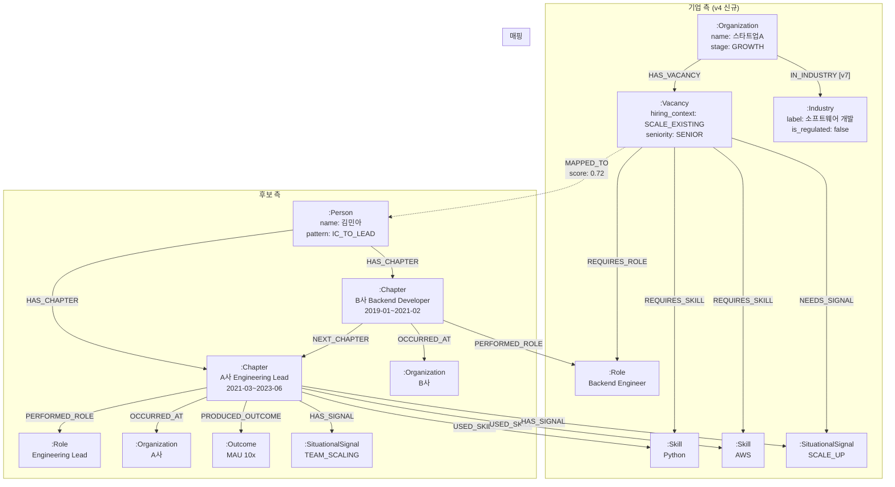

# 통합 Graph 스키마 v19 — 통합판

> v4 원본에 A2(Industry 노드 정의), A5(Company 간 관계 제외 명문화)를 통합.
>
> 작성일: 2026-03-11 | 현재 유효 버전: **v19** | 기준: v4 Graph Schema + v4 amendments (A2, A5) + v12 데이터 분석 v2.1
>
> **v19 변경** (2026-03-11): v18 리뷰 피드백 반영
> - [S-3] §1.3 Chapter 노드에 "Career 1건 = 1 Chapter" 원칙 및 동일 회사 연속 근무 시 NEXT_CHAPTER 처리 규칙 추가
>
> <details><summary>v18 변경 이력</summary>
>
> **v18 변경** (2026-03-10): v17 리뷰 피드백 반영
> - [R-2] §1.6 Outcome 노드에 v1 ROI 결정 기록 (v1 추출 수행, Neo4j 적재는 선택적)
> - [R-5] §9 BigQuery-Neo4j 동기화: 구현 상세(DLQ, exponential backoff 등)는 구현 단계에서 정의하도록 범위 축소, 온톨로지 문서에는 동기화 방향/주기만 유지
>
> </details>
>
> <details><summary>v16~v17 변경 이력</summary>
>
> **v17 변경** (2026-03-10): v16 리뷰 피드백 반영
> - [R-1] §1.8 Vacancy 노드 `scope_type` → `hiring_context`로 명칭 변경 (Candidate scope_type과의 용어 충돌 해소)
> - [R-5] §4 Q4에 NEEDS_SIGNAL 자동 추론 파일럿 검증 계획 추가
> - [R-7] §2.1 USED_SKILL 엣지에 Skill recency 명시적 결정 (v1: 별도 속성 불필요, Chapter.period로 추론)
>
> </details>
>
> <details><summary>v8~v16 변경 이력</summary>
>
> **v16 변경** (2026-03-10): v15 리뷰 피드백 반영
> - [S-7] §1.5 Skill 노드에 매칭 시 HARD_SKILL만 사용 규칙 명시
> - [S-5] §1.1 Person 노드에 v1 매칭 범위 제한 주석 추가
> - §7.3 MAPPED_TO TTL 정책에 "v1.1+ 검토" 표시 추가
>
> **v15 변경** (2026-03-10): v14 리뷰 피드백 반영
> - [N14-2] §7.2 MAPPED_TO 엣지 TTL/아카이빙 정책 추가
> - [N14-5] §8.2 Organization.name 풀텍스트 인덱스 추가
> - [N14-4] §9.1 동기화 방향성 기술 정확화 ("주로 단방향, 매핑 결과만 역방향")
> - [N14-3] §9.3 sync_to_neo4j 에러 핸들링/재시도 정책 정의
>
> **v14 변경** (2026-03-10): v13 리뷰 피드백 반영
> - [U-11] §7 노드/엣지 규모 추정 섹션 신규 추가 (서비스 풀 3.2M 기준)
> - [U-12] §8 Neo4j 인덱스 전략 섹션 신규 추가
> - [U-13] §9 BigQuery-Neo4j 데이터 동기화 전략 섹션 신규 추가
> - [O-9/O-10] v2 로드맵 상세 설명 축소 (테이블 한 줄로 압축)
>
>
>
> **v13 변경** (2026-03-10): Person 보강 속성, Industry 노드 code-hub 정합
>
> **v10 변경** (2026-03-08): Organization 크롤링 보강 속성 추가
>
> **v8 변경** (2026-03-08): 임베딩 모델 통일
>
> </details>

---

## 1. 노드 정의

### 1.1 Person (후보자)

```
(:Person {
  person_id: STRING,           -- 전역 고유 ID (SiteUserMapping.id)
  name: STRING,
  resume_id: STRING,
  total_experience_years: FLOAT,
  role_evolution_pattern: STRING,  -- "IC_TO_LEAD" 등
  primary_domain: STRING,

  // --- v13 보강 속성 (데이터 분석 v2.1 기반, 00_data_source_mapping §3.5) [C-1] ---
  gender: STRING | null,          -- "M" / "F" / "OTHER" (fill rate 100%, 매칭 점수에 사용 금지, 편향 모니터링 전용)
  age: INT | null,                -- 1~100 필터 적용 (fill rate 93.3%, 평균 36.2세, age>100 이상치 제거)
  career_type: STRING,            -- "EXPERIENCED" / "NEW_COMER" (fill rate 100%, EXPERIENCED 69.1%)
  freshness_weight: FLOAT,        -- 0.3~1.0 (resume.userUpdatedAt 기반, 00_data_source_mapping §3.5 참조)
  education_level: STRING | null, -- education.schoolType MAX 기반 (fill rate 95.6%, finalEducationLevel 35.6% 불일치 → schoolType 진실 소스)

  context_version: STRING,
  generated_at: DATETIME
})
```

> **[v16] v1 매칭 범위 제한**: v1에서 MAPPED_TO 엣지 생성(매칭) 대상은 `career_type = "EXPERIENCED"` Person 노드로 제한한다. NEW_COMER(30.9%)는 Person 노드로 존재하지만 매칭 대상에서 제외된다. 상세: `03_mapping_features.md §0.1`.

### 1.2 Organization (기업)

**v3에서 누락되었던 Company 측 핵심 노드.** CompanyContext의 company_profile + stage_estimate를 그래프에 표현.

```
(:Organization {
  org_id: STRING,              -- company_id
  name: STRING,
  industry_code: STRING,
  industry_label: STRING,
  founded_year: INT,
  employee_count: INT,
  revenue_range: STRING,
  is_regulated_industry: BOOLEAN,
  stage_label: STRING,         -- "EARLY" / "GROWTH" / "SCALE" / "MATURE" / "UNKNOWN"
  stage_confidence: FLOAT,
  data_source: STRING,         -- "nice" / "invest_db" / "crawl"
  updated_at: DATETIME,

  // --- v1.1 크롤링 보강 속성 (optional, 크롤링 활성화 전까지 null) [v10] ---
  product_description: STRING | null,   -- 홈페이지 P2에서 추출
  market_segment: STRING | null,        -- 홈페이지 P1+P2에서 추출
  latest_funding_round: STRING | null,  -- 뉴스 N1에서 추출
  latest_funding_date: DATE | null,     -- 뉴스 N1에서 추출
  crawl_quality: FLOAT | null,          -- 크롤링 품질 지표 (0~1)
  last_crawled_at: DATETIME | null      -- 최종 크롤링 일시
})
```

> **[v10]** 크롤링 보강 속성은 `06_crawling_strategy.md` 5.4절의 Cypher 확장 스키마와 정합된다. v1에서는 모두 null이며, v1.1 크롤링 활성화 시 채워진다. v1 Neo4j 스키마 구현 시 이 속성들을 nullable로 선언해 두면 v1.1 마이그레이션 없이 바로 사용 가능하다.

### 1.3 Chapter (경험 단위)

Person의 각 Experience를 그래프 노드로 표현. v3 GraphDB의 Chapter 개념 유지.

> **[v19] Chapter 분할 원칙 [S-3]**: "resume-hub Career 레코드 1건 = 1 Chapter". 동일 회사에서 직급/직무 변경으로 Career 레코드가 2건 이상인 경우에도 각각 독립 Chapter로 생성한다. 이 경우 NEXT_CHAPTER 엣지의 `gap_months = 0`으로 설정하며, 동일 Organization 노드를 공유한다 (OCCURRED_AT 관계). 상세: `02_candidate_context.md §2.1`.

```
(:Chapter {
  chapter_id: STRING,          -- experience_id
  title: STRING,               -- "A사 Engineering Lead"
  scope_type: STRING,          -- "IC" / "LEAD" / "HEAD" / "FOUNDER"
  period_start: STRING,        -- "2021-03"
  period_end: STRING,          -- "2023-06" | "present"
  duration_months: INT,
  scope_summary: STRING,
  evidence_chunk: STRING,      -- 이력서 원문 발췌 (Vector Index용)
  evidence_chunk_embedding: VECTOR  -- 임베딩 벡터
})
```

### 1.4 Role (역할)

```
(:Role {
  role_id: STRING,             -- 정규화된 역할 ID
  name: STRING,                -- "Backend Engineer"
  name_ko: STRING,             -- "백엔드 엔지니어"
  category: STRING             -- "engineering" / "product" / "design" / "data" / "business"
})
```

**정규화 전략**: 동의어 사전 기반. `{"팀 리더": "Team Lead", "팀장": "Team Lead", "테크리드": "Tech Lead"}`

### 1.5 Skill (기술)

```
(:Skill {
  skill_id: STRING,            -- 정규화된 스킬 ID
  name: STRING,                -- "Python"
  category: STRING,            -- "language" / "framework" / "database" / "infra" / "tool"
  aliases: STRING[]            -- ["파이썬", "py"]
})
```

> **[v16] 매칭 시 HARD_SKILL만 사용**: Skill 노드는 HARD_SKILL과 SOFT_SKILL 모두 저장하지만, **MappingFeatures 스킬 매칭(F3 domain_fit 보조, 00_data_source_mapping §4.3)에서는 `type=HARD` 스킬만 사용한다.** SOFT_SKILL은 TOP 10의 60%가 "성실성(25.2%), 긍정적(17.3%)"으로 편중되어 있어 매칭 노이즈를 유발하므로 제외한다. SOFT_SKILL Skill 노드는 후보 프로필 표시용으로만 유지한다.

### 1.6 Outcome (성과)

v3의 이중 설계(별도 노드 vs 속성)를 **별도 노드**로 확정. Evidence와 분리.

> **[v18] v1 ROI 결정**: Outcome은 v1 MappingFeatures(F1~F5)에서 매칭 피처로 **사용하지 않는다** (상세: `03_mapping_features.md §2 F2 보충`). 그러나 LLM 추출은 SituationalSignal과 동일 호출에서 수행되므로 추가 비용이 미미하여 **v1에서 추출을 수행한다**. Neo4j 적재는 선택적 — v1 파일럿에서 Outcome 노드 없이 시작하고, Q3 하이브리드 검색의 필요에 따라 적재 여부를 결정할 수 있다. 상세: `02_candidate_context.md §2.2`.

```
(:Outcome {
  outcome_id: STRING,
  description: STRING,         -- "MAU 10x 달성"
  outcome_type: STRING,        -- "METRIC" / "SCALE" / "DELIVERY" / "ORGANIZATIONAL"
  quantitative: BOOLEAN,
  metric_value: STRING,        -- "10x"
  confidence: FLOAT,
  evidence_span: STRING        -- 원문 근거
})
```

### 1.7 SituationalSignal (상황 라벨) — v4 신규

같은 상황을 경험한 후보를 그래프 탐색으로 연결하기 위한 **공유 노드**.

```
(:SituationalSignal {
  signal_id: STRING,           -- signal_label과 동일
  label: STRING,               -- "SCALE_UP" (14개 taxonomy)
  category: STRING,            -- "growth" / "org_change" / "tech_change" / "business"
  description: STRING          -- taxonomy 설명
})
```

### 1.8 Vacancy (채용 포지션) — v4 신규

CompanyContext의 vacancy를 그래프에 표현. **매칭의 기업 측 앵커.**

```
(:Vacancy {
  vacancy_id: STRING,          -- job_id
  hiring_context: STRING,      -- "BUILD_NEW" / "SCALE_EXISTING" / "RESET" / "REPLACE" [v17: scope_type에서 명칭 변경]
  role_title: STRING,
  seniority: STRING,           -- "JUNIOR" ~ "HEAD"
  team_context: STRING,
  evidence_chunk: STRING,      -- JD 원문 발췌 (Vector Index용)
  evidence_chunk_embedding: VECTOR
})
```

### 1.9 Industry — v7 추가, v13 code-hub 정합 [v7, v13]

`:Industry` 노드는 **code-hub INDUSTRY_SUBCATEGORY (63개 코드)** 기반의 마스터 데이터로 사전 생성된다.

> **[v13]** v10까지 NICE 업종 코드를 primary로 사용했으나, v11에서 code-hub INDUSTRY 코드를 primary 산업 코드로 채택함에 따라 (00_data_source_mapping §1.1), Industry 노드의 `industry_id`도 code-hub 기준으로 변경한다. NICE 코드는 보조 소스로 교차 검증에 활용한다.

```
(:Industry {
  industry_id: STRING,        -- code-hub INDUSTRY_SUBCATEGORY 코드 (63개, primary)
  label: STRING,              -- code-hub detail_name (예: "소프트웨어 개발")
  category: STRING,           -- code-hub INDUSTRY_CATEGORY (1depth 대분류)
  category_label: STRING,     -- 대분류명
  nice_code: STRING | null,   -- NICE 업종 코드 (보조, 교차 검증용) [v13]
  is_regulated: BOOLEAN       -- 규제 산업 여부
})
```

**생성 규칙**:
- code-hub INDUSTRY_SUBCATEGORY 63개 코드 기반으로 Industry 노드를 사전 생성 (마스터 데이터)
- Organization 노드 생성 시 industry_code로 매칭하여 IN_INDUSTRY 관계 생성
- 동일 업종의 기업들이 하나의 Industry 노드를 공유 -> "같은 산업의 기업" 그래프 탐색 가능
- NICE 코드가 있는 경우 `nice_code`에 보조 저장하여 외부 데이터 교차 검증에 활용

**is_regulated 판정 기준**:

| 대분류 코드 | 대분류명 | is_regulated | 근거 |
|---|---|---|---|
| K | 금융 및 보험업 | true | 금융위원회/금감원 규제 |
| Q | 보건업 및 사회복지 서비스업 | true | 보건복지부/식약처 규제 |
| D | 전기, 가스, 증기 및 공기조절 공급업 | true | 에너지 규제 |
| H | 운수 및 창고업 | true | 교통/물류 규제 |
| 기타 | -- | false | 기본값 |

```python
REGULATED_CATEGORIES = {"K", "Q", "D", "H"}

def is_regulated_industry(industry_code):
    """code-hub INDUSTRY_CATEGORY 대분류가 규제 산업인지 판정"""
    category = lookup_common_code(type="INDUSTRY_SUBCATEGORY", code=industry_code)
    if not category:
        return False
    return category.group_code in REGULATED_CATEGORIES
```

> 세분류 수준의 규제 산업(예: J631 내 핀테크)은 v2에서 수동 태깅으로 보완한다.

---

## 2. 관계(Edge) 정의

### 2.1 후보 측 관계 (v3 유지 + 확장)

| 관계 | 설명 | edge 속성 |
|---|---|---|
| `(:Person)-[:HAS_CHAPTER]->(:Chapter)` | 후보의 경험 | seq_order: INT |
| `(:Chapter)-[:NEXT_CHAPTER]->(:Chapter)` | 시간순 궤적 | gap_months: INT |
| `(:Chapter)-[:PERFORMED_ROLE]->(:Role)` | 해당 시기의 역할 | confidence: FLOAT |
| `(:Chapter)-[:USED_SKILL]->(:Skill)` | 사용 기술 | — (아래 recency 결정 참조) |
| `(:Chapter)-[:OCCURRED_AT]->(:Organization)` | 경험 배경 회사 | tenure_start, tenure_end, stage_at_tenure |
| `(:Chapter)-[:PRODUCED_OUTCOME]->(:Outcome)` | 성과 | confidence: FLOAT |
| `(:Chapter)-[:HAS_SIGNAL]->(:SituationalSignal)` | 경험한 상황 | confidence: FLOAT |

> **[v17] USED_SKILL Skill recency 결정**: v1에서 USED_SKILL 엣지에 `last_used_year` 또는 `recency_weight` 속성을 **별도로 추가하지 않는다.** 스킬의 사용 시점은 `(:Chapter)-[:USED_SKILL]->(:Skill)` 관계를 통해 Chapter의 `period_start`/`period_end`로 추론 가능하며, 별도 속성을 두면 Chapter.period와 이중 관리가 된다. 매칭 시 스킬의 recency가 필요하면 Chapter.period를 조회하여 계산한다. v2에서 실제 매칭 품질에 recency가 유의미한 영향을 미치는지 검증 후, 성능 최적화가 필요하면 별도 속성 추가를 재검토한다.

### 2.2 기업 측 관계 (v4 신규)

| 관계 | 설명 | edge 속성 |
|---|---|---|
| `(:Organization)-[:HAS_VACANCY]->(:Vacancy)` | 기업의 채용 포지션 | posted_at: DATETIME |
| `(:Vacancy)-[:REQUIRES_ROLE]->(:Role)` | 포지션이 요구하는 역할 | seniority: STRING |
| `(:Vacancy)-[:REQUIRES_SKILL]->(:Skill)` | 포지션이 요구하는 기술 | required / preferred |
| `(:Vacancy)-[:NEEDS_SIGNAL]->(:SituationalSignal)` | 포지션이 필요로 하는 상황 경험 | inferred: BOOLEAN |
| `(:Organization)-[:IN_INDUSTRY]->(:Industry)` | 산업 분류 [v7] | — |

**v7 추가 설명**: Organization 생성 시 industry_code 기준으로 자동 연결. 동일 업종 기업은 같은 Industry 노드를 공유하여 산업별 그래프 탐색을 지원한다.

### 2.3 매핑 관계 (v4 신규)

| 관계 | 설명 | edge 속성 |
|---|---|---|
| `(:Vacancy)-[:MAPPED_TO]->(:Person)` | 매핑 결과 | overall_score, generated_at, last_accessed_at [v15] |

### 2.4 v1 범위 밖 관계 — v7 추가 [v7]

v1에서 Company 간 관계는 데이터 소스 부재, MappingFeatures 직접 기여 없음, 그래프 복잡도 관리 이유로 제외한다.

**v2 로드맵**:

| 관계 | 도입 시기 | 데이터 소스 | 활용 피처 |
|---|---|---|---|
| `(:Organization)-[:COMPETES_WITH]->(:Organization)` | v2 | 뉴스(N3) + 수동 태깅 | competitive_landscape |
| `(:Organization)-[:INVESTED_BY]->(:Investor)` | v1.1 | TheVC API | stage_estimate 보강 |
| `(:Organization)-[:ACQUIRED]->(:Organization)` | v2 | 뉴스(N3) | structural_tensions |
| `(:Organization)-[:PARTNERED_WITH]->(:Organization)` | v2 | 뉴스(N3) | domain_positioning |

---

## 3. 그래프 다이어그램



---

## 4. 핵심 그래프 탐색 쿼리 (Cypher 예시)

### Q1: vacancy_fit — 포지션이 필요로 하는 상황을 경험한 후보 탐색

```cypher
// Vacancy가 NEEDS_SIGNAL로 연결된 SituationalSignal을 경험한 후보 찾기
MATCH (v:Vacancy {vacancy_id: $job_id})
      -[:NEEDS_SIGNAL]->(sig:SituationalSignal)
      <-[:HAS_SIGNAL]-(ch:Chapter)
      <-[:HAS_CHAPTER]-(p:Person)
RETURN p.person_id,
       collect(DISTINCT sig.label) AS matched_signals,
       count(DISTINCT sig) AS match_count
ORDER BY match_count DESC
```

### Q2: stage_match — 동일 성장 단계 기업 경험 후보 탐색

```cypher
// 채용 기업과 같은 stage의 기업에서 일한 후보 찾기
MATCH (target_org:Organization {org_id: $company_id})
MATCH (ch:Chapter)-[:OCCURRED_AT]->(past_org:Organization)
WHERE past_org.stage_label = target_org.stage_label
      AND ch.duration_months >= 12  // 최소 1년 경험
MATCH (p:Person)-[:HAS_CHAPTER]->(ch)
RETURN p.person_id,
       past_org.name AS experienced_company,
       ch.duration_months,
       ch.scope_type
ORDER BY ch.duration_months DESC
```

### Q3: 유사 경험 후보 탐색 (Vector + Graph 하이브리드)

```cypher
// Step 1: Vector 검색으로 유사한 Chapter 찾기
CALL db.index.vector.queryNodes('chapter_embedding_index', 10, $jd_embedding)
YIELD node AS similar_chapter, score AS vector_score

// Step 2: 그래프 탐색으로 주변 정보 수집
MATCH (p:Person)-[:HAS_CHAPTER]->(similar_chapter)
MATCH (similar_chapter)-[:PERFORMED_ROLE]->(r:Role)
MATCH (similar_chapter)-[:USED_SKILL]->(s:Skill)
OPTIONAL MATCH (similar_chapter)-[:PRODUCED_OUTCOME]->(o:Outcome)
OPTIONAL MATCH (similar_chapter)-[:HAS_SIGNAL]->(sig:SituationalSignal)

RETURN p.person_id,
       similar_chapter.title,
       vector_score,
       collect(DISTINCT r.name) AS roles,
       collect(DISTINCT s.name) AS skills,
       collect(DISTINCT o.description) AS outcomes,
       collect(DISTINCT sig.label) AS signals
ORDER BY vector_score DESC
```

### Q4: NEEDS_SIGNAL 자동 추론 (Vacancy 생성 시)

Vacancy 노드의 `NEEDS_SIGNAL` 관계를 JD 분석에서 자동 생성하는 로직.

```python
# vacancy hiring_context → SituationalSignal 연결 (01_company_context.md의 매핑 테이블 기준)
# [v17] scope_type → hiring_context 명칭 변경 반영
def infer_vacancy_signals(vacancy):
    HIRING_CONTEXT_TO_SIGNALS = {
        "BUILD_NEW": ["NEW_SYSTEM_BUILD", "EARLY_STAGE", "PMF_SEARCH", "TEAM_BUILDING"],
        "SCALE_EXISTING": ["SCALE_UP", "TEAM_SCALING", "LEGACY_MODERNIZATION"],
        "RESET": ["LEGACY_MODERNIZATION", "TURNAROUND", "TECH_STACK_TRANSITION", "REORG"],
        "REPLACE": []
    }

    signals = HIRING_CONTEXT_TO_SIGNALS.get(vacancy.hiring_context, [])

    # JD 텍스트에서 추가 시그널 탐지
    jd_signals = llm_extract_signals_from_jd(vacancy.evidence_chunk)
    signals = list(set(signals + jd_signals))

    return [
        ("NEEDS_SIGNAL", signal_label, {"inferred": True})
        for signal_label in signals
    ]
```

> **[v17] NEEDS_SIGNAL 자동 추론 파일럿 검증 계획 [R-5]**: `HIRING_CONTEXT_TO_SIGNALS` 매핑은 전문가 판단 기반 초기값이며, 이 매핑의 타당성이 검증되지 않은 상태이다. v1 파일럿에서 다음 검증을 수행한다:
>
> | 단계 | 방법 | 규모 | 성공 기준 |
> |---|---|---|---|
> | 1차 | 50건 JD에서 자동 추론 결과 vs 채용 전문가 수동 태깅 비교 | 50건 × 14 signals | Precision >= 0.70, Recall >= 0.60 |
> | 2차 | 자동 추론 signal이 실제 매칭 품질에 기여하는지 분석 | 파일럿 전체 | NEEDS_SIGNAL 매칭 활성화 시 vacancy_fit 점수 분포 분석 |
>
> - **1차 검증 미달 시**: HIRING_CONTEXT_TO_SIGNALS 매핑 테이블을 채용 전문가 피드백으로 보정하고, JD LLM 추출의 비중을 높인다.
> - **Precision 낮음** (불필요한 signal 과다): `HIRING_CONTEXT_TO_SIGNALS`의 strong → moderate 또는 제거로 보정.
> - **Recall 낮음** (필요한 signal 누락): JD 텍스트 기반 LLM 추출에 더 의존하도록 전략 조정.

### Q5: 같은 산업의 기업에서 일한 후보 탐색 — v7 추가 [v7]

```cypher
MATCH (target:Organization {org_id: $company_id})-[:IN_INDUSTRY]->(ind:Industry)
      <-[:IN_INDUSTRY]-(similar_org:Organization)
      <-[:OCCURRED_AT]-(ch:Chapter)
      <-[:HAS_CHAPTER]-(p:Person)
RETURN p.person_id, similar_org.name, ch.scope_type
```

---

## 5. Vector Index 전략

| 대상 노드 | 임베딩 대상 텍스트 | 인덱스 용도 |
|---|---|---|
| `:Chapter` | evidence_chunk (이력서 원문 발췌) | JD ↔ 경험 유사도 검색 |
| `:Vacancy` | evidence_chunk (JD 원문 발췌) | 후보 경험 ↔ JD 유사도 검색 |
| `:Outcome` | description | 성과 유사도 검색 (v2) |

### 임베딩 모델 선택 기준

| 요구사항 | 권장 |
|---|---|
| 한국어+영어 혼합 | multilingual 모델 필수 |
| 문장~단락 수준 | sentence-level embedding |
| v1 채택 | `text-multilingual-embedding-002` (Vertex AI) — GCP 네이티브, 다국어 지원. 대안: Cohere embed-multilingual-v3.0 |

---

## 6. 기술 스택 후보

| 컴포넌트 | 옵션 A (권장) | 옵션 B | 비고 |
|---|---|---|---|
| Graph DB | **Neo4j AuraDB** | Amazon Neptune | Neo4j는 Vector Index 내장, Cypher 생태계 |
| Vector Index | Neo4j Vector Index | 별도 Pinecone/Weaviate | Neo4j 5.11+ 내장 벡터 인덱스 권장 |
| 서빙 (v1) | BigQuery 테이블 | — | Graph에서 배치 추출 후 BQ 적재 |
| LLM (추출) | GPT-4o / Claude | — | 추출 프롬프트 품질 비교 필요 |
| Embedding | **text-multilingual-embedding-002** (Vertex AI) | Cohere multilingual | GCP 네이티브, 05_evaluation_strategy와 동일 모델 [v8] |

---

## 7. 노드/엣지 규모 추정 [v14 신규]

서비스 풀 ~3.2M 이력서 기준으로 Neo4j에 적재될 노드/엣지 규모를 추정한다.

### 7.1 노드 규모

| 노드 | 추정 수량 | 산출 근거 |
|---|---|---|
| Person | ~3.2M | 서비스 가용 이력서 풀 (PUBLIC+COMPLETED) |
| Chapter | ~18M | 경력 보유자 기준, 이력서당 평균 ~5.6건 |
| Organization | ~500K | Career.companyName 4.48M 고유값 → 정규화 후 추정 |
| Role | 242 | code-hub JOB_CLASSIFICATION_SUBCATEGORY 코드 수 |
| Skill | ~100K | 고유 스킬 101,925개 (정규화 후 ~50K 예상) |
| Industry | 63 | code-hub INDUSTRY_SUBCATEGORY 코드 수 |
| Outcome | ~5M | 이력서당 평균 ~2.3개 추출 예상 (Outcome 보유 ~65% × 3.2M) |
| SituationalSignal | 14 | 고정 taxonomy (공유 노드) |
| Vacancy | ~100K+ | job-hub 공고 수 (Phase 4-1에서 확정) |

### 7.2 관계(엣지) 규모

| 관계 | 추정 수량 | 산출 근거 |
|---|---|---|
| HAS_CHAPTER | ~18M | Person → Chapter (1:N) |
| NEXT_CHAPTER | ~15M | Chapter 간 시간순 연결 (경력 2건 이상) |
| PERFORMED_ROLE | ~18M | Chapter당 1개 |
| USED_SKILL | ~50M | Chapter당 평균 ~2.8개 스킬 |
| OCCURRED_AT | ~18M | Chapter당 1개 Organization |
| PRODUCED_OUTCOME | ~5M | Outcome 보유 Chapter |
| HAS_SIGNAL | ~8M | Chapter당 평균 ~1.5개 signal (보유 시) |
| IN_INDUSTRY | ~500K | Organization당 1개 |
| HAS_VACANCY | ~100K+ | Organization → Vacancy |
| REQUIRES_ROLE | ~100K+ | Vacancy당 1개 |
| REQUIRES_SKILL | ~300K+ | Vacancy당 평균 ~3개 |
| NEEDS_SIGNAL | ~200K+ | Vacancy당 평균 ~2개 |
| MAPPED_TO | ~10M+ | 매핑 결과 (운영 후 증가, 아래 TTL 정책 참조) |

### 7.3 MAPPED_TO 엣지 수명 관리 정책 [v15 신규, v1.1+ 검토]

MAPPED_TO 엣지는 매핑이 수행될 때마다 생성되며, 정책 없이 운영하면 무한 증가하여 그래프 성능에 영향을 줄 수 있다. 다음 TTL/아카이빙 정책을 적용한다.

| 정책 | 기준 | 처리 |
|---|---|---|
| **활성 유지** | 생성 후 90일 이내 **또는** 90일 이내 조회된 매핑 | Neo4j에 유지 |
| **아카이빙** | 90일 이상 미조회 **且** Vacancy가 마감된 매핑 | Neo4j에서 삭제, BigQuery `mapping_features_archive` 테이블로 이관 |
| **영구 삭제** | 아카이빙 후 1년 경과 | BigQuery 아카이브에서도 삭제 |

> **[v16] v1.1+ 검토 대상**: 아래 TTL/아카이빙 정책은 v1 파일럿 단계에서는 구현하지 않는다. 매핑 결과 자체가 없는 상태에서 아카이빙 정책을 구현하는 것은 시기상조이며, 운영 데이터가 축적된 후(6개월+) 실제 MAPPED_TO 엣지 증가 속도를 관측하고 정책을 수립한다. v1에서는 `last_accessed_at` 속성만 유지하고, 아카이빙 로직은 구현하지 않는다.

```python
def archive_stale_mappings():
    """
    주간 배치로 실행. 90일 이상 미조회 + Vacancy 마감인 MAPPED_TO 엣지를
    BigQuery 아카이브로 이관 후 Neo4j에서 삭제.
    """
    stale_cutoff = datetime.now() - timedelta(days=90)

    # 1. 아카이빙 대상 식별
    stale_mappings = neo4j_query("""
        MATCH (v:Vacancy)-[m:MAPPED_TO]->(p:Person)
        WHERE m.generated_at < $cutoff
          AND (m.last_accessed_at IS NULL OR m.last_accessed_at < $cutoff)
          AND v.status = 'CLOSED'
        RETURN v.vacancy_id, p.person_id, m.overall_score, m.generated_at
    """, cutoff=stale_cutoff)

    # 2. BigQuery 아카이브 적재
    bq_insert("mapping_features_archive", stale_mappings)

    # 3. Neo4j에서 삭제 (배치 단위, 트랜잭션당 1000건)
    for batch in chunked(stale_mappings, 1000):
        neo4j_query("""
            UNWIND $batch AS row
            MATCH (v:Vacancy {vacancy_id: row.vacancy_id})
                  -[m:MAPPED_TO]->(p:Person {person_id: row.person_id})
            DELETE m
        """, batch=batch)
```

> **MAPPED_TO 엣지 속성 추가**: TTL 관리를 위해 `last_accessed_at: DATETIME` 속성을 MAPPED_TO 엣지에 추가한다. 매핑 결과가 조회될 때마다 갱신한다.

### 7.4 총 규모 요약

| 구분 | 수량 |
|---|---|
| **총 노드** | ~27M |
| **총 관계** | ~133M+ |
| **Neo4j AuraDB 요구 tier** | Professional 이상 (Free: 200K 노드/400K 관계 한계 초과) |

> **[v14] 사전 PoC 필수**: 이 규모에서 Q1~Q5 쿼리의 응답 시간이 1초 이내인지, AuraDB Professional/Enterprise tier에서 감당 가능한지 사전 검증이 필요하다. 파일럿에서 ~10K Person + ~50K Chapter 규모로 먼저 테스트한 후 full-scale 적재를 진행한다.

---

## 8. Neo4j 인덱스 전략 [v14 신규]

Q1~Q5 쿼리 성능을 보장하기 위한 인덱스 정의.

### 8.1 고유성 제약 (Unique Constraints)

```cypher
CREATE CONSTRAINT person_id_unique FOR (p:Person) REQUIRE p.person_id IS UNIQUE;
CREATE CONSTRAINT org_id_unique FOR (o:Organization) REQUIRE o.org_id IS UNIQUE;
CREATE CONSTRAINT vacancy_id_unique FOR (v:Vacancy) REQUIRE v.vacancy_id IS UNIQUE;
CREATE CONSTRAINT role_id_unique FOR (r:Role) REQUIRE r.role_id IS UNIQUE;
CREATE CONSTRAINT skill_id_unique FOR (s:Skill) REQUIRE s.skill_id IS UNIQUE;
CREATE CONSTRAINT industry_id_unique FOR (i:Industry) REQUIRE i.industry_id IS UNIQUE;
CREATE CONSTRAINT signal_id_unique FOR (ss:SituationalSignal) REQUIRE ss.signal_id IS UNIQUE;
```

### 8.2 탐색 인덱스

```cypher
-- Q2 stage_match: Organization.stage_label 기반 탐색
CREATE INDEX org_stage_label FOR (o:Organization) ON (o.stage_label);

-- Q1/Q5: 복합 탐색
CREATE INDEX chapter_duration FOR (c:Chapter) ON (c.duration_months);

-- Person 검색
CREATE INDEX person_career_type FOR (p:Person) ON (p.career_type);

-- [v15] Organization.name 풀텍스트 인덱스 (PastCompanyContext 보강 시 회사명 기반 탐색)
CREATE FULLTEXT INDEX org_name_fulltext FOR (o:Organization) ON EACH [o.name];
```

> **[v15] N14-5 해소**: 00_data_source_mapping §3.4에서 `query_jobs_by_company_name(company_name)`으로 회사명 기반 탐색을 수행한다. 4.48M 고유 회사명에서 이름 기반 검색이 PastCompanyContext 보강의 핵심 경로이므로, 풀텍스트 인덱스가 필수적이다.

### 8.3 Vector Index

```cypher
-- Q3 하이브리드 검색
CREATE VECTOR INDEX chapter_embedding_index
FOR (c:Chapter) ON (c.evidence_chunk_embedding)
OPTIONS {indexConfig: {
  `vector.dimensions`: 1536,
  `vector.similarity_function`: 'cosine'
}};

CREATE VECTOR INDEX vacancy_embedding_index
FOR (v:Vacancy) ON (v.evidence_chunk_embedding)
OPTIONS {indexConfig: {
  `vector.dimensions`: 1536,
  `vector.similarity_function`: 'cosine'
}};
```

---

## 9. BigQuery-Neo4j 데이터 동기화 전략 [v14 신규]

서빙(BigQuery)과 그래프 탐색(Neo4j) 간 데이터 일관성을 보장하기 위한 동기화 방안.

### 9.1 동기화 방향

```
[resume-hub / job-hub] ──→ [ETL Pipeline] ──┬──→ [Neo4j] (그래프 탐색, Q1~Q5)
                                             └──→ [BigQuery] (서빙, SQL 조회)
```

- **주로 단방향 동기화**: 원본 DB → Neo4j + BigQuery가 기본 흐름
- **매핑 결과만 역방향**: MAPPED_TO 엣지는 Neo4j에서 생성되어 BigQuery로 역방향 적재. 이 1건의 역방향 흐름을 제외하면 Neo4j는 읽기 전용이다 [v15 N14-4 정확화]

### 9.2 동기화 주기

| 데이터 유형 | 동기화 주기 | 트리거 | 비고 |
|---|---|---|---|
| Person/Chapter/Skill 노드 | 일간 (배치) | Cloud Scheduler | 신규/변경 이력서 증분 |
| Organization/Industry 노드 | 주간 (배치) | Cloud Scheduler | NICE 데이터 갱신 주기 |
| Vacancy 노드 | 일간 (배치) | Cloud Scheduler | 신규 공고 증분 |
| MAPPED_TO 관계 | 실시간 (이벤트) | 매핑 완료 후 | 매핑 파이프라인에서 직접 적재 |
| 크롤링 보강 속성 | 월간 | 크롤링 완료 후 | 06_crawling_strategy 재크롤링 주기와 동일 |

### 9.3 증분 동기화 원칙

> **[v18] 범위 축소**: 에러 핸들링(DLQ, exponential backoff), 배치 크기, 정합성 검증 등의 **구현 상세는 02.knowledge_graph 구현 단계에서 정의**한다. 온톨로지 설계 문서에서는 동기화 대상과 Cypher 패턴만 기술한다.

**동기화 Cypher 패턴**:

```cypher
-- Person/Chapter 노드 증분 동기화
MERGE (p:Person {person_id: $person_id}) SET p += $props

-- Organization 노드 증분 동기화
MERGE (o:Organization {org_id: $org_id}) SET o += $props

-- Vacancy 노드 증분 동기화
MERGE (v:Vacancy {vacancy_id: $vacancy_id}) SET v += $props

-- MAPPED_TO 관계 생성 (매핑 결과)
MATCH (v:Vacancy {vacancy_id: $vacancy_id})
MATCH (p:Person {person_id: $person_id})
MERGE (v)-[m:MAPPED_TO]->(p)
SET m.overall_score = $overall_score,
    m.generated_at = datetime($generated_at),
    m.last_accessed_at = datetime($generated_at)
```

**구현 시 고려사항** (상세는 02.knowledge_graph에서 정의):
- 배치 단위 트랜잭션 처리 (권장 1,000건/트랜잭션)
- 실패 시 재시도 정책 (exponential backoff)
- 부분 실패 처리 (DLQ 기록)
- 동기화 완료 후 count 비교 정합성 검증
```
