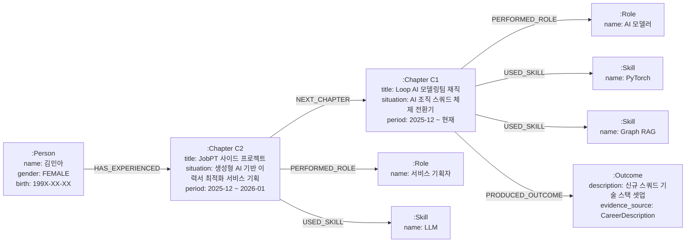

# GraphDB 엔티티 구조 Ideation (인재 중심)

## 핵심 구조

핵심 컨셉: 상황(Situation) – 역할(Role) – 결과(Outcome) 구조를 통한 인재 맥락 보존 및 Graph RAG 기반 추천 근거 확보

## 1. GraphDB 엔티티 및 관계 정의 전략

단순히 `Resume` 중심의 별 모양(Star Schema) 구조를 넘어, **역량과 경험이 교차되는 지점**을 엔티티화하는 것이 핵심

- **Node (엔티티):** 인재, 회사, 스킬, 챕터 등 핵심 개체
- **Edge (관계):** 각 엔티티 간의 의미론적 연결 (시간순, 소속 등)
- **Property (속성):** 노드와 관계 내부에 상세 텍스트(Chunk) 및 벡터 임베딩 저장

## 2. 핵심 엔티티 및 관계 정의

**2.1 주요 노드 (Nodes)**

| **노드명** | **설명** | **비고** |
| --- | --- | --- |
| **Person** | 구직자 본체 (기본 프로필 정보 포함) | 전역 고유 ID 관리 |
| **Chapter** | **[핵심]** 특정 기간 발생한 사건의 집합 (경력/학력/경험의 통합 단위) | Situation 정보 포함 |
| **Skill/Tool** | 보유 기술 스택 및 활용 도구 (Python, PyTorch 등) | 표준화된 공통 노드 |
| **Role** | 수행한 직무 및 직책 (데이터 사이언티스트, 팀장 등) | 표준 직무 코드 매핑 |
| **Organization** | 해당 경험이 발생한 기업 또는 기관 | 기업 성장 단계 속성 포함 |
| **Outcome** | 자격증, 수상 이력, 혹은 경력 기술서에서 추출된 정량적/정성적 성과 | 성과/결과 |

**2.2 주요 관계 (Edges)**

- `(:Person)-[:HAS_EXPERIENCED]->(:Chapter)` : 후보자의 경험 연결
- `(:Chapter)-[:NEXT_CHAPTER]->(:Chapter)` : **커리어 궤적(Trajectory) 보존**
- `(:Chapter)-[:PERFORMED_ROLE]->(:Role)` : 해당 시기의 역할 정의
- `(:Chapter)-[:USED_SKILL]->(:Skill)` : 투입된 기술 스택
- `(:Chapter)-[:OCCURRED_AT]->(:Organization)` : 경험의 배경 장소**

## 3. 맥락 및 근거 보존 상세 설계

### ① Chapter 노드: 상황(Situation) 중심의 통합

- **통합 관리:** `Career`, `Education`, `Experience` 데이터를 `Chapter`로 단일화하여 인재의 생애 주기를 관리합니다.
- **시간 기반 연결:** 각 Chapter를 `[:NEXT_CHAPTER]`로 연결하여 LLM이 후보자의 성장 서사를 읽을 수 있도록 합니다.

### ② Raw Text Chunk 삽입을 통한 근거(Evidence) 구체화

- **방식:** `Outcome` 노드를 파편화하는 대신, `Chapter` 노드 내부에 **`evidence_chunk`** 속성을 생성합니다.
- **내용:** 자격증, 수상, 자기소개서, 경력기술서에서 추출된 원본 텍스트(예: "시리즈 B~C 성장기 결제 모듈 구축...")를 직접 삽입합니다.
- **이점:** LLM이 추천 근거를 생성할 때 외부 데이터를 재조회할 필요 없이, 노드 내부의 풍부한 컨텍스트를 즉시 활용할 수 있습니다.

### ③ Vector Index를 통한 하이브리드 검색 전략

- **의미론적 검색:** `evidence_chunk`를 임베딩하여 **Vector Index**를 생성합니다.
- **검색 시나리오:**
    1. 사용자 쿼리(예: "성장기 스타트업 해결사")와 유사한 벡터를 가진 `Chapter` 노드 검색.
    2. 검색된 노드에서 그래프 탐색을 통해 주변 정보(Role, Skill, Trajectory) 취합.
    3. LLM이 "과거 [A사] 챕터에서 [B 성과]를 냈으므로 적합합니다"라는 고도화된 근거 생성.

### 예시 노드



### 노드 정의(원문 형태)

```
(:Person {name: "김민아", gender: "FEMALE", birth: "199X-XX-XX"})

C1: (:Chapter {title: "Loop AI 모델링팀 재직", situation: "AI 조직 스쿼드 체제 전환기", period: "2025-12 ~ 현재"})
C2: (:Chapter {title: "JobPT 사이드 프로젝트", situation: "생성형 AI 기반 이력서 최적화 서비스 기획", period: "2025-12 ~ 2026-01"})

(:Role {name: "AI 모델러"})
(:Role {name: "서비스 기획자"})

(:Skill {name: "PyTorch"})
(:Skill {name: "Graph RAG"})
(:Skill {name: "LLM"})

(:Outcome {description: "신규 스쿼드 기술 스택 셋업", evidence_source: "CareerDescription"})
```

### 관계 정의(원문 형태)

```
(Person)-[:HAS_EXPERIENCED]->(C2)-[:NEXT_CHAPTER]->(C1)
(C1)-[:PERFORMED_ROLE]->(:Role {name: "AI 모델러"})
(C1)-[:USED_SKILL]->(:Skill {name: "PyTorch"})
(C1)-[:USED_SKILL]->(:Skill {name: "Graph RAG"})

(샘플 추가)
(C2)-[:PERFORMED_ROLE]->(:Role {name: "서비스 기획자"})
(C2)-[:USED_SKILL]->(:Skill {name: "LLM"})
(C1)-[:PRODUCED_OUTCOME]->(Outcome)
```

- 참고 자료
    
    [석모님 초기 엔티티 Ideation](https://www.notion.so/02-Knowledge-Graph-Schema-2b2b52ac8da1813180d0d107ab8cab0a?pvs=21) 
    
    [석모님 Graph DB Ideation](https://www.notion.so/05-Data-Layer-2b2b52ac8da181849b69eccf51231a65?pvs=21)