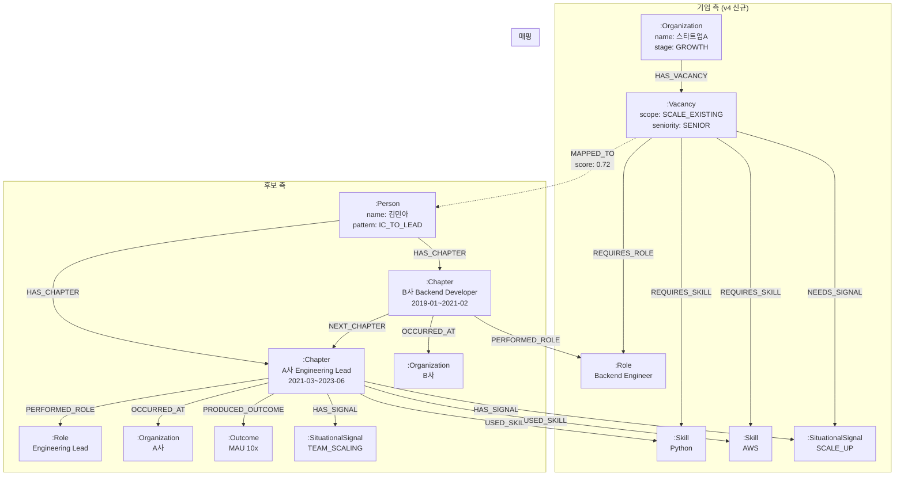

# 통합 Graph 스키마 v4

> v3 평가에서 식별된 **Company 측 모델링 부재, Evidence 구조 불일치**를 해결하는 통합 그래프 스키마.
> Company와 Candidate 양쪽을 모두 포함하며, MappingFeatures 생성을 위한 그래프 탐색 패턴을 정의.
>
> 작성일: 2026-03-08

---

## 1. 노드 정의

### 1.1 Person (후보자)

```
(:Person {
  person_id: STRING,           -- 전역 고유 ID
  name: STRING,
  resume_id: STRING,
  total_experience_years: FLOAT,
  role_evolution_pattern: STRING,  -- "IC_TO_LEAD" 등
  primary_domain: STRING,
  context_version: STRING,
  generated_at: DATETIME
})
```

### 1.2 Organization (기업)

**v3에서 누락되었던 Company 측 핵심 노드.** CompanyContext의 company_profile + stage_estimate를 그래프에 표현.

```
(:Organization {
  org_id: STRING,              -- company_id
  name: STRING,
  industry_code: STRING,
  industry_label: STRING,
  founded_year: INT,
  employee_count: INT,
  revenue_range: STRING,
  is_regulated_industry: BOOLEAN,
  stage_label: STRING,         -- "EARLY" / "GROWTH" / "SCALE" / "MATURE" / "UNKNOWN"
  stage_confidence: FLOAT,
  data_source: STRING,         -- "nice" / "invest_db" / "crawl"
  updated_at: DATETIME
})
```

### 1.3 Chapter (경험 단위)

Person의 각 Experience를 그래프 노드로 표현. v3 GraphDB의 Chapter 개념 유지.

```
(:Chapter {
  chapter_id: STRING,          -- experience_id
  title: STRING,               -- "A사 Engineering Lead"
  scope_type: STRING,          -- "IC" / "LEAD" / "HEAD" / "FOUNDER"
  period_start: STRING,        -- "2021-03"
  period_end: STRING,          -- "2023-06" | "present"
  duration_months: INT,
  scope_summary: STRING,
  evidence_chunk: STRING,      -- 이력서 원문 발췌 (Vector Index용)
  evidence_chunk_embedding: VECTOR  -- 임베딩 벡터
})
```

### 1.4 Role (역할)

```
(:Role {
  role_id: STRING,             -- 정규화된 역할 ID
  name: STRING,                -- "Backend Engineer"
  name_ko: STRING,             -- "백엔드 엔지니어"
  category: STRING             -- "engineering" / "product" / "design" / "data" / "business"
})
```

**정규화 전략**: 동의어 사전 기반. `{"팀 리더": "Team Lead", "팀장": "Team Lead", "테크리드": "Tech Lead"}`

### 1.5 Skill (기술)

```
(:Skill {
  skill_id: STRING,            -- 정규화된 스킬 ID
  name: STRING,                -- "Python"
  category: STRING,            -- "language" / "framework" / "database" / "infra" / "tool"
  aliases: STRING[]            -- ["파이썬", "py"]
})
```

### 1.6 Outcome (성과)

v3의 이중 설계(별도 노드 vs 속성)를 **별도 노드**로 확정. Evidence와 분리.

```
(:Outcome {
  outcome_id: STRING,
  description: STRING,         -- "MAU 10x 달성"
  outcome_type: STRING,        -- "METRIC" / "SCALE" / "DELIVERY" / "ORGANIZATIONAL"
  quantitative: BOOLEAN,
  metric_value: STRING,        -- "10x"
  confidence: FLOAT,
  evidence_span: STRING        -- 원문 근거
})
```

### 1.7 SituationalSignal (상황 라벨) — v4 신규

같은 상황을 경험한 후보를 그래프 탐색으로 연결하기 위한 **공유 노드**.

```
(:SituationalSignal {
  signal_id: STRING,           -- signal_label과 동일
  label: STRING,               -- "SCALE_UP" (14개 taxonomy)
  category: STRING,            -- "growth" / "org_change" / "tech_change" / "business"
  description: STRING          -- taxonomy 설명
})
```

### 1.8 Vacancy (채용 포지션) — v4 신규

CompanyContext의 vacancy를 그래프에 표현. **매칭의 기업 측 앵커.**

```
(:Vacancy {
  vacancy_id: STRING,          -- job_id
  scope_type: STRING,          -- "BUILD_NEW" / "SCALE_EXISTING" / "RESET" / "REPLACE"
  role_title: STRING,
  seniority: STRING,           -- "JUNIOR" ~ "HEAD"
  team_context: STRING,
  evidence_chunk: STRING,      -- JD 원문 발췌 (Vector Index용)
  evidence_chunk_embedding: VECTOR
})
```

---

## 2. 관계(Edge) 정의

### 2.1 후보 측 관계 (v3 유지 + 확장)

| 관계 | 설명 | edge 속성 |
|---|---|---|
| `(:Person)-[:HAS_CHAPTER]->(:Chapter)` | 후보의 경험 | seq_order: INT |
| `(:Chapter)-[:NEXT_CHAPTER]->(:Chapter)` | 시간순 궤적 | gap_months: INT |
| `(:Chapter)-[:PERFORMED_ROLE]->(:Role)` | 해당 시기의 역할 | confidence: FLOAT |
| `(:Chapter)-[:USED_SKILL]->(:Skill)` | 사용 기술 | — |
| `(:Chapter)-[:OCCURRED_AT]->(:Organization)` | 경험 배경 회사 | tenure_start, tenure_end, stage_at_tenure |
| `(:Chapter)-[:PRODUCED_OUTCOME]->(:Outcome)` | 성과 | confidence: FLOAT |
| `(:Chapter)-[:HAS_SIGNAL]->(:SituationalSignal)` | 경험한 상황 | confidence: FLOAT |

### 2.2 기업 측 관계 (v4 신규)

| 관계 | 설명 | edge 속성 |
|---|---|---|
| `(:Organization)-[:HAS_VACANCY]->(:Vacancy)` | 기업의 채용 포지션 | posted_at: DATETIME |
| `(:Vacancy)-[:REQUIRES_ROLE]->(:Role)` | 포지션이 요구하는 역할 | seniority: STRING |
| `(:Vacancy)-[:REQUIRES_SKILL]->(:Skill)` | 포지션이 요구하는 기술 | required / preferred |
| `(:Vacancy)-[:NEEDS_SIGNAL]->(:SituationalSignal)` | 포지션이 필요로 하는 상황 경험 | inferred: BOOLEAN |
| `(:Organization)-[:IN_INDUSTRY]->(:Industry)` | 산업 분류 | — |

### 2.3 매핑 관계 (v4 신규)

| 관계 | 설명 | edge 속성 |
|---|---|---|
| `(:Vacancy)-[:MAPPED_TO]->(:Person)` | 매핑 결과 | overall_score, generated_at |

---

## 3. 그래프 다이어그램



---

## 4. 핵심 그래프 탐색 쿼리 (Cypher 예시)

### Q1: vacancy_fit — 포지션이 필요로 하는 상황을 경험한 후보 탐색

```cypher
// Vacancy가 NEEDS_SIGNAL로 연결된 SituationalSignal을 경험한 후보 찾기
MATCH (v:Vacancy {vacancy_id: $job_id})
      -[:NEEDS_SIGNAL]->(sig:SituationalSignal)
      <-[:HAS_SIGNAL]-(ch:Chapter)
      <-[:HAS_CHAPTER]-(p:Person)
RETURN p.person_id,
       collect(DISTINCT sig.label) AS matched_signals,
       count(DISTINCT sig) AS match_count
ORDER BY match_count DESC
```

### Q2: stage_match — 동일 성장 단계 기업 경험 후보 탐색

```cypher
// 채용 기업과 같은 stage의 기업에서 일한 후보 찾기
MATCH (target_org:Organization {org_id: $company_id})
MATCH (ch:Chapter)-[:OCCURRED_AT]->(past_org:Organization)
WHERE past_org.stage_label = target_org.stage_label
      AND ch.duration_months >= 12  // 최소 1년 경험
MATCH (p:Person)-[:HAS_CHAPTER]->(ch)
RETURN p.person_id,
       past_org.name AS experienced_company,
       ch.duration_months,
       ch.scope_type
ORDER BY ch.duration_months DESC
```

### Q3: 유사 경험 후보 탐색 (Vector + Graph 하이브리드)

```cypher
// Step 1: Vector 검색으로 유사한 Chapter 찾기
CALL db.index.vector.queryNodes('chapter_embedding_index', 10, $jd_embedding)
YIELD node AS similar_chapter, score AS vector_score

// Step 2: 그래프 탐색으로 주변 정보 수집
MATCH (p:Person)-[:HAS_CHAPTER]->(similar_chapter)
MATCH (similar_chapter)-[:PERFORMED_ROLE]->(r:Role)
MATCH (similar_chapter)-[:USED_SKILL]->(s:Skill)
OPTIONAL MATCH (similar_chapter)-[:PRODUCED_OUTCOME]->(o:Outcome)
OPTIONAL MATCH (similar_chapter)-[:HAS_SIGNAL]->(sig:SituationalSignal)

RETURN p.person_id,
       similar_chapter.title,
       vector_score,
       collect(DISTINCT r.name) AS roles,
       collect(DISTINCT s.name) AS skills,
       collect(DISTINCT o.description) AS outcomes,
       collect(DISTINCT sig.label) AS signals
ORDER BY vector_score DESC
```

### Q4: NEEDS_SIGNAL 자동 추론 (Vacancy 생성 시)

Vacancy 노드의 `NEEDS_SIGNAL` 관계를 JD 분석에서 자동 생성하는 로직.

```python
# vacancy_scope_type → SituationalSignal 연결 (01_company_context.md의 매핑 테이블 기반)
def infer_vacancy_signals(vacancy):
    SCOPE_TO_SIGNALS = {
        "BUILD_NEW": ["NEW_SYSTEM_BUILD", "EARLY_STAGE", "PMF_SEARCH", "TEAM_BUILDING"],
        "SCALE_EXISTING": ["SCALE_UP", "TEAM_SCALING", "LEGACY_MODERNIZATION"],
        "RESET": ["LEGACY_MODERNIZATION", "TURNAROUND", "TECH_STACK_TRANSITION", "REORG"],
        "REPLACE": []
    }

    signals = SCOPE_TO_SIGNALS.get(vacancy.scope_type, [])

    # JD 텍스트에서 추가 시그널 탐지
    jd_signals = llm_extract_signals_from_jd(vacancy.evidence_chunk)
    signals = list(set(signals + jd_signals))

    return [
        ("NEEDS_SIGNAL", signal_label, {"inferred": True})
        for signal_label in signals
    ]
```

---

## 5. Vector Index 전략

| 대상 노드 | 임베딩 대상 텍스트 | 인덱스 용도 |
|---|---|---|
| `:Chapter` | evidence_chunk (이력서 원문 발췌) | JD ↔ 경험 유사도 검색 |
| `:Vacancy` | evidence_chunk (JD 원문 발췌) | 후보 경험 ↔ JD 유사도 검색 |
| `:Outcome` | description | 성과 유사도 검색 (v2) |

### 임베딩 모델 선택 기준

| 요구사항 | 권장 |
|---|---|
| 한국어+영어 혼합 | multilingual 모델 필수 |
| 문장~단락 수준 | sentence-level embedding |
| v1 후보 | OpenAI text-embedding-3-small, Cohere embed-multilingual-v3.0 |

---

## 6. 기술 스택 후보

| 컴포넌트 | 옵션 A (권장) | 옵션 B | 비고 |
|---|---|---|---|
| Graph DB | **Neo4j AuraDB** | Amazon Neptune | Neo4j는 Vector Index 내장, Cypher 생태계 |
| Vector Index | Neo4j Vector Index | 별도 Pinecone/Weaviate | Neo4j 5.11+ 내장 벡터 인덱스 권장 |
| 서빙 (v1) | BigQuery 테이블 | — | Graph에서 배치 추출 후 BQ 적재 |
| LLM (추출) | GPT-4o / Claude | — | 추출 프롬프트 품질 비교 필요 |
| Embedding | text-embedding-3-small | Cohere multilingual | 비용/품질 트레이드오프 |
