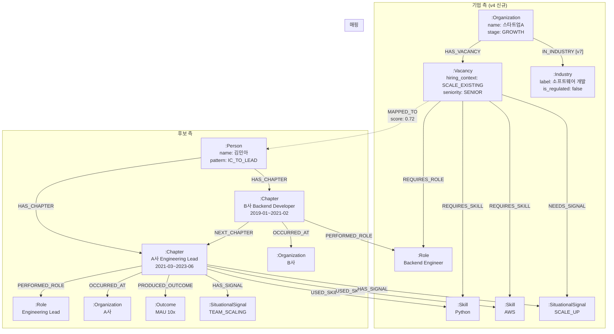

# 통합 Graph 스키마

> 작성일: 2026-03-11
> 

---

## 1. 노드 정의

### 1.1 Person (후보자)

```
(:Person {
  person_id: STRING,           -- 전역 고유 ID (SiteUserMapping.id)
  name: STRING,
  resume_id: STRING,
  total_experience_years: FLOAT,
  role_evolution_pattern: STRING,  -- "IC_TO_LEAD" 등
  primary_domain: STRING,

  // --- (데이터 분석 v2.1 기반, 00_data_source_mapping §3.5) ---
  gender: STRING | null,          -- "M" / "F" / "OTHER" (fill rate 100%, 매칭 점수에 사용 금지, 편향 모니터링 전용) [v23: analytics 분리 검토]
  age: INT | null,                -- 1~100 필터 적용 (fill rate 93.3%, 평균 36.2세, age>100 이상치 제거) [v23: analytics 분리 검토]
  career_type: STRING,            -- "EXPERIENCED" / "NEW_COMER" (fill rate 100%, EXPERIENCED 69.1%)
  freshness_weight: FLOAT,        -- 0.3~1.0 (resume.userUpdatedAt 기반, 00_data_source_mapping §3.5 참조)
  education_level: STRING | null, -- education.schoolType MAX 기반 (fill rate 95.6%, finalEducationLevel 35.6% 불일치 -> schoolType 진실 소스)

  context_version: STRING,
  generated_at: DATETIME
})
```

> **[v23]** gender, age는 매칭 점수에 사용 금지 (편향 모니터링 전용). v2에서 별도 analytics 테이블 분리를 검토한다.

> **v1 매칭 범위 제한**: v1에서 MAPPED_TO 엣지 생성(매칭) 대상은 `career_type = "EXPERIENCED"` Person 노드로 제한한다. NEW_COMER(30.9%)는 Person 노드로 존재하지만 매칭 대상에서 제외된다. 상세: `03_mapping_features.md §0.1`.
> 

### 1.2 Organization (기업)

**Company 측 핵심 노드.** CompanyContext의 company_profile + stage_estimate를 그래프에 표현.

```
(:Organization {
  org_id: STRING,              -- company_id
  // [v3] Organization 고유 회사명: resume-hub 4,479,983개 + LinkedIn 933,923개
  // 정규화 전략: BRN 1차(62%) → 회사명 argMax 2차(38%) → LinkedIn company_id 3차 교차
  name: STRING,
  industry_code: STRING,
  industry_label: STRING,
  founded_year: INT,
  employee_count: INT,
  revenue_range: STRING,
  is_regulated_industry: BOOLEAN,
  stage_label: STRING,         -- "EARLY" / "GROWTH" / "SCALE" / "MATURE" / "UNKNOWN"
  stage_confidence: FLOAT,
  data_source: STRING,         -- "nice" / "invest_db" / "crawl"
  updated_at: DATETIME,

  // --- v1.1 크롤링 보강 속성 (optional, 크롤링 활성화 전까지 null) [v10] ---
  product_description: STRING | null,   -- 홈페이지 P2에서 추출
  market_segment: STRING | null,        -- 홈페이지 P1+P2에서 추출
  latest_funding_round: STRING | null,  -- 뉴스 N1에서 추출
  latest_funding_date: DATE | null,     -- 뉴스 N1에서 추출
  crawl_quality: FLOAT | null,          -- 크롤링 품질 지표 (0~1)
  last_crawled_at: DATETIME | null      -- 최종 크롤링 일시
})
```

> 크롤링 보강 속성은 `06_crawling_strategy.md` 5.4절의 Cypher 확장 스키마와 매칭. v1에서는 모두 null이며, 크롤링 활성화 시 채워진다. Neo4j 스키마 구현 시 이 속성들을 nullable로 선언해 두면 마이그레이션 없이 바로 사용 가능
> 

### 1.3 Chapter (경험 단위)

Person의 각 Experience를 그래프 노드로 표현

> **Chapter 분할 원칙 [S-3]**: “resume-hub Career 레코드 1건 = 1 Chapter”. 동일 회사에서 직급/직무 변경으로 Career 레코드가 2건 이상인 경우에도 각각 독립 Chapter로 생성한다. 이 경우 NEXT_CHAPTER 엣지의 `gap_months = 0`으로 설정하며, 동일 Organization 노드를 공유한다 (OCCURRED_AT 관계). 상세: `02_candidate_context.md §2.1`.
> 

```
(:Chapter {
  chapter_id: STRING,          -- experience_id
  title: STRING,               -- "A사 Engineering Lead"
  scope_type: STRING,          -- "IC" / "LEAD" / "HEAD" / "FOUNDER" / "UNKNOWN"
  period_start: STRING,        -- "2021-03"
  period_end: STRING,          -- "2023-06" | "present"
  duration_months: INT,
  scope_summary: STRING,
  evidence_chunk: STRING,      -- 이력서 원문 발췌 (Vector Index용)
  evidence_chunk_embedding: VECTOR  -- 임베딩 벡터
  // [v3] SIE 모델(GLiNER2)로 evidence_chunk 정밀 추출 가능 — Span 기반, Hallucination 없음
})
```

### 1.4 Role (역할)

```
(:Role {
  role_id: STRING,             -- 정규화된 역할 ID
  name: STRING,                -- "Backend Engineer"
  name_ko: STRING,             -- "백엔드 엔지니어"
  category: STRING             -- "engineering" / "product" / "design" / "data" / "business"
  // [v3] JOB_CLASSIFICATION_SUBCATEGORY 242개 과도 세분화 이슈
  // 권장: JobCategory(~30개) → JobClassification(242개) 2단 계층 도입
})
```

**정규화 전략**: 동의어 사전 기반. `{"팀 리더": "Team Lead", "팀장": "Team Lead", "테크리드": "Tech Lead"}`

### 1.5 Skill (기술)

```
(:Skill {
  skill_id: STRING,            -- 정규화된 스킬 ID
  name: STRING,                -- "Python"
  category: STRING,            -- "language" / "framework" / "database" / "infra" / "tool"
  aliases: STRING[]            -- ["파이썬", "py"]
})
```

> **매칭 시 HARD_SKILL만 사용**: Skill 노드는 HARD_SKILL과 SOFT_SKILL 모두 저장하지만, **MappingFeatures 스킬 매칭(F3 domain_fit 보조, 00_data_source_mapping §4.3)에서는 `type=HARD` 스킬만 사용한다.** SOFT_SKILL은 TOP 10의 60%가 “성실성(25.2%), 긍정적(17.3%)”으로 편중되어 있어 매칭 노이즈를 유발하므로 제외한다. SOFT_SKILL Skill 노드는 후보 프로필 표시용으로만 유지한다.
> 

### 1.6 Outcome (성과)

Evidence와 분리.

> **v1 ROI 결정**: Outcome은 v1 MappingFeatures(F1~F5)에서 매칭 피처로 **사용하지 않는다** (상세: `03_mapping_features.md §2 F2 보충`). 그러나 LLM 추출은 SituationalSignal과 동일 호출에서 수행되므로 추가 비용이 미미하여 **v1에서 추출 수행**. Neo4j 적재는 선택적 - v1 파일럿에서 Outcome 노드 없이 시작하고, Q3 하이브리드 검색의 필요에 따라 적재 여부를 결정할 수 있다. 상세: `02_candidate_context.md §2.2`.
> 

```
(:Outcome {
  outcome_id: STRING,
  description: STRING,         -- "MAU 10x 달성"
  outcome_type: STRING,        -- "METRIC" / "SCALE" / "DELIVERY" / "ORGANIZATIONAL" / "OTHER"
  quantitative: BOOLEAN,
  metric_value: STRING,        -- "10x"
  confidence: FLOAT,
  evidence_span: STRING        -- 원문 근거
})
```

### 1.7 SituationalSignal (상황 라벨)

같은 상황을 경험한 후보를 그래프 탐색으로 연결하기 위한 **공유 노드**.

```
(:SituationalSignal {
  signal_id: STRING,           -- signal_label과 동일
  label: STRING,               -- "SCALE_UP" (14개 taxonomy)
  category: STRING,            -- "growth" / "org_change" / "tech" / "business" / "other"
  description: STRING          -- taxonomy 설명
})
```

### 1.8 Vacancy (채용 포지션)

CompanyContext의 vacancy를 그래프에 표현. **매칭의 기업 측 앵커.**

```
(:Vacancy {
  vacancy_id: STRING,          -- job_id
  hiring_context: STRING,      -- "BUILD_NEW" / "SCALE_EXISTING" / "RESET" / "REPLACE" [v17: scope_type에서 명칭 변경]
  role_title: STRING,
  seniority: STRING,           -- "JUNIOR" ~ "HEAD"
  team_context: STRING,
  evidence_chunk: STRING,      -- JD 원문 발췌 (Vector Index용)
  evidence_chunk_embedding: VECTOR
})
```

### 1.9 Industry

`:Industry` 노드는 **code-hub INDUSTRY_SUBCATEGORY (63개 코드)** 기반의 마스터 데이터로 사전 생성된다.

> Industry 노드의 `industry_id`도 code-hub 기준으로 변경한다. NICE 코드는 보조 소스로 교차 검증 활용
> 

```
(:Industry {
  industry_id: STRING,        -- code-hub INDUSTRY_SUBCATEGORY 코드 (63개, primary)
  label: STRING,              -- code-hub detail_name (예: "소프트웨어 개발")
  category: STRING,           -- code-hub INDUSTRY_CATEGORY (1depth 대분류)
  category_label: STRING,     -- 대분류명
  nice_code: STRING | null,   -- NICE 업종 코드 (보조, 교차 검증용) [v13]
  is_regulated: BOOLEAN       -- 규제 산업 여부
})
```

**생성 규칙**:
- code-hub INDUSTRY_SUBCATEGORY 63개 코드 기반으로 Industry 노드를 사전 생성 (마스터 데이터)
- Organization 노드 생성 시 industry_code로 매칭하여 IN_INDUSTRY 관계 생성
- 동일 업종의 기업들이 하나의 Industry 노드를 공유 -> “같은 산업의 기업” 그래프 탐색 가능
- NICE 코드가 있는 경우 `nice_code`에 보조 저장하여 외부 데이터 교차 검증에 활용

**is_regulated 판정 기준**:

| 대분류 코드 | 대분류명 | is_regulated | 근거 |
| --- | --- | --- | --- |
| K | 금융 및 보험업 | true | 금융위원회/금감원 규제 |
| Q | 보건업 및 사회복지 서비스업 | true | 보건복지부/식약처 규제 |
| D | 전기, 가스, 증기 및 공기조절 공급업 | true | 에너지 규제 |
| H | 운수 및 창고업 | true | 교통/물류 규제 |
| 기타 | – | false | 기본값 |

```python
REGULATED_CATEGORIES = {"K", "Q", "D", "H"}

def is_regulated_industry(industry_code):
    """code-hub INDUSTRY_CATEGORY 대분류가 규제 산업인지 판정"""
    category = lookup_common_code(type="INDUSTRY_SUBCATEGORY", code=industry_code)
    if not category:
        return False
    return category.group_code in REGULATED_CATEGORIES
```

> 세분류 수준의 규제 산업(예: J631 내 핀테크)은 v2에서 수동 태깅으로 보완한다.
> 

---

## 2. 관계(Edge) 정의

### 2.1 후보 측 관계

| 관계 | 설명 | edge 속성 |
| --- | --- | --- |
| `(:Person)-[:HAS_CHAPTER]->(:Chapter)` | 후보의 경험 | seq_order: INT |
| `(:Chapter)-[:NEXT_CHAPTER]->(:Chapter)` | 시간순 궤적 | gap_months: INT |

> **[v23] 방향 규약**: NEXT_CHAPTER는 시간순으로 **이전 Chapter -> 이후 Chapter** 방향이다. 즉 화살표가 과거에서 미래를 가리킨다. `(C_2019) -[:NEXT_CHAPTER]-> (C_2021)`.

| `(:Chapter)-[:PERFORMED_ROLE]->(:Role)` | 해당 시기의 역할 | confidence: FLOAT |
| `(:Chapter)-[:USED_SKILL]->(:Skill)` | 사용 기술 | - (아래 recency 결정 참조) |
| `(:Chapter)-[:OCCURRED_AT]->(:Organization)` | 경험 배경 회사 | tenure_start, tenure_end, stage_at_tenure |
| `(:Chapter)-[:PRODUCED_OUTCOME]->(:Outcome)` | 성과 | confidence: FLOAT |
| `(:Chapter)-[:HAS_SIGNAL]->(:SituationalSignal)` | 경험한 상황 | confidence: FLOAT |

> **USED_SKILL Skill recency 결정**: v1에서 USED_SKILL 엣지에 `last_used_year` 또는 `recency_weight` 속성을 **별도로 추가하지 않는다.** 스킬의 사용 시점은 `(:Chapter)-[:USED_SKILL]->(:Skill)` 관계를 통해 Chapter의 `period_start`/`period_end`로 추론 가능하며, 별도 속성을 두면 Chapter.period와 이중 관리가 된다. 매칭 시 스킬의 recency가 필요하면 Chapter.period를 조회하여 계산한다. v2에서 실제 매칭 품질에 recency가 유의미한 영향을 미치는지 검증 후, 성능 최적화가 필요하면 별도 속성 추가를 재검토한다.
> 

### 2.2 기업 측 관계

| 관계 | 설명 | edge 속성 |
| --- | --- | --- |
| `(:Organization)-[:HAS_VACANCY]->(:Vacancy)` | 기업의 채용 포지션 | posted_at: DATETIME |
| `(:Vacancy)-[:REQUIRES_ROLE]->(:Role)` | 포지션이 요구하는 역할 | seniority: STRING |
| `(:Vacancy)-[:REQUIRES_SKILL]->(:Skill)` | 포지션이 요구하는 기술 | required / preferred |
| `(:Vacancy)-[:NEEDS_SIGNAL]->(:SituationalSignal)` | 포지션이 필요로 하는 상황 경험 | inferred: BOOLEAN |
| `(:Organization)-[:IN_INDUSTRY]->(:Industry)` | 산업 분류 [v7] | - |

Organization 생성 시 industry_code 기준으로 자동 연결. 동일 업종 기업은 같은 Industry 노드를 공유하여 산업별 그래프 탐색 지원

### 2.3 매핑 관계

| 관계 | 설명 | edge 속성 |
| --- | --- | --- |
| `(:Vacancy)-[:MAPPED_TO]->(:Person)` | 매핑 결과 | overall_score, generated_at, last_accessed_at [v15] |

### 2.4 v1 범위 밖 관계

v1에서 Company 간 관계는 데이터 소스 부재, MappingFeatures 직접 기여 없음, 그래프 복잡도 관리 이유로 제외

**v2 로드맵**:

| 관계 | 도입 시기 | 데이터 소스 | 활용 피처 |
| --- | --- | --- | --- |
| `(:Organization)-[:COMPETES_WITH]->(:Organization)` | v2 | 뉴스(N3) + 수동 태깅 | competitive_landscape |
| `(:Organization)-[:INVESTED_BY]->(:Investor)` | v1.1 | TheVC API | stage_estimate 보강 |
| `(:Organization)-[:ACQUIRED]->(:Organization)` | v2 | 뉴스(N3) | structural_tensions |
| `(:Organization)-[:PARTNERED_WITH]->(:Organization)` | v2 | 뉴스(N3) | domain_positioning |

---

## 3. 그래프 다이어그램



---

## 4-9. Neo4j 구현 상세

> §4-§9 (Cypher 쿼리, Vector Index, 기술 스택, 규모 추정, 인덱스 전략, BQ-Neo4j 동기화)
> → 03.graphrag/results/implement_planning/separate/v8/graphrag/07_neo4j_schema.md로 이동