# S&F ↔ GraphRAG 인터페이스 사양

> 두 팀 간의 **Data Contract, API SLA, Go/No-Go 기준, 의사결정 포인트, 리스크 관리**를 정의하는 공동 문서

---

## 핵심 원칙

S&F 팀과 GraphRAG 팀은 **Data Contract(JSON) + Event(PubSub)**으로만 결합합니다.
GraphRAG는 "텍스트가 어떻게 파싱/벡터화되었는지" 전혀 알 필요가 없고,
S&F는 "그래프가 어떻게 구조화/매칭되는지" 전혀 알 필요가 없습니다.

---

## 통합 병렬 타임라인

```mermaid
gantt
    title VG4 — S&F / GraphRAG 병렬 파이프라인
    dateFormat W
    axisFormat %W주차

    section S&F 팀 (~22주)
    환경+PoC (W1)            :sf_0, 0, 1w
    전처리/PII (W2-3)        :sf_1, after sf_0, 2w
    LLM 추출 1K (W4-5)      :sf_2, after sf_1, 2w
    파서구축 (W7-9)          :sf_3, after sf_2, 3w
    Batch 600K (W10-15)      :sf_4, after sf_3, 6w
    JD+Company (W17-18)      :sf_5, after sf_4, 2w
    잔여+크롤링 (W19-27)     :sf_6, after sf_5, 9w

    section 인터페이스 포인트
    ① PoC 결과 (수동)        :milestone, m0, after sf_0, 0d
    ② 1K JSON (PubSub)       :milestone, m1, after sf_2, 0d
    ③ 480K+ JSON (PubSub)    :milestone, m2, after sf_4, 0d
    ④ JD+Cmp JSON (PubSub)   :milestone, m3, after sf_5, 0d

    section GraphRAG 팀 (~18주)
    G-0: Neo4j 환경 (0.5주)          :gr_0, 0, 0.5w
    [대기A] API골격+선행 (W2-4)      :gr_w1, after gr_0, 3w
    G-1: MVP 적재+API (W5-6)         :gr_1, after m1, 2w
    [대기B] Bulk코드+사이징 (W7-9)   :gr_w2, after gr_1, 1.5w
    G-2: 대량 적재+벤치마크 (W10-11) :gr_2, after m2, 2w
    버퍼/Go-NoGo (W11후반)           :gr_buf, after gr_2, 0.5w
    G-3: 매칭+ER+튜닝 (W17-22)       :gr_3, after m3, 5.5w
    G-4: 증분+운영 (W24-26)          :gr_4, after gr_3, 3w
```

---

## 태스크 분류 집계 (73개)

> 상세 태스크 테이블: `v1/c_01_task_classification.md` 참조

| 팀 | Phase 0 | Phase 1 | Phase 2 | Phase 3 | Phase 4 | **합계** |
|----|---------|---------|---------|---------|---------|--------|
| **S&F** | 10 | 8 | 10 | 6 | 1 | **35 (48%)** |
| **GraphRAG** | 1 | 7 | 4 | 7 | 10 | **29 (40%)** |
| **공동** | 2 | 1 | 2 | 3 | 1 | **9 (12%)** |
| **합계** | 13 | 16 | 16 | 16 | 12 | **73** |

---

## 문서 목록

| # | 파일 | 내용 |
|---|------|------|
| 0 | `00_data_contract.md` | PubSub 토픽 스키마, JSON 3종(Candidate/Vacancy/Enrichment), 산출물 5종 교환 스펙, 2-Tier API SLA, 서비스 계정 4개 보안 |
| 1 | `01_go_nogo_decisions.md` | Phase별 Go/No-Go 통과 기준(팀별 주체 명시), 의사결정 14건(시점·주체·실패 대응), 주간 싱크 회의 |
| 2 | `02_risks.md` | 팀 분리 5대 리스크(R1~R5) + 완화 방안, v5 리스크 이관 항목, 스키마 변경 관리, 실행 체크리스트(E1~E5) |

---

## 2-Tier API SLA

| 구간 | p95 | 담당 |
|------|-----|------|
| S&F API (하드필터+벡터) | < 500ms | S&F |
| GraphRAG API (IN-list 매칭) | < 2s | GraphRAG |
| **전체 체인** | **< 3s** | 공동 |
