# VC4 — GraphRAG 팀 독립 실행 계획

> **인력**: DE 1명 + MLE 1명
> **전제**: S&F 팀이 하드필터·PII·파싱·임베딩·LLM 추출을 전담. GraphRAG는 Chapter 중심 그래프 연산에 집중.

---

## 1. 병렬 타임라인 (Mermaid Gantt)

```mermaid
gantt
    title VC4 — S&F / GraphRAG 병렬 파이프라인 (최종)
    dateFormat W
    axisFormat %W주차
    
    section S&F 팀 (~22주)
    환경+PoC (W1)            :sf_0, 0, 1w
    전처리/PII (W2-3)        :sf_1, after sf_0, 2w
    LLM 추출 1K (W4-5)      :sf_2, after sf_1, 2w
    파서구축 (W7-9)          :sf_3, after sf_2, 3w
    Batch 600K (W10-15)      :sf_4, after sf_3, 6w
    JD+Company (W17-18)      :sf_5, after sf_4, 2w
    잔여+크롤링 (W19-27)     :sf_6, after sf_5, 9w
    
    section 인터페이스 포인트
    ① PoC 결과 (수동)        :milestone, m0, after sf_0, 0d
    ② 1K JSON (PubSub)       :milestone, m1, after sf_2, 0d
    ③ 480K+ JSON (PubSub)    :milestone, m2, after sf_4, 0d
    ④ JD+Cmp JSON (PubSub)   :milestone, m3, after sf_5, 0d

    section GraphRAG 팀 (~12.5주)
    G-0: Neo4j 환경 (0.5주)          :gr_0, 0, 0.5w
    [대기A] API골격+선행 (W2-4)      :gr_w1, after gr_0, 3w
    G-1: MVP 적재+API (W5-6)         :gr_1, after m1, 2w
    [대기B] Bulk코드+사이징 (W7-9)   :gr_w2, after gr_1, 1.5w
    G-2: 대량 적재+벤치마크 (W10-11) :gr_2, after m2, 2w
    버퍼 Go/No-Go (W11후반)          :gr_buf, after gr_2, 0.5w
    G-3: 매칭+ER+튜닝 (W17-22)       :gr_3, after m3, 5.5w
    G-4: 증분+운영 (W24-26)          :gr_4, after gr_3, 3w
```

---

## 2. Phase 상세 + 선행 작업

### G-0: Neo4j 환경 + 스키마 (0.5주, W1 후반)
- DE: Neo4j AuraDB Free + v19 스키마 + Vector Index(768d)
- MLE: UNWIND Batch 적재 코드 골격
- 공동: GCP 환경 분담

### 대기 구간 A (W2~4, ~3주) — S&F 1K 처리 대기
> **선행 작업 (~2주)**:
> - GraphRAG REST API 골격 설계 (FastAPI, 라우트 정의)
> - Cypher 쿼리 5종 초안 + Mock 데이터 테스트
> - PII 필터 미들웨어 설계 + 단위 테스트 (N2)
> - NEXT_CHAPTER 연결 로직 설계 + 테스트 데이터
> - GCS→PubSub→Cloud Run Job 자동 적재 트리거 구축

### G-1: 그래프 MVP (2주, W5~6)
- W5: PubSub 트리거로 1,000건 JSON 자동 수신 → 노드/엣지 적재
  - Person, Chapter, Skill, Role, Organization, Industry (v19)
  - NEXT_CHAPTER 연결 (chapters[] 순서 기반)
  - Idempotency + 롤백 테스트
- W6: Cypher 쿼리 5종 + REST API 배포
  - /search/skills, /search/semantic, /search/compound
  - /candidates/{id} (PII 필터링)
  - API Key 인증 + Rate limiting + /health
- 공동: E2E 검증 + 스팟체크 50건

**산출물**: Neo4j MVP (1K), REST API 5종, PII 정의서, PubSub 적재 파이프라인

### 대기 구간 B (W7~9, ~1.5주) — S&F Batch 시작 대기
> **선행 작업 (~1주)**: Neo4j Professional 사이징 외삽 스크립트, Bulk Loading 오케스트레이션 코드

### G-2: 대규모 적재 + 사이징 (2주, W10~11)
- W10: Neo4j Free→Professional 전환 (A3), 메모리 측정 → 600K 외삽 (N8)
- W10~11: PubSub 트리거로 S&F 완료분 순차 적재 (batch_size=100)
- W11: 쿼리 성능 벤치마크 (Cypher 5종 × 480K+, **p95 < 2초**)

**산출물**: Neo4j Professional (사이징 확정), 480K+ Graph, 벤치마크 결과

### 버퍼 0.5주 (W11 후반): Go/No-Go

### G-3: 매칭 알고리즘 + 기업 그래프 (4주+테스트, W17~22)
- W17: 매칭 설계 (MappingFeatures F1~F5, MAPPED_TO 규모 추정 N3)
- W17 후반: Vacancy 노드 적재 (PubSub로 S&F JD JSON 수신)
  - v19: HAS_VACANCY, REQUIRES_ROLE, REQUIRES_SKILL, NEEDS_SIGNAL
- W18: Organization ER + 한국어 특화 (계열사 사전: 삼성/현대/SK/LG/롯데 초기)
  - S&F NICE 데이터 + BigQuery 조인
- W19~20: 5-피처 스코어링 구현 + MAPPED_TO 생성 (임계값 ≥ 0.4)
  - GraphRAG API 확장: /match/jd-to-candidates, /match/candidate-to-jds
- W20: 가중치 수동 튜닝 (3~4 조합 Top-10 비교)
- W21: 통합 테스트 + 매칭 50건 수동 검증
- W22: 버퍼 Go/No-Go

**산출물**: 매칭 알고리즘, 5-피처 스코어링, Organization ER, 가중치 튜닝

### G-4: 증분 + 운영 (3주, W24~26)
- W24: 증분 처리(변경 감지, DETACH DELETE 2단계, 소프트 삭제)
- W25: Cloud Workflows DAG + 보강 데이터 PubSub 적재
- W25~26: Gold Label 100건 + Runbook 5종 + Alarm 10종 + Cold Start 대응
- W26: 인수인계 문서

**W27**: Final Go/No-Go → 프로덕션 전환

---

## 3. 리소스 활용률 (Work vs Wait)

| 구간 | 기간 | 유형 | 순수 작업량 |
|------|------|------|-----------|
| G-0 | 0.5주 | Work | 0.5주 |
| 대기 A | 3주 | Wait+선행 | 선행 2주 + 유휴 1주 |
| G-1 | 2주 | Work | 2주 |
| 대기 B | 1.5주 | Wait+선행 | 선행 1주 + 유휴 0.5주 |
| G-2 | 2주 | Work | 2주 |
| 버퍼 | 0.5주 | 판정 | — |
| G-3+테스트 | 5.5주 | Work | 5.5주 |
| G-4 | 3주 | Work | 3주 |
| **합계** | **18주** | | **순수 작업 ~13주, 유휴 ~1.5주** |

> **리소스 활용률: ~87%** (유휴 1.5주 / 가동 18주)

---

## 4. Go/No-Go 기준

| 전환 | 통과 조건 |
|------|---------|
| **G-1 → G-2** | 1K Person·Chapter·Skill 정상 적재, API 5종 응답 정상, NEXT_CHAPTER 오류 0건 |
| **G-2 → G-3** | 480K+ 적재, Neo4j 사이징 안정, Cypher **p95 < 2초** |
| **G-3 → G-4** | MAPPED_TO 규모 정상 (N3), Top-10 적합도 **70%+**, 가중치 튜닝 완료 |

---

## 5. GraphRAG 팀 비용

| Phase | Neo4j | Cloud Run/기타 | Gold Label | **합계** |
|-------|-------|-------------|-----------|--------|
| G-0~G-1 | $0 (Free) | ~$15 | — | **~$15** |
| G-2 | $55~110 | ~$20 | — | **~$75~130** |
| G-3 | $225~450 | ~$25 | — | **~$250~475** |
| G-4 | $150~300 | ~$25 | $2,920~5,840 | **~$3,095~6,165** |
| **합계** | **$430~860** | **~$85** | **$2,920~5,840** | **~$3,435~6,785** |
