# 2. 실행 타임라인 및 마일스톤 (vg2)

> **요약**: v5 원본의 27주 단일 파이프라인(DE/MLE 병행)을 "S&F팀의 비정형 처리"와 "GraphRAG팀의 지식 그래프 매칭" 두 개의 병렬 파이프라인으로 쪼개어, 전체 크리티컬 패스를 최소화하고 GraphRAG 시스템의 순수 유휴를 낮춘다.

---

## 2.1. 전체 병렬 타임라인 개요 (약 12.5주 + α)

> **S&F 진행 상황에 따른 대기 및 자동화 트리거 파이프라인 최적화**

```mermaid
gantt
    title GraphRAG 고도화 태스크 병렬화 파이프라인 (vg2)
    dateFormat W
    axisFormat %W주차
    
    section S&F 팀 (~22주)
    환경 및 PoC (W1)         :sf_1, 0, 1w
    전처리/마스킹 (W2-3)     :sf_2, after sf_1, 2w
    1K 추출 (W4-5)           :sf_3, after sf_2, 2w
    설계/파서구축 (W7-9)     :sf_4, after sf_3, 3w
    600K Batch (W10-15)      :sf_5, after sf_4, 6w
    JD+Company (W17-18)      :sf_6, after sf_5, 2w
    
    section (트리거)
    1K JSONL (GCS + PubSub)  :milestone, m1, after sf_3, 0d
    480K+ JSONL (GCS+PubSub) :milestone, m2, after sf_5, 0d
    JD JSONL (GCS + PubSub)  :milestone, m3, after sf_6, 0d

    section GraphRAG 팀 (~12.5주)
    G-0: 스키마 및 환경 (W1.5)           :gr_0, 0, 0.5w
    [대기 A] API 설계, 선행 (W2-4)      :gr_w1, after gr_0, 3w
    G-1: 1K MVP 적재 + API (W5-6)       :gr_1, after m1, 2w
    [대기 B] Bulk Code/사이징 (W7-9)    :gr_w2, after gr_1, 1.5w
    G-2: 대량 적재 + 벤치마크 (W10-11)   :gr_2, after m2, 2w
    G-3: 매칭 알고리즘 + ER (W17-20)    :gr_3, after m3, 4w
    G-4: 증분 처리 + 운영 (W24-26)      :gr_4, after gr_3, 3w
```

---

## 2.2 Phase별 세부 실행 및 Go/No-Go

> *v5의 전체 73개 태스크 분류 기준을 따름. GraphRAG 팀의 실제 워크로드는 "순수 작업" 약 8주에, "대기 구간 동안의 선행 작업"으로 유휴 리소스를 87% 효율로 활용한다.*

### Phase G-0: Neo4j 환경 및 스키마 (0.5주)

* **주요 작업**:
  * Neo4j AuraDB Free 인스턴스 구축
  * v19 표준 스키마 적용
  * Graph 적재 공통 골격 작성 (UNWIND Batch 템플릿)
* **대기 구간 A 선행 작업 (W2~4)**: S&F 1K 처리 대기. API 라우터 설계 및 PubSub GCS 이벤트 수신 트리거(Cloud Run) 아키텍처 준비.

### Phase G-1: 그래프 MVP 구축 (2주)

* **조건**: S&F에서 PubSub을 통해 *첫 번째 PoC 및 1K JSON 데이터 통지*
* **주요 작업**:
  * **수동 적재 제거**: PubSub 메시지 트리거로 1,000건 노드 엣지 자동 적재.
  * GraphRAG REST API 배포 (FastAPI: 스킬 검색/복합 조건 등 `Q1~Q5`)
* **Go/No-Go 통과 기준**: Cypher 5종 API 정상 응답 및 NEXT_CHAPTER 무결성 에러 0건.

### Phase G-2: 스케일링 및 최적화 (2주)

* **조건**: S&F에서 대규모 480K+ JSON Batch 추출 통지 (PubSub, Chunk 단위)
* **대기 구간 B 선행 작업 (W7~9)**: Neo4j 외삽(N8) 스크립트 작성, Bulk 오케스트레이션 설계.
* **주요 작업**:
  * Free → Professional 인스턴스 마이그레이션 및 확장.
  * S&F의 10K 청크 단위 Bulk Load 수행.
  * Graph 구조적 매칭 성능(Cypher 인덱싱) 벤치마크 (p95 < 2s).
* **Go/No-Go 통과 기준**: 전체 ID 리스트 중 유효 노드 손실 < 1% 및 스케일 아웃 후에도 SLA 인메모리 반응속도 준수.

### Phase G-3: 매칭 알고리즘 고도화 (4주)

* **조건**: S&F에서 Vacancy (JD) 및 Company 추출 데이터 PubSub 통지.
* **주요 작업**:
  * 기업 조직 분할 및 ER, `HAS_VACANCY` 적재.
  * 핵심 로직인 **MappingFeatures 5가지 스코어링** 구현 (`[NEXT_CHAPTER]` 기반 시계열 매칭 포함).
  * 추천 모델 캐싱용 `[MAPPED_TO]` 엣지 일괄 생성.
* **통과 기준**: Top-10 전문가 품질 평가 (Precision 검증 > 70%).

### Phase G-4: 증분 동기화 및 프로덕션 (3주)

* **조건**: 기존 데이터 적재 완료 및 Cloud Workflows 인프라 승인.
* **주요 작업**:
  * DETACH DELETE 2단계 최적화 구현.
  * S&F 단에서 넘어온 변경 데이터(Webhook/Event)의 일일 데일리 동기화.
  * 매칭 모델 모니터링 경보 및 Runbook 작성.
