# 3. 73개 태스크 전수 분류 및 실행 타임라인 (VG3)

> **요약**: v5 원본의 27주 단일 파이프라인(전체 73개 태스크)을 S&F 팀의 "비정형 추출 병목 패스(~22주)"와 GraphRAG 팀의 "순수 매칭 연산 패스(~8주 가동+4.5주 대기)" 두 축으로 병렬 전개한다.

---

## 3.1. 73개 태스크 분류 기준 및 매핑

| 프로젝트 Phase | S&F 팀 할당수 | GraphRAG 팀 할당수 | 공동 할당수 | 총 태스크 |
|---|:---:|:---:|:---:|:---:|
| **Phase 0** (환경/PoC) | 10 | 1 | 2 | 13 |
| **Phase 1** (Core MVP) | 8 | 7 | 1 | 16 |
| **Phase 2** (파일/스케일링) | 10 | 4 | 2 | 16 |
| **Phase 3** (기업매칭) | 6 | 7 | 3 | 16 |
| **Phase 4** (보강/운영) | 1 | 10 | 1 | 12 |
| **통합** | **35 (48%)** | **29 (40%)** | **9 (12%)** | **73 (100%)** |

> *참고*: 73개 개별 식별 태스크의 E2E E2E 세부 내역표는 분량 상 `vc2/02_task_classification.md`를 1:1로 원용한다.

---

## 3.2. 병렬 타임라인 (Mermaid 시각화)

S&F 팀의 대규모 전처리(Batch 600K) 처리 속도에 맞춰, GraphRAG 팀은 GCS+PubSub 이벤트 수신을 통한 "마일스톤 기반 비동기 대기 및 적재" 전략을 취한다.

```mermaid
gantt
    title GraphRAG 고도화 태스크 병렬화 파이프라인 (vg3)
    dateFormat W
    axisFormat %W주차
    
    section S&F 팀 (~22주)
    환경 및 PoC (W1)         :sf_1, 0, 1w
    전처리/마스킹 (W2-3)     :sf_2, after sf_1, 2w
    1K 추출 (W4-5)           :sf_3, after sf_2, 2w
    설계/파서구축 (W7-9)     :sf_4, after sf_3, 3w
    600K Batch (W10-15)      :sf_5, after sf_4, 6w
    JD+Company (W17-18)      :sf_6, after sf_5, 2w
    
    section (트리거)
    1K JSONL (GCS + PubSub)  :milestone, m1, after sf_3, 0d
    480K+ JSONL (GCS+PubSub) :milestone, m2, after sf_5, 0d
    JD JSONL (GCS + PubSub)  :milestone, m3, after sf_6, 0d

    section GraphRAG 팀 (~12.5주)
    G-0: 스키마 및 환경 (W1.5)           :gr_0, 0, 0.5w
    [대기 A] API 설계, 선행 (W2-4)      :gr_w1, after gr_0, 3w
    G-1: 1K MVP 적재 + API (W5-6)       :gr_1, after m1, 2w
    [대기 B] Bulk Code/사이징 (W7-9)    :gr_w2, after gr_1, 1.5w
    G-2: 대량 적재 + 벤치마크 (W10-11)   :gr_2, after m2, 2w
    G-3: 매칭 알고리즘 + ER (W17-20)    :gr_3, after m3, 4w
    G-4: 증분 처리 + 운영 (W24-26)      :gr_4, after gr_3, 3w
```

---

## 3.3. GraphRAG 팀 리소스 활용률 (Work vs Wait 분할)

> 대기 시간(네트워크/S&F 대기 병목)을 유휴 자원 낭비로 방치하지 않기 위해 선행 개발 작업을 전략적으로 배치한다.

| 타임라인 구간 | 소요 주차 | 유형 (Work/Wait) | 실제 수행 내용 |
|---|:---:|---|---|
| Phase G-0 | 0.5주 | **Work (작업)** | Neo4j Aura 환경 구성 및 스키마 인덱스 |
| **대기 구간 A** (W2~4) | **3주** | Wait (선행 작업 중) | S&F 데이터 대기, API 골격 설계 및 PII 필터 미들웨어 구현 |
| Phase G-1 | 2주 | **Work (작업)** | S&F 1K MVP 적재 및 Cypher API 배포 |
| **대기 구간 B** (W7~9) | **1.5주** | Wait (선행 작업 중) | S&F 대량 Batch 시작 대기, 사이징 스크립트 작성 및 Bulk Airflow 코드 뼈대화 |
| Phase G-2 | 2주 | **Work (작업)** | 480K+ 데이터 GCS 수신 이벤트 통한 적재, 벤치마킹 분석 |
| 버퍼 / 판정 | 0.5주 | QA / Go-NoGo | 리소싱 없이 품질 측정 회의 집중 |
| Phase G-3~4 | 7주 | **Work (작업)** | JD 파이프라인 합류. `[NEXT_CHAPTER]` 기반 5-피처 매칭, 운영 전환(증분, 알람) |

> 📌 추정: 12.5주의 캘린더 기간 중 핵심 **Work 가동은 약 8~8.5주, 대기를 빙자한 선행 기술검증(Wait)에 약 4~4.5주**가 소요된다. 프로젝트 기간 내 **인력 Utilization 효율은 87% 내외**로 유지된다.

---

## 3.4 Go / No-Go 품질 통과 마일스톤

팀 분리의 부작용 방지를 위해 E2E 결합 시점마다 강도 높은 품질 판정을 수립한다.

1. **[G-1 MVP 적재기]**: S&F가 건네준 Candidate Data의 JSON 스키마 규격 정합성률 > 98%.
2. **[G-2 대량 벤치마킹]**: S&F 480K 적재 후 Neo4j의 IN-list Traversal 레이턴시 p95가 **SLA 2초 이내 판정**.
3. **[G-3/G-4 매칭 최종]**: GraphRAG 전문 피처 알고리즘 스코어 산출 결과가 현행 방식 대비 Gold label 정확도(Top-10 Precision 기준) **최소 70% 이상 상향 확보**.
