# VG4 — 통합 실행 계획 (타임라인 + 마일스톤 + 의사결정)

> **전제**: S&F 팀이 하드필터·PII·파싱·임베딩을 전담. GraphRAG는 Chapter 중심 그래프 연산에 집중.
> **인력**: GraphRAG DE 1명 + MLE 1명 / S&F 별도 정의

---

## 1. 병렬 타임라인 (Mermaid Gantt)

```mermaid
gantt
    title VG4 — S&F / GraphRAG 병렬 파이프라인 (최종)
    dateFormat W
    axisFormat %W주차
    
    section S&F 팀 (~22주)
    환경+PoC (W1)            :sf_0, 0, 1w
    전처리/PII (W2-3)        :sf_1, after sf_0, 2w
    LLM 추출 1K (W4-5)      :sf_2, after sf_1, 2w
    파서구축 (W7-9)          :sf_3, after sf_2, 3w
    Batch 600K (W10-15)      :sf_4, after sf_3, 6w
    JD+Company (W17-18)      :sf_5, after sf_4, 2w
    잔여+크롤링 (W19-27)     :sf_6, after sf_5, 9w
    
    section 인터페이스 포인트
    ① PoC 결과 (수동)        :milestone, m0, after sf_0, 0d
    ② 1K JSON (PubSub)       :milestone, m1, after sf_2, 0d
    ③ 480K+ JSON (PubSub)    :milestone, m2, after sf_4, 0d
    ④ JD+Cmp JSON (PubSub)   :milestone, m3, after sf_5, 0d

    section GraphRAG 팀 (~12.5주)
    G-0: Neo4j 환경 (0.5주)          :gr_0, 0, 0.5w
    [대기A] API골격+선행 (W2-4)      :gr_w1, after gr_0, 3w
    G-1: MVP 적재+API (W5-6)         :gr_1, after m1, 2w
    [대기B] Bulk코드+사이징 (W7-9)   :gr_w2, after gr_1, 1.5w
    G-2: 대량 적재+벤치마크 (W10-11) :gr_2, after m2, 2w
    버퍼/Go-NoGo (W11후반)           :gr_buf, after gr_2, 0.5w
    G-3: 매칭+ER+튜닝 (W17-22)       :gr_3, after m3, 5.5w
    G-4: 증분+운영 (W24-26)          :gr_4, after gr_3, 3w
```

---

## 2. 리소스 활용률 (Work vs Wait)

| 구간 | 기간 | 유형 | 순수 작업량 |
|------|------|------|-----------|
| G-0 | 0.5주 | Work | 0.5주 |
| 대기 A | 3주 | Wait+선행 | 선행 2주 + 유휴 1주 |
| G-1 | 2주 | Work | 2주 |
| 대기 B | 1.5주 | Wait+선행 | 선행 1주 + 유휴 0.5주 |
| G-2 | 2주 | Work | 2주 |
| 버퍼 | 0.5주 | 판정 | — |
| G-3+테스트 | 5.5주 | Work | 5.5주 |
| G-4 | 3주 | Work | 3주 |
| **합계** | **18주** | | **순수 작업 ~13주, 유휴 ~1.5주** |

> **리소스 활용률: ~87%** (유휴 1.5주 / 가동 18주)

---

## 3. Go/No-Go 통과 기준

| 전환 | 통과 조건 |
|------|---------|
| **G-1 → G-2** | 1K Person·Chapter·Skill 정상 적재, API 5종 응답 정상, NEXT_CHAPTER 무결성 오류 0건 |
| **G-2 → G-3** | 480K+ 적재 완료, Neo4j 사이징 안정(N8), Cypher **p95 < 2초** |
| **G-3 → G-4** | MAPPED_TO 규모 정상 (N3), Top-10 적합도 **70%+**, 가중치 튜닝 완료 |

---

## 4. 의사결정 포인트 재배치 (11건)

| 시점 | 의사결정 | 주체 |
|------|---------|------|
| W1 D3 | LLM 모델 선택 (Haiku vs Sonnet) | **S&F** |
| W1 D3 | Embedding 모델 확정 (768d) | **S&F** |
| W1 D5 | Phase 0 Go/No-Go | **공동** (S&F PoC 결과 기반) |
| W6 | Phase 1 Go/No-Go | **공동** (GraphRAG E2E + S&F 품질) |
| W10 | Neo4j 사이징 확정 (N8) | **GraphRAG** |
| W12 | DB 500K 완료율 확인 (R6) | **S&F** (리포트 → GraphRAG 공유) |
| W15 | Phase 2 Go/No-Go | **공동** |
| W17 | MAPPED_TO 규모 테스트 (N3) | **GraphRAG** |
| W17 | job-hub API 스펙 확정 (A1) | **S&F** |
| W22 | 매칭 가중치 재조정 (N7) | **GraphRAG** |
| W26 | Gold Label 100→200건 (N6) | **공동** |
