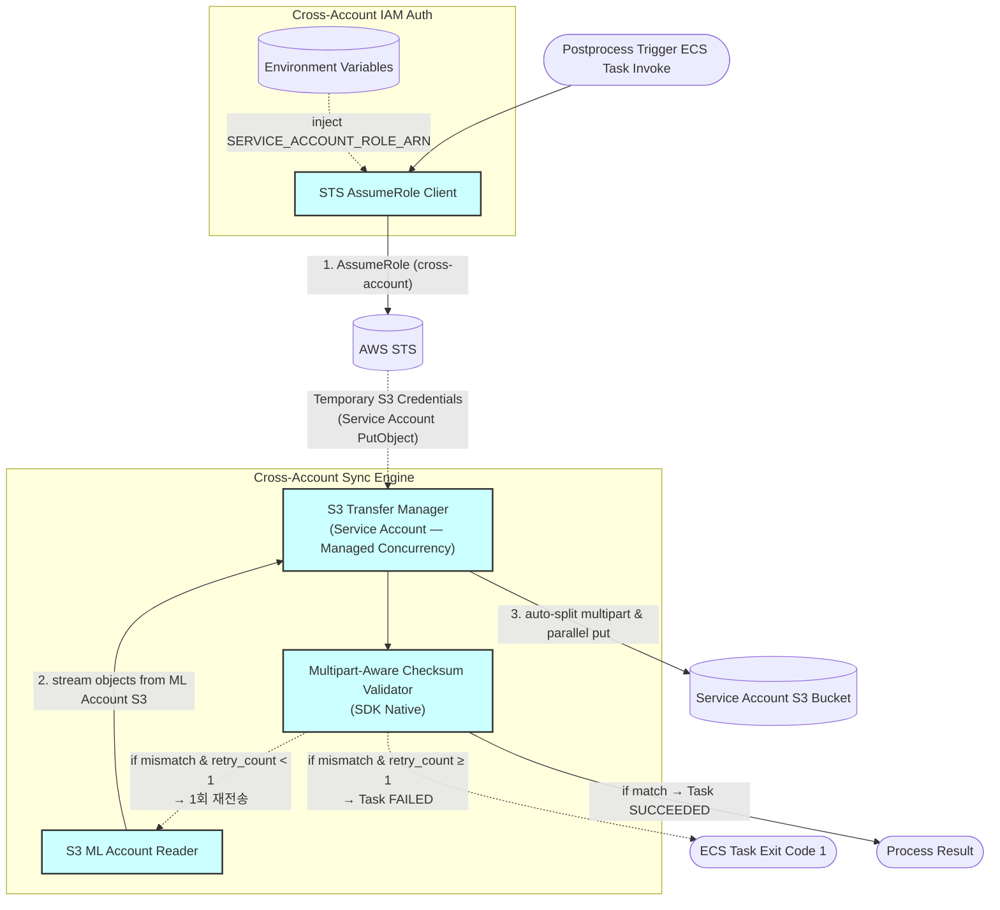

> **Related Documents**: [C4_Component_Layer_Triggers.md](./C4_Component_Layer_Triggers.md) (Postprocess Trigger — EXP 동기 호출 주체), [C4_Component_Layer_RunAPI.md](./C4_Component_Layer_RunAPI.md) (인증 구조 참조)

### Component Details
1. **Environment Variables**: `SERVICE_ACCOUNT_ROLE_ARN`과 같은 Cross-Account Role ARN(비암호화 구성값)을 저장하고 주입하여 불필요한 Secrets Manager 호출 비용을 줄입니다.
2. **STS AssumeRole Client**: ECS Fargate Task의 Task Role을 사용하여 AWS STS에 `AssumeRole`을 호출, Service Account의 S3 쓰기 역할에 대한 제한된 수명을 가진 임시 접속 자격증명(S3 PutObject)을 취득합니다. 동일 AWS 내이므로 GCP의 WIF(Workload Identity Federation) 대신 표준 IAM Cross-Account AssumeRole을 사용하여 인증 체인이 크게 단순화됩니다. (STS 세션 토큰 재사용 포함)
3. **S3 ML Account Reader**: ML Account S3 bucket에서 모델 아티팩트 또는 추론 결과를 스트리밍 읽기합니다. ECS Task Role에 ML Account S3 읽기 권한이 직접 부여되어 있으므로 별도의 AssumeRole이 불필요합니다.
4. **S3 Transfer Manager**: 객체 크기에 따른 Multipart 분할, 병렬 스레드 풀 관리 책임을 애플리케이션 코드가 아닌 AWS 공식 SDK(`boto3 S3 Transfer` 등)의 관리형 인프라에 위임(통폐합)한 컴포넌트입니다. Service Account S3 bucket에 업로드합니다.
5. **Multipart-Aware Checksum Validator**: AWS SDK의 Native Checksum 기능(`ChecksumAlgorithm='SHA256'` 등)을 활용하여 S3 멀티파트 업로드 시 파일의 병합 해시 무결성을 안전하고 정확하게 검증합니다. Checksum 불일치 시 **최대 1회 재전송**을 시도하며, 재전송 후에도 불일치하면 즉시 ECS Task Exit Code 1(FAILED)을 반환하여 무한 루프를 방지합니다.
