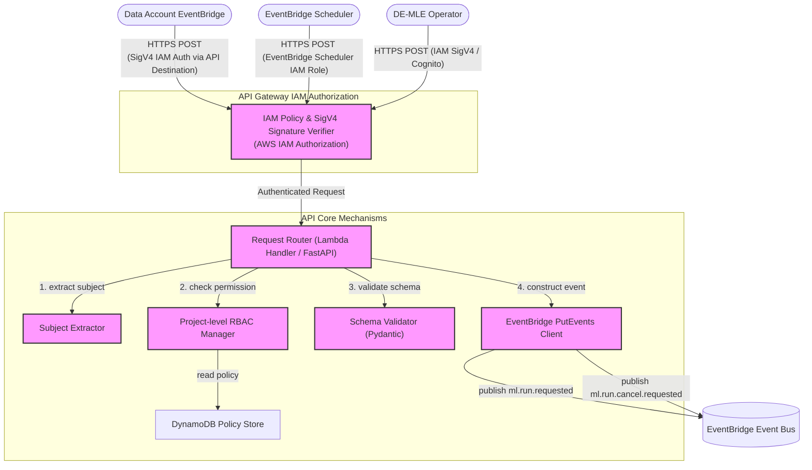

> **Related Documents**: [C4_Component_Layer_EP.md](./C4_Component_Layer_EP.md) (Execution Planner — 요청 수신 후속 처리), [C4_Component_Layer_RT.md](./C4_Component_Layer_RT.md) (Run Tracker — Cancel 요청 처리)

### Component Details
1. **API Gateway IAM Authorization**: API Gateway의 IAM 인증(AWS_IAM Authorizer) 설정을 통해 진입하는 모든 요청(Data Account EventBridge, EventBridge Scheduler, DE)의 SigV4 서명과 IAM 정책을 검증합니다. Data Account EventBridge는 API Destination의 IAM 인증으로 ML Account API Gateway에 요청을 전송하며, API Gateway가 SigV4 서명을 검증합니다. Cognito User Pool 연동 시 JWT 토큰도 지원합니다.
2. **Subject Extractor**: 검증을 통과한 요청 헤더(`X-Email` 또는 Authorization Bearer Token의 Payload)에서 호출자의 식별자(Subject)를 추출하는 모듈입니다.
3. **Request Router**: Lambda Handler 기반의 FastAPI 컨트롤러로, 하위 모듈들에 대한 의존성 주입(Dependency Injection)을 기반으로 실행 흐름을 통제합니다. Lambda Web Adapter 또는 Mangum을 통해 API Gateway 이벤트를 FastAPI로 라우팅합니다.
4. **Project-level RBAC Manager**: 추출된 식별자가 대상 `project`에 대해 실행(Run) 또는 취소(Cancel) 권한이 있는지 DynamoDB 정책 테이블에서 확인합니다.
5. **Schema Validator**: `ml.run.requested`의 필수 파라미터(project, run_key_hint 등) 정합성을 Pydantic 모델을 통해 검증합니다.
6. **EventBridge PutEvents Client**: 인가 및 검증이 모두 완료된 요청을 `ml.run.requested` 또는 `ml.run.cancel.requested` 이벤트로 규격화하여 EventBridge에 발행합니다. `Source=ml-platform`, `DetailType` 필드로 이벤트를 구분하며, EventBridge Rule이 대상 SQS FIFO Queue로 라우팅합니다.
