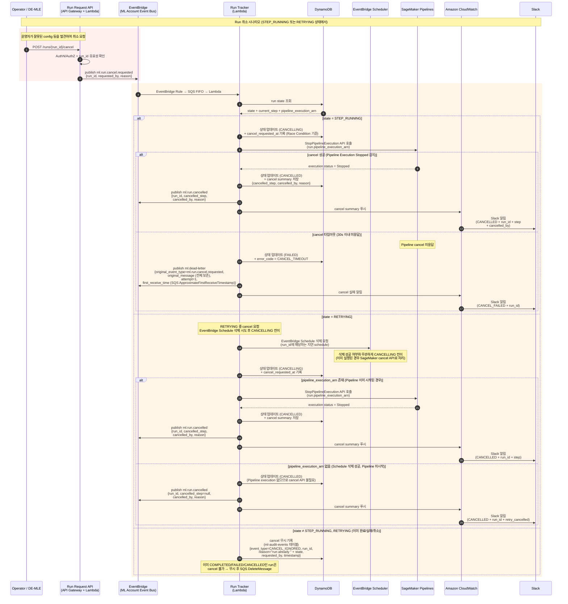

```mermaid
sequenceDiagram
  autonumber

  participant DE     as Operator / DE-MLE
  participant RunAPI as Run Request API<br>(API Gateway + Lambda)
  participant EB     as EventBridge<br>(ML Account Event Bus)
  participant RT     as Run Tracker<br>(Lambda)
  participant DDB    as DynamoDB
  participant SCHED  as EventBridge Scheduler
  participant SMP    as SageMaker Pipelines
  participant CW     as Amazon CloudWatch
  participant SL     as Slack

  Note over DE, SL: Run 취소 시나리오 (STEP_RUNNING 또는 RETRYING 상태에서)

  %% ── Cancel 요청 ──
  rect rgb(255, 240, 240)
    Note over DE, RunAPI: 운영자가 잘못된 config 등을 발견하여 취소 요청
    DE->>RunAPI: POST /runs/{run_id}/cancel
    RunAPI->>RunAPI: AuthN/AuthZ + run_id 유효성 확인
    RunAPI->>EB: publish ml.run.cancel.requested<br>{run_id, requested_by, reason}
  end

  %% ── Run Tracker Cancel 처리 ──
  rect rgb(255, 245, 230)
    EB->>RT: EventBridge Rule → SQS FIFO → Lambda
    RT->>DDB: run state 조회
    DDB-->>RT: state + current_step + pipeline_execution_arn

    alt state = STEP_RUNNING
      RT->>DDB: 상태 업데이트 (CANCELLING)<br>+ cancel_requested_at 기록 (Race Condition 기준)
      RT->>SMP: StopPipelineExecution API 호출<br>(run.pipeline_execution_arn)

      alt cancel 성공 (Pipeline Execution Stopped 감지)
        SMP-->>RT: execution status = Stopped
        RT->>DDB: 상태 업데이트 (CANCELLED)<br>+ cancel summary 저장<br>{cancelled_step, cancelled_by, reason}
        RT->>EB: publish ml.run.cancelled<br>{run_id, cancelled_step,<br>cancelled_by, reason}
        RT->>CW: cancel summary 푸시
        CW->>SL: Slack 알림<br>(CANCELLED + run_id + step<br>+ cancelled_by)
      else cancel 타임아웃 (30s 이내 미응답)
        Note over SMP: Pipeline cancel 미응답
        RT->>DDB: 상태 업데이트 (FAILED)<br>+ error_code = CANCEL_TIMEOUT
        RT->>EB: publish ml.dead-letter<br>{original_event_type=ml.run.cancel.requested,<br>original_message (전체 보존),<br>attempt=1,<br>first_receive_time (SQS ApproximateFirstReceiveTimestamp)}
        RT->>CW: cancel 실패 알림
        CW->>SL: Slack 알림<br>(CANCEL_FAILED + run_id)
      end

    else state = RETRYING
      Note over RT: RETRYING 중 cancel 요청<br>EventBridge Schedule 삭제 시도 후 CANCELLING 전이
      RT->>SCHED: EventBridge Schedule 삭제 요청<br>(run_id에 해당하는 지연 schedule)
      Note over SCHED: 삭제 성공 여부와 무관하게 CANCELLING 전이<br>(이미 실행된 경우 SageMaker cancel API로 처리)
      RT->>DDB: 상태 업데이트 (CANCELLING)<br>+ cancel_requested_at 기록

      alt pipeline_execution_arn 존재 (Pipeline 이미 시작된 경우)
        RT->>SMP: StopPipelineExecution API 호출<br>(run.pipeline_execution_arn)
        SMP-->>RT: execution status = Stopped
        RT->>DDB: 상태 업데이트 (CANCELLED)<br>+ cancel summary 저장
        RT->>EB: publish ml.run.cancelled<br>{run_id, cancelled_step,<br>cancelled_by, reason}
        RT->>CW: cancel summary 푸시
        CW->>SL: Slack 알림<br>(CANCELLED + run_id + step)
      else pipeline_execution_arn 없음 (Schedule 삭제 성공, Pipeline 미시작)
        RT->>DDB: 상태 업데이트 (CANCELLED)<br>(Pipeline execution 없으므로 cancel API 불필요)
        RT->>EB: publish ml.run.cancelled<br>{run_id, cancelled_step=null,<br>cancelled_by, reason}
        RT->>CW: cancel summary 푸시
        CW->>SL: Slack 알림<br>(CANCELLED + run_id + retry_cancelled)
      end

    else state ≠ STEP_RUNNING, RETRYING (이미 완료/실패/취소)
      RT->>DDB: cancel 무시 기록<br>(ml-audit-events 테이블)<br>{event_type=CANCEL_IGNORED, run_id,<br>reason="run already " + state,<br>requested_by, timestamp}
      Note over RT: 이미 COMPLETED/FAILED/CANCELLED인 run은<br>cancel 불가 → 무시 후 SQS DeleteMessage
    end
  end
```
