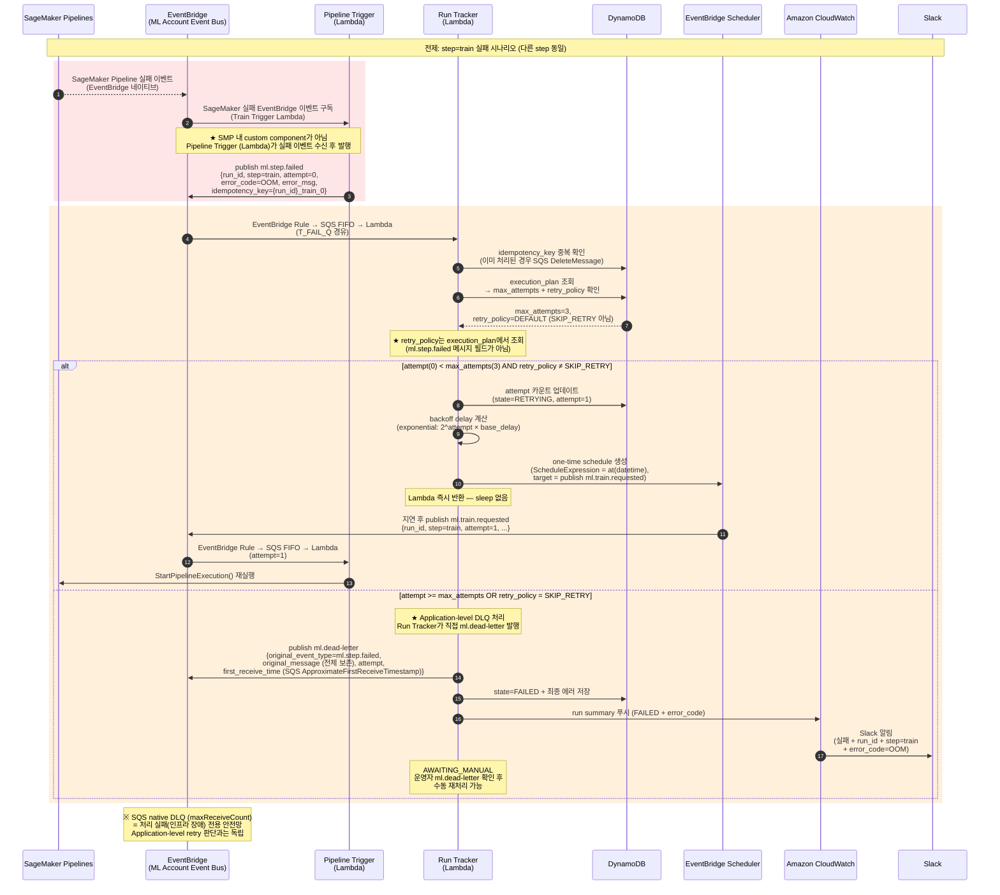

```mermaid
sequenceDiagram
  autonumber

  participant SMP  as SageMaker Pipelines
  participant EB   as EventBridge<br>(ML Account Event Bus)
  participant TRG  as Pipeline Trigger<br>(Lambda)
  participant RT   as Run Tracker<br>(Lambda)
  participant DDB  as DynamoDB
  participant SCHED as EventBridge Scheduler
  participant CW   as Amazon CloudWatch
  participant SL   as Slack

  Note over SMP, SL: 전제: step=train 실패 시나리오 (다른 step 동일)

  %% ── Step 실패 발행 ──
  rect rgb(255, 230, 230)
    SMP-->>EB: SageMaker Pipeline 실패 이벤트<br>(EventBridge 네이티브)
    EB->>TRG: SageMaker 실패 EventBridge 이벤트 구독<br>(Train Trigger Lambda)
    Note over TRG, EB: ★ SMP 내 custom component가 아님<br>Pipeline Trigger (Lambda)가 실패 이벤트 수신 후 발행
    TRG->>EB: publish ml.step.failed<br>{run_id, step=train, attempt=0,<br>error_code=OOM, error_msg,<br>idempotency_key={run_id}_train_0}
  end

  %% ── Retry 판단 ──
  rect rgb(255, 240, 220)
    EB->>RT: EventBridge Rule → SQS FIFO → Lambda<br>(T_FAIL_Q 경유)
    RT->>DDB: idempotency_key 중복 확인<br>(이미 처리된 경우 SQS DeleteMessage)
    RT->>DDB: execution_plan 조회<br>→ max_attempts + retry_policy 확인
    DDB-->>RT: max_attempts=3,<br>retry_policy=DEFAULT (SKIP_RETRY 아님)

    Note over RT: ★ retry_policy는 execution_plan에서 조회<br>(ml.step.failed 메시지 필드가 아님)

    alt attempt(0) < max_attempts(3) AND retry_policy ≠ SKIP_RETRY
      RT->>DDB: attempt 카운트 업데이트<br>(state=RETRYING, attempt=1)
      RT->>RT: backoff delay 계산<br>(exponential: 2^attempt × base_delay)
      RT->>SCHED: one-time schedule 생성<br>(ScheduleExpression = at(datetime),<br>target = publish ml.train.requested)
      Note over RT: Lambda 즉시 반환 — sleep 없음
      SCHED->>EB: 지연 후 publish ml.train.requested<br>{run_id, step=train, attempt=1, ...}
      EB->>TRG: EventBridge Rule → SQS FIFO → Lambda<br>(attempt=1)
      TRG->>SMP: StartPipelineExecution() 재실행
    else attempt >= max_attempts OR retry_policy = SKIP_RETRY
      Note over RT: ★ Application-level DLQ 처리<br>Run Tracker가 직접 ml.dead-letter 발행
      RT->>EB: publish ml.dead-letter<br>{original_event_type=ml.step.failed,<br>original_message (전체 보존), attempt,<br>first_receive_time (SQS ApproximateFirstReceiveTimestamp)}
      RT->>DDB: state=FAILED + 최종 에러 저장
      RT->>CW: run summary 푸시 (FAILED + error_code)
      CW->>SL: Slack 알림<br>(실패 + run_id + step=train<br>+ error_code=OOM)
      Note over RT: AWAITING_MANUAL<br>운영자 ml.dead-letter 확인 후<br>수동 재처리 가능
    end
  end

  Note over EB: ※ SQS native DLQ (maxReceiveCount)<br>= 처리 실패(인프라 장애) 전용 안전망<br>Application-level retry 판단과는 독립
```
