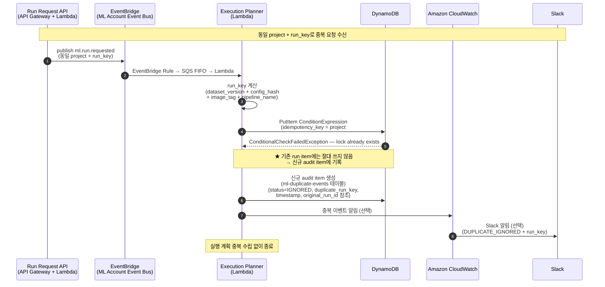

```mermaid
sequenceDiagram
  autonumber

  participant RunAPI as Run Request API<br>(API Gateway + Lambda)
  participant EB    as EventBridge<br>(ML Account Event Bus)
  participant EP    as Execution Planner<br>(Lambda)
  participant DDB   as DynamoDB
  participant CW    as Amazon CloudWatch
  participant SL    as Slack

  Note over RunAPI, SL: 동일 project + run_key로 중복 요청 수신

  RunAPI->>EB: publish ml.run.requested<br>(동일 project + run_key)
  EB->>EP: EventBridge Rule → SQS FIFO → Lambda
  EP->>EP: run_key 계산<br>(dataset_version + config_hash<br>+ image_tag + pipeline_name)
  EP->>DDB: PutItem ConditionExpression<br>(idempotency_key = project#run_key,<br>attribute_not_exists(PK))
  DDB-->>EP: ConditionalCheckFailedException — lock already exists

  Note over EP, DDB: ★ 기존 run item에는 절대 쓰지 않음<br>→ 신규 audit item에 기록
  EP->>DDB: 신규 audit item 생성<br>(ml-duplicate-events 테이블)<br>{status=IGNORED, duplicate_run_key,<br>timestamp, original_run_id 참조}

  EP->>CW: 중복 이벤트 알림 (선택)
  CW->>SL: Slack 알림 (선택)<br>(DUPLICATE_IGNORED + run_key)
  Note over EP: 실행 계획 중복 수립 없이 종료
```
