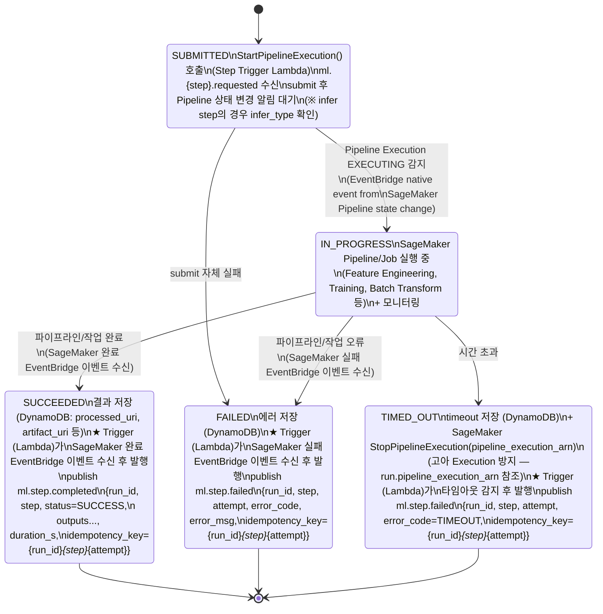

```mermaid
stateDiagram-v2
  [*] --> SUBMITTED

  state "SUBMITTED\nStartPipelineExecution() 호출\n(Step Trigger Lambda)\nml.{step}.requested 수신\nsubmit 후 Pipeline 상태 변경 알림 대기\n(※ infer step의 경우 infer_type 확인)" as SUBMITTED
  SUBMITTED --> IN_PROGRESS : Pipeline Execution EXECUTING 감지\n(EventBridge native event from\nSageMaker Pipeline state change)
  SUBMITTED --> FAILED : submit 자체 실패

  state "IN_PROGRESS\nSageMaker Pipeline/Job 실행 중\n(Feature Engineering, Training, Batch Transform 등)\n+ 모니터링" as IN_PROGRESS
  IN_PROGRESS --> SUCCEEDED : 파이프라인/작업 완료\n(SageMaker 완료 EventBridge 이벤트 수신)
  IN_PROGRESS --> FAILED : 파이프라인/작업 오류\n(SageMaker 실패 EventBridge 이벤트 수신)
  IN_PROGRESS --> TIMED_OUT : 시간 초과

  state "SUCCEEDED\n결과 저장 (DynamoDB: processed_uri, artifact_uri 등)\n★ Trigger (Lambda)가\nSageMaker 완료 EventBridge 이벤트 수신 후 발행\npublish ml.step.completed\n{run_id, step, status=SUCCESS,\n outputs..., duration_s,\nidempotency_key={run_id}_{step}_{attempt}}" as SUCCEEDED
  SUCCEEDED --> [*]

  state "FAILED\n에러 저장 (DynamoDB)\n★ Trigger (Lambda)가\nSageMaker 실패 EventBridge 이벤트 수신 후 발행\npublish ml.step.failed\n{run_id, step, attempt, error_code, error_msg,\nidempotency_key={run_id}_{step}_{attempt}}" as FAILED
  FAILED --> [*]

  state "TIMED_OUT\ntimeout 저장 (DynamoDB)\n+ SageMaker StopPipelineExecution(pipeline_execution_arn)\n  (고아 Execution 방지 — run.pipeline_execution_arn 참조)\n★ Trigger (Lambda)가\n타임아웃 감지 후 발행\npublish ml.step.failed\n{run_id, step, attempt, error_code=TIMEOUT,\nidempotency_key={run_id}_{step}_{attempt}}" as TIMED_OUT
  TIMED_OUT --> [*]

  %% ※ TIMED_OUT은 동일 설정으로 재시도해도 같은 결과가
  %% 나올 가능성이 높으므로 기본적으로 retry를 건너뜀.
  %% RT는 error_code=TIMEOUT 수신 시 SKIP_RETRY를 자체 적용
  %% (Topic_Spec SSOT: ml.step.failed에 retry_policy 필드 포함 안 함).
  %% 타임아웃 전용 retry가 필요하면 execution_plan에
  %% timeout_retry_policy를 별도 정의.
  %%
  %% ※ ml.step.completed / ml.step.failed 발행자:
  %% SageMaker Pipeline 내 custom component가 아님.
  %% Pipeline Trigger (Lambda)가 SageMaker 상태 변경
  %% EventBridge 이벤트를 구독·수신한 후 발행.
```
