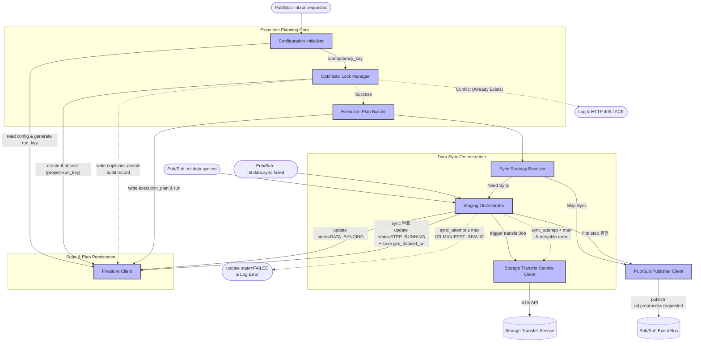

> **Related Documents**: [C4_Component_Layer_RT.md](./C4_Component_Layer_RT.md) (Run Tracker — Step 완료/실패 수신), [C4_Component_Layer_Triggers.md](./C4_Component_Layer_Triggers.md) (Pipeline Trigger — Step 실행), [C4_Component_Layer_VXP.md](./C4_Component_Layer_VXP.md) (Vertex AI Pipelines)

### Component Details
1. **Configuration Initializer**: Firestore `config` 컬렉션을 조회하여 설정값을 병합하고, `dataset_version`, `config_hash`, `image_tag`, `pipeline_name`을 조합하여 고유한 `run_key`를 계산하는 통합 파이프라인(순차 프로세스)입니다. v3에서 사용하던 Secret Manager 민감 정보 조회는 EXP 컴포넌트로 이관하였으며, EP에서는 ENV 기반 비암호화 구성값만 사용합니다.
2. **Optimistic Lock Manager**: Firestore 트랜잭션을 사용하여 `idempotency_key` (project+run_key)를 기반으로 중복 실행을 원천 차단(create-if-absent)합니다. 잠금 실패(중복 요청) 시 `duplicate_events` 컬렉션에 감사 기록(`status=IGNORED, duplicate_run_key, timestamp, original_run_id`)을 저장한 후 조기 종료합니다.
3. **Execution Plan Builder**: 사용할 Step 시퀀스, 재시도 횟수, Sync Target 등의 최종 `execution_plan` 문서와 `run` 문서를 생성하여 Firestore에 저장합니다.
4. **Sync Strategy Resolver**: 수립된 계획과 S3/GCS 상태를 비교하여 Data Sync(STS)가 필요한지 판단합니다. 동기화가 불필요하면 즉시 `Pub/Sub Publisher Client`를 호출해 첫 Step 이벤트(`ml.preprocess.requested`)를 날립니다.
5. **Staging Orchestrator**: STS Client를 호출하여 전송 작업을 시작하며, 동시에 Firestore에 `state=DATA_SYNCING`을 기록합니다. 비동기로 라우팅되는 `ml.data.synced` 이벤트를 수신하면, **EP 내부에서 `execution_plan`을 재조회**하고, `state=STEP_RUNNING + gcs_dataset_uri`를 Firestore에 업데이트한 후, 직접 `Pub/Sub Publisher Client`를 통해 `ml.preprocess.requested`를 발행합니다 (v3 Topic Spec의 `ml.data.synced` Subscriber = EP 원칙 유지). `ml.data.sync.failed` 수신 시에는 `error_code`와 `sync_attempt`를 평가하여, 재시도 가능하면(`error_code ≠ MANIFEST_INVALID && sync_attempt < max_sync_attempts`) STS를 재트리거하고, 그렇지 않으면 `state=FAILED`로 전이하여 종료합니다.
6. **Storage Transfer Service Client**: GCP STS API를 명시적으로 호출하고 전송 작업 상태를 제어하는 래퍼 컴포넌트입니다.
