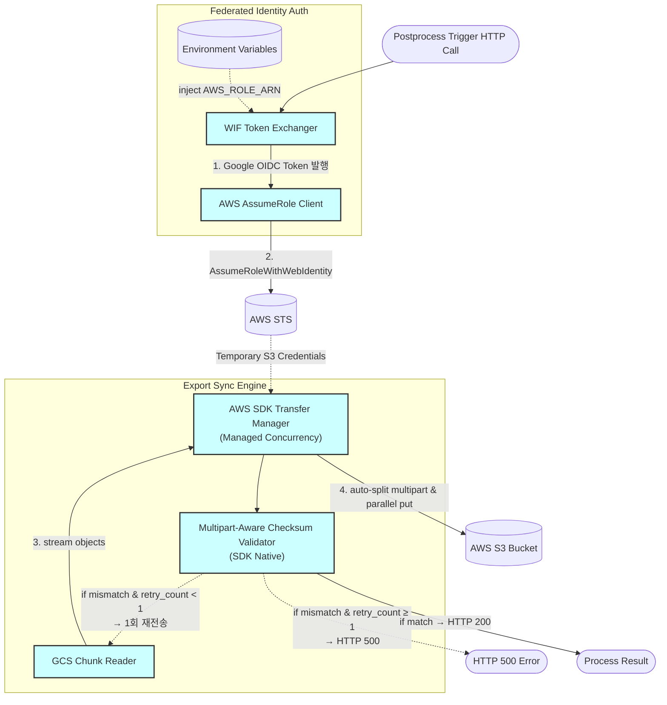

> **Related Documents**: [C4_Component_Layer_Triggers.md](./C4_Component_Layer_Triggers.md) (Postprocess Trigger — EXP 동기 호출 주체), [C4_Component_Layer_RunAPI.md](./C4_Component_Layer_RunAPI.md) (인증 구조 참조)

### Component Details
1. **Environment Variables**: `AWS_ROLE_ARN`과 같은 클라우드 리소스 식별자(비암호화 구성값)를 저장하고 주입하여 불필요한 Secret Manager 호출 비용을 줄입니다.
2. **WIF Token Exchanger**: Google Cloud Service Account의 서명 권한을 바탕으로 OIDC JWT 토큰을 발급받습니다.
3. **AWS AssumeRole Client**: 발급된 OIDC 토큰과 Role ARN을 사용하여 AWS STS에 `AssumeRoleWithWebIdentity`를 호출, 제한된 수명을 가진 S3 임시 접속 자격증명(S3 PutObject)을 취득합니다. (STS 토큰 재사용 포함)
4. **AWS SDK Transfer Manager**: 객체 크기에 따른 Multipart 분할, 병렬 스레드 풀 관리 책임을 애플리케이션 코드가 아닌 AWS 공식 SDK(`transfer.S3Transfer` 등)의 관리형 인프라에 위임(통폐합)한 컴포넌트입니다.
5. **Multipart-Aware Checksum Validator**: AWS SDK의 Native Checksum 기능(`ChecksumAlgorithm='SHA256'` 등)을 활용하여 S3 멀티파트 업로드 시 파일의 병합 해시 무결성을 안전하고 정확하게 검증합니다. Checksum 불일치 시 **최대 1회 재전송**을 시도하며, 재전송 후에도 불일치하면 즉시 HTTP 500을 반환하여 무한 루프를 방지합니다.
