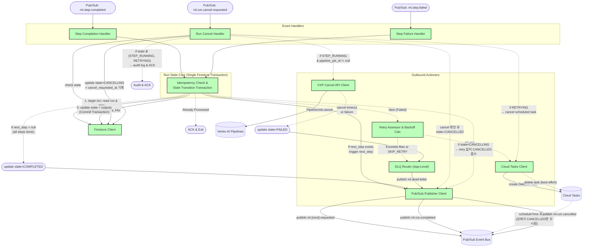

> **Related Documents**: [C4_Component_Layer_FailureHandling.md](./C4_Component_Layer_FailureHandling.md) (실패 처리 3-Tier 상세), [C4_Component_Layer_EP.md](./C4_Component_Layer_EP.md) (Execution Planner — 첫 Step 발행), [C4_Component_Layer_Triggers.md](./C4_Component_Layer_Triggers.md) (Pipeline Trigger — Step 실행)

### Component Details
1. **Idempotency Check & State Transition Transaction**: 모든 인입 메시지(`ml.step.completed/failed`)의 `idempotency_key` 확인과 `execution_plan`에 따른 `next_step` 탐색 및 `state` 업데이트를 **단일 Firestore 트랜잭션** 내에서 수행합니다. 멱등성 확인(read → check processed_events)과 상태 전이(write)가 동일 트랜잭션에 포함되어 TOCTOU(Time-Of-Check-to-Time-Of-Use) 경합이 발생하지 않습니다.
2. **Run 완료 처리**: `next_step = null`(모든 step 소진)이면 `state=COMPLETED`로 업데이트하고, `Pub/Sub Publisher Client`를 통해 `ml.run.completed` 이벤트를 발행합니다. (v3 `Execution_Sequence_default.md` L214-225 대응)
3. **Retry Assessor**: 실패 시 트랜잭션 내에서 읽어온 `max_attempts` 속성과 `retry_policy`를 기반으로 재시도 적격성을 판단하고 Exponential Backoff 지연 시간을 계산합니다. (상세 흐름: [FailureHandling 문서](./C4_Component_Layer_FailureHandling.md) 참조)
4. **Cloud Tasks Client**: 산출된 지연 시간(`scheduleTime`)을 바탕으로 Cloud Tasks에 재시도 이벤트 발행을 예약합니다. Cancel이 발생하더라도 명시적으로 Task를 지우지 않고, 나중에 Task가 실행될 때 상태 머신이 `CANCELLED`를 확인하고 자연스럽게 무시하는 '상태 기반 무력화' 패턴을 사용합니다.
5. **Run Cancel Handler**: CANCELLING 전이 시 `cancel_requested_at` 타임스탬프를 기록하며(Race Condition 해소용), 4가지 분기를 수행합니다:
   - **`state = STEP_RUNNING`**: `pipeline_job_id`가 존재하면 VXP Cancel API Client로 Vertex AI Pipeline Job을 중지시킨 후 `CANCELLING → CANCELLED` 전이. **cancel 타임아웃(30s 이내 미응답) 또는 cancel 자체 실패 시** `state=FAILED`로 전이하고 `ml.dead-letter`를 발행합니다.
   - **`state = RETRYING`**: Cloud Tasks의 예약된 재시도 task를 삭제 시도(best-effort)한 후 `CANCELLING` 전이. `pipeline_job_id`가 이미 존재하면 추가로 VXP cancel도 수행.
   - **`state = CANCELLING` (Race Condition)**: CANCELLING 상태에서 `ml.step.failed`를 수신하면, `step_failed.timestamp`와 무관하게 **retry 없이 CANCELLED로 흡수**합니다 (운영자 cancel 의도 우선 정책).
   - **`state ∉ {STEP_RUNNING, RETRYING}`**: 이미 완료/실패/취소된 Run이므로 `audit_events`에 기록 후 ACK.
   - CANCELLED 확인 후 `Pub/Sub Publisher Client`를 통해 `ml.run.cancelled`를 발행합니다.
6. **VXP Cancel API Client**: `run.pipeline_job_id`가 존재하는 경우(Postprocess 제외)에만 조건부로 Vertex AI Pipeline Job을 직접 중지시킵니다.
7. **DLQ Router (App-Level)**: 재시도 임계치가 초과된 실패 건 또는 cancel 타임아웃 건을 어플리케이션 레벨의 DLQ 토픽(`ml.dead-letter`)으로 원본 메시지와 함께 라우팅합니다.
