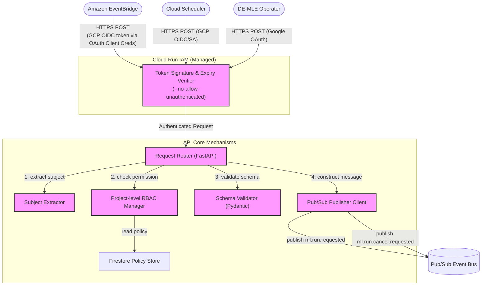

> **Related Documents**: [C4_Component_Layer_EP.md](./C4_Component_Layer_EP.md) (Execution Planner — 요청 수신 후속 처리), [C4_Component_Layer_RT.md](./C4_Component_Layer_RT.md) (Run Tracker — Cancel 요청 처리)

### Component Details
1. **Cloud Run IAM (Managed)**: Cloud Run의 `--no-allow-unauthenticated` 인프라 설정을 통해 진입하는 모든 요청(AWS EventBridge, Cloud Scheduler, DE)의 JWT 서명과 만료 여부를 검증합니다. EventBridge 호출 시 API Destination의 OAuth 설정으로 부여받은 GCP OIDC 토큰을 파싱합니다.
2. **Subject Extractor**: 검증을 통과한 요청 헤더(`X-Email` 또는 Auth JWT Payload)에서 호출자의 식별자(Subject)를 추출하는 모듈입니다.
3. **Request Router**: FastAPI 컨트롤러로, 하위 모듈들에 대한 의존성 주입(Dependency Injection)을 기반으로 실행 흐름을 통제합니다.
4. **Project-level RBAC Manager**: 추출된 식별자가 대상 `project`에 대해 실행(Run) 또는 취소(Cancel) 권한이 있는지 Firestore 정책상에서 확인합니다.
5. **Schema Validator**: `ml.run.requested`의 필수 파라미터(project, run_key_hint 등) 정합성을 Pydantic 모델을 통해 검증합니다.
6. **Pub/Sub Publisher Client**: 인가 및 검증이 모두 완료된 요청을 `ml.run.requested` 또는 `ml.run.cancel.requested` 이벤트로 규격화하여 비동기 발행합니다.
