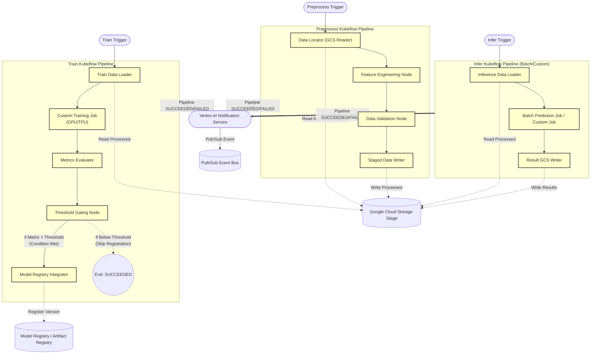

> **Related Documents**: [C4_Component_Layer_Triggers.md](./C4_Component_Layer_Triggers.md) (Pipeline Trigger — Step 실행 및 Submit), [C4_Component_Layer_RT.md](./C4_Component_Layer_RT.md) (Run Tracker — Pipeline 완료/실패 후속 처리)

### Component Details
*※ 주의: Postprocess 로직은 VXP 파이프라인 구성에서 제외되며 별도의 Cross-Cloud Exporter(EXP) 컴포넌트가 담당합니다.*

1. **Preprocess Pipeline**
   - **Data Locator (GCS Reader)**: EP의 Data Sync(STS)가 완료된 **GCS staging 영역**에서 데이터를 읽습니다. (STS 동기화 이후이므로 S3 직접 접근이 아닌 GCS 읽기)
   - **Feature Engineering Node**: 수집된 텍스트 코퍼스를 정제하고 Graph / RAG용 Embedding 파생 피처를 생성합니다.
   - **Data Validation Node**: null 분포, Outlier 검출 등을 통한 무결성 테스트를 수행하여 불량 데이터 파이프라인 통과를 방지합니다.

2. **Train Pipeline**
   - **Metrics Evaluator**: 생성된 KGE (Knowledge Graph Embedding)나 LLM Fine-tuning 모델의 Loss 및 Evaluation Task 성능을 측정합니다.
   - **Threshold Gating Node**: Evaluator의 결과 Metric이 사전에 정의된 임계점(Threshold)을 넘는 경우에만 다음 `Model Registry Integrator` 단계로 통과시킵니다. **미달하더라도 파이프라인 자체는 정상 종료(`SUCCEEDED`)**되어, Run Tracker가 이를 장애로 오인하고 재시도하는 것을 예방합니다.
   - **Model Registry Integrator**: Vertex AI Model Registry에 최신 버전 명세 및 URI를 매핑합니다.

3. **Infer Pipeline**
   - **Batch Prediction / Custom Job**: `infer_type` 파라미터에 따라 정규 데이터셋에 대한 오프라인 일괄 추론을 병렬로 수행합니다. 파이프라인 파라미터로 넘어온 Model Registry ID를 자체적으로 즉시 해석하므로 별도의 모델 Fetcher 노드가 불필요합니다.
