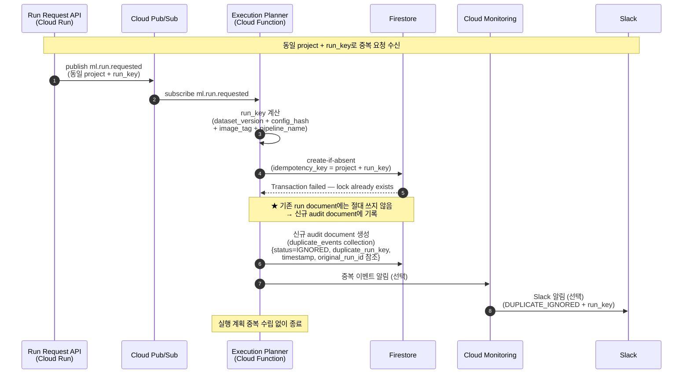

```mermaid
sequenceDiagram
  autonumber

  participant RunAPI as Run Request API<br>(Cloud Run)
  participant PS    as Cloud Pub/Sub
  participant EP    as Execution Planner<br>(Cloud Function)
  participant FS    as Firestore
  participant MON   as Cloud Monitoring
  participant SL    as Slack

  Note over RunAPI, SL: 동일 project + run_key로 중복 요청 수신

  RunAPI->>PS: publish ml.run.requested<br>(동일 project + run_key)
  PS->>EP: subscribe ml.run.requested
  EP->>EP: run_key 계산<br>(dataset_version + config_hash<br>+ image_tag + pipeline_name)
  EP->>FS: create-if-absent<br>(idempotency_key = project + run_key)
  FS-->>EP: Transaction failed — lock already exists

  Note over EP, FS: ★ 기존 run document에는 절대 쓰지 않음<br>→ 신규 audit document에 기록
  EP->>FS: 신규 audit document 생성<br>(duplicate_events collection)<br>{status=IGNORED, duplicate_run_key,<br>timestamp, original_run_id 참조}

  EP->>MON: 중복 이벤트 알림 (선택)
  MON->>SL: Slack 알림 (선택)<br>(DUPLICATE_IGNORED + run_key)
  Note over EP: 실행 계획 중복 수립 없이 종료
```