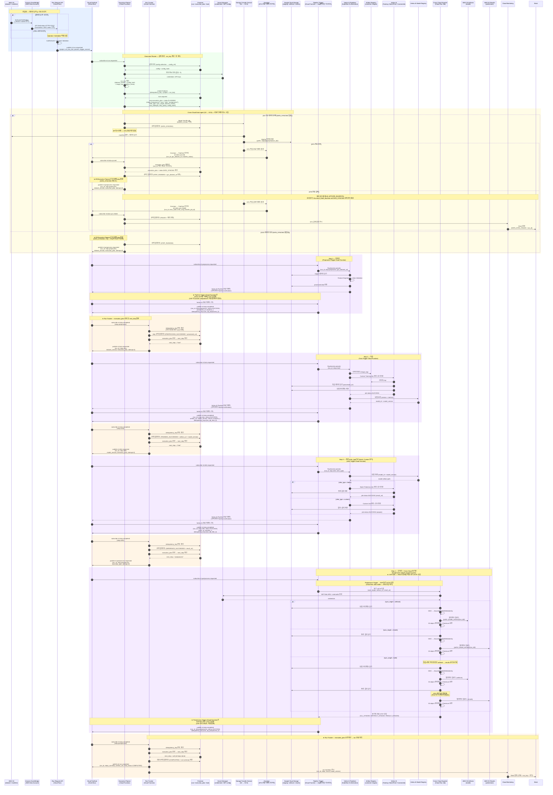

```mermaid
sequenceDiagram
  autonumber

  participant S3      as AWS S3<br>(dataset / manifest)
  participant EB      as Amazon EventBridge<br>(AWS Data Account)
  participant RunAPI  as Run Request API<br>(Cloud Run)
  participant PS      as Cloud Pub/Sub<br>(Event Bus)
  participant EP      as Execution Planner<br>(Cloud Function)
  participant RT      as Run Tracker<br>(Cloud Function)
  participant FS      as Firestore<br>(run / execution_plan / lock)
  participant SM      as Secret Manager<br>(credentials / WIF config)
  participant STS     as Storage Transfer Service<br>(S3 → GCS)
  participant EA      as Eventarc<br>(STS 완료 이벤트 라우팅)
  participant GCS     as Google Cloud Storage<br>(staging / artifacts / results)
  participant TRG     as Pipeline Trigger<br>(Cloud Function — step별 독립 인스턴스)
  participant VXP     as Vertex AI Pipelines<br>(Kubeflow Orchestration)
  participant AR      as Artifact Registry<br>(container images)
  participant VX      as Vertex AI<br>(Training / BatchPred / CustomJob)
  participant MR      as Vertex AI Model Registry
  participant EXP     as Cross-Cloud Exporter<br>(Cloud Run Job)
  participant S3A     as AWS S3 Artifacts<br>(model)
  participant S3R     as AWS S3 Results<br>(predictions)
  participant MON     as Cloud Monitoring
  participant SL      as Slack

  %% ── Trigger ──
  rect rgb(230, 240, 255)
    Note over S3, RunAPI: 진입점 — 데이터 도착 or 수동 트리거
    alt 데이터 도착 트리거
      S3->>EB: S3 Event Notification<br>(_READY marker 감지)
      EB->>RunAPI: API Destination HTTPS POST<br>(Connection: OIDC token 인증)
    else 수동 / 운영 트리거
      Note over RunAPI: Operator / Scheduler 직접 호출
    end
    RunAPI->>RunAPI: AuthN/AuthZ + Request Validation
    RunAPI->>PS: publish ml.run.requested<br>{project, run_key_hint, params, trigger_source}
  end

  %% ── Config / run_key / Lock ──
  rect rgb(240, 255, 240)
    Note over EP, FS: Execution Planner — 설정 조회 · run_key 계산 · 락 획득
    PS->>EP: subscribe ml.run.requested
    EP->>FS: 설정 조회 (config collection → config_ref)
    FS-->>EP: config + config_hash
    EP->>SM: 민감 정보 조회 (필요 시)
    SM-->>EP: credentials / API keys
    EP->>EP: run_key 계산<br>(dataset_version + config_hash<br>+ image_tag + pipeline_name)
    EP->>FS: create-if-absent<br>(idempotency_key = project + run_key)
    FS-->>EP: lock acquired
    EP->>FS: save execution_plan + state=PLANNING<br>{steps=["preprocess","train","infer","postprocess"],<br>infer_type, sync_target, dataset_version,<br>max_attempts, retry_policy, config_hash}
  end

  %% ── Data Sync (비동기) / Data Sync 스킵 분기 ──
  rect rgb(255, 252, 230)
    Note over EP, GCS: Cross-Cloud Data Ingest (S3 → GCS) — 비동기 패턴 또는 스킵
    alt S3 신규 데이터 존재 (DATA_SYNCING 필요)
      EP->>STS: trigger transfer job<br>(dataset_version 지정)
      EP->>FS: 상태 업데이트 (DATA_SYNCING)
      Note over EP: EP 즉시 반환 — STS 완료 대기 없음

      STS->>S3: manifest 검증 + 데이터 읽기
      STS->>GCS: staging 영역에 저장<br>(prefix: staging/{project}/{run_id}/)

      alt STS 전송 성공
        STS-->>EA: STS 작업 완료 이벤트 발생
        EA->>PS: Eventarc → Pub/Sub 라우팅<br>(ml.data.synced)<br>{run_id, gcs_dataset_uri, transfer_status}

        PS->>EP: subscribe ml.data.synced
        EP->>FS: execution_plan 재조회<br>(run_id 기반, 새 EP 인스턴스)
        FS-->>EP: execution_plan + state=DATA_SYNCING 확인
        EP->>FS: 상태 업데이트 (STEP_RUNNING + gcs_dataset_uri 저장)

        Note over EP, PS: ★ EP(Execution Planner)가 첫 번째 step 발행<br>(DATA_SYNCING 완료 후)
        EP->>PS: publish ml.preprocess.requested<br>{run_id, step=preprocess,<br>dataset_version, execution_plan, attempt=0}
      else STS 전송 실패
        Note over EP, SL: 에러 코드별 재시도 로직 포함 (단순화된 뷰)<br>상세 분기: Run-level_State_Machine.md DATA_SYNCING 상태 전이 참조
        STS-->>EA: STS 작업 실패 이벤트 발생
        EA->>PS: Eventarc → Pub/Sub 라우팅<br>(ml.data.sync.failed)<br>{run_id, error_code, error_msg, transfer_job_id}
        PS->>EP: subscribe ml.data.sync.failed
        EP->>FS: 상태 업데이트 (FAILED + 에러 저장)
        EP->>MON: STS 실패 알림 푸시
        MON->>SL: Slack 알림<br>(DATA_SYNC_FAILED + run_id)
      end
    else GCS 데이터 최신 (DATA_SYNCING 불필요)
      Note over EP, PS: ★ EP(Execution Planner)가 첫 번째 step 발행<br>(DATA_SYNCING 스킵 — 동일하게 EP가 발행)
      EP->>FS: 상태 업데이트 (STEP_RUNNING)
      EP->>PS: publish ml.preprocess.requested<br>{run_id, step=preprocess,<br>dataset_version, execution_plan, attempt=0}
    end
  end

  %% ── Preprocess Step ──
  rect rgb(245, 235, 255)
    Note over TRG, VXP: Step 1 — 전처리<br>(Preprocess Trigger Cloud Function)
    PS->>TRG: subscribe ml.preprocess.requested
    TRG->>VXP: PipelineJob.submit()<br>{run_id, step=preprocess, gcs_dataset_uri}
    VXP->>GCS: staged 데이터 읽기
    VXP->>VXP: Feature Engineering + Data Validation
    VXP->>GCS: processed data 저장
    VXP-->>PS: Vertex AI Pipeline 완료 이벤트<br>(상태 변경 Pub/Sub notification)
    Note over TRG, PS: ★ Pipeline Trigger (Cloud Function)가<br>Vertex AI 완료 이벤트 수신 후 발행<br>(VXP 내 custom component가 직접 발행하지 않음)
    PS->>TRG: Vertex AI 완료 이벤트 구독
    TRG->>PS: publish ml.step.completed<br>{run_id, step=preprocess, status=SUCCESS,<br>processed_uri, duration_s,<br>idempotency_key={run_id}_preprocess_0}
  end

  %% ── Run Tracker: preprocess 완료 → next_step 판단 → train 발행 ──
  rect rgb(255, 245, 230)
    Note over RT, PS: ★ Run Tracker — execution_plan 조회 후 next_step 결정
    PS->>RT: subscribe ml.step.completed<br>{step=preprocess}
    RT->>FS: idempotency_key 중복 확인<br>(이미 처리된 경우 ACK 반환)
    RT->>FS: step 상태 업데이트 (PREPROCESS_SUCCEEDED + processed_uri)
    RT->>FS: execution_plan 조회 → next_step 확인
    FS-->>RT: next_step = "train"
    RT->>PS: publish ml.train.requested<br>{run_id, step=train,<br>dataset_version, execution_plan, attempt=0}
  end

  %% ── Train Step ──
  rect rgb(245, 235, 255)
    Note over TRG, MR: Step 2 — 학습<br>(Train Trigger Cloud Function)
    PS->>TRG: subscribe ml.train.requested
    TRG->>VXP: PipelineJob.submit()<br>{run_id, step=train}
    VXP->>AR: 이미지 확인 (image_tag)
    VXP->>VX: Custom Training Job 생성 / 모니터링
    VX->>AR: 이미지 Pull
    VX->>GCS: 학습 데이터 읽기 (processed_uri)
    VX->>GCS: 모델 아티팩트 저장
    VX-->>VXP: job status=SUCCESS
    VXP->>MR: 모델 등록 (version + metrics)
    MR-->>VXP: model_id + model_version
    VXP-->>PS: Vertex AI Pipeline 완료 이벤트<br>(상태 변경 Pub/Sub notification)
    PS->>TRG: Vertex AI 완료 이벤트 구독
    TRG->>PS: publish ml.step.completed<br>{run_id, step=train, status=SUCCESS,<br>artifact_uri, model_version, metrics, duration_s,<br>idempotency_key={run_id}_train_0}
  end

  %% ── Run Tracker: train 완료 → next_step 판단 → infer 발행 ──
  rect rgb(255, 245, 230)
    PS->>RT: subscribe ml.step.completed<br>{step=train}
    RT->>FS: idempotency_key 중복 확인
    RT->>FS: 상태 업데이트 (TRAINING_SUCCEEDED + artifact_uri + model_version)
    RT->>FS: execution_plan 조회 → next_step 확인
    FS-->>RT: next_step = "infer"
    RT->>PS: publish ml.infer.requested<br>{run_id, step=infer,<br>model_version, execution_plan, attempt=0}
  end

  %% ── Infer Step ──
  rect rgb(245, 235, 255)
    Note over TRG, VX: Step 3 — 추론 (infer_type으로 Batch / Custom 분기)<br>(Infer Trigger Cloud Function)
    PS->>TRG: subscribe ml.infer.requested
    TRG->>VXP: PipelineJob.submit()<br>{run_id, step=infer, infer_type}
    VXP->>MR: 모델 참조 (model_id + model_version)
    MR-->>VXP: model artifact path

    alt infer_type = batch
      VXP->>VX: Batch Prediction Job 생성 / 모니터링
      VX->>GCS: 추론 결과 저장
      VX-->>VXP: job status=SUCCESS (result_uri)
    else infer_type = custom
      VXP->>VX: Custom Job 생성 / 모니터링
      VX->>GCS: 결과 / 출력 저장
      VX-->>VXP: job status=SUCCESS (outputs)
    end

    VXP-->>PS: Vertex AI Pipeline 완료 이벤트<br>(상태 변경 Pub/Sub notification)
    PS->>TRG: Vertex AI 완료 이벤트 구독
    TRG->>PS: publish ml.step.completed<br>{run_id, step=infer, status=SUCCESS,<br>result_uri, duration_s,<br>idempotency_key={run_id}_infer_0}
  end

  %% ── Run Tracker: infer 완료 → next_step 판단 → postprocess 발행 ──
  rect rgb(255, 245, 230)
    PS->>RT: subscribe ml.step.completed<br>{step=infer}
    RT->>FS: idempotency_key 중복 확인
    RT->>FS: 상태 업데이트 (INFERENCE_SUCCEEDED + result_uri)
    RT->>FS: execution_plan 조회 → next_step 확인
    FS-->>RT: next_step = "postprocess"
    RT->>PS: publish ml.postprocess.requested<br>{run_id, step=postprocess,<br>execution_plan, attempt=0}
  end

  %% ── Postprocess Step (Cross-Cloud Sync) ──
  rect rgb(245, 235, 255)
    Note over TRG, S3R: Step 4 — 후처리 + Cross-Cloud 동기화<br>(Postprocess Trigger Cloud Function)<br>★ VXP 없음 — TRG가 EXP를 직접 동기 HTTP 호출
    PS->>TRG: subscribe ml.postprocess.requested
    Note over TRG, EXP: Postprocess Trigger → EXP 동기 HTTP 호출<br>(Cloud Run Job invoke — 완료 응답 대기)
    TRG->>EXP: 동기 HTTP 호출<br>(sync_target, artifact_uri, result_uri)
    EXP->>SM: WIF Role ARN + externalId 조회
    SM-->>EXP: credentials

    alt sync_target = artifacts
      EXP->>GCS: 모델 아티팩트 읽기
      EXP->>EXP: OIDC → AssumeRoleWithWebIdentity
      EXP->>S3A: 멀티파트 업로드<br>(prefix: {model_version}/{run_id}/)
      EXP->>EXP: S3 object 존재 확인 + Checksum 검증
    else sync_target = results
      EXP->>GCS: 추론 결과 읽기
      EXP->>EXP: OIDC → AssumeRoleWithWebIdentity
      EXP->>S3R: 멀티파트 업로드<br>(prefix: {model_version}/{run_id}/)
      EXP->>EXP: S3 object 존재 확인 + Checksum 검증
    else sync_target = both
      Note over EXP: 학습+추론 파이프라인: artifacts → results 순차 동기화
      EXP->>GCS: 모델 아티팩트 읽기
      EXP->>EXP: OIDC → AssumeRoleWithWebIdentity
      EXP->>S3A: 멀티파트 업로드 (artifacts)
      EXP->>EXP: S3 object 존재 확인 + Checksum 검증
      EXP->>GCS: 추론 결과 읽기
      Note over EXP: STS 세션 토큰 재사용<br>(유효시간 내 재인증 불필요)
      EXP->>S3R: 멀티파트 업로드 (results)
      EXP->>EXP: S3 object 존재 확인 + Checksum 검증
    end

    EXP-->>TRG: 동기화 완료 HTTP 응답<br>(ALL_SYNCED / ARTIFACT_SYNCED / RESULT_SYNCED)
    Note over TRG, PS: ★ Postprocess Trigger (Cloud Function)가<br>EXP 동기 응답 수신 후 발행<br>(VXP 없이 TRG가 직접 발행)
    TRG->>PS: publish ml.step.completed<br>{run_id, step=postprocess, status=SUCCESS,<br>idempotency_key={run_id}_postprocess_0}
  end

  %% ── Run Tracker: all steps done ──
  rect rgb(255, 245, 230)
    Note over RT, SL: ★ Run Tracker — execution_plan 소진 확인 → run 완료 처리
    PS->>RT: subscribe ml.step.completed<br>{step=postprocess}
    RT->>FS: idempotency_key 중복 확인
    RT->>FS: execution_plan 조회 → next_step 확인
    FS-->>RT: next_step = null (all steps done)
    RT->>FS: 최종 상태 업데이트 (COMPLETED) + run summary 저장
    RT->>PS: publish ml.run.completed<br>{run_id, steps_summary, artifact_uris, final_status=COMPLETED}
    RT->>MON: run summary 푸시<br>(run_id, steps, result, model_version)
    MON->>SL: Slack 알림 (완료 + run_key + 링크)
  end
```
