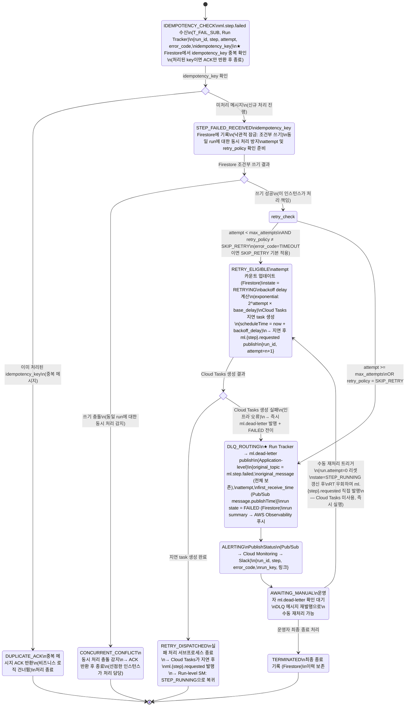

```mermaid
stateDiagram-v2
  %% ────────────────────────────────────────────
  %% 역할 분리 Note
  %% - Run-level SM: Run 전체 생명주기 (고수준 상태 흐름)
  %% - 이 Failure Handling SM: ml.step.failed 수신 후의
  %%   상세 실패 처리 로직 (retry 판단, DLQ, alerting, 수동 재처리)
  %% - Run-level SM의 RETRYING/FAILED 내부 서브프로세스
  %% ────────────────────────────────────────────

  [*] --> IDEMPOTENCY_CHECK

  state "IDEMPOTENCY_CHECK\nml.step.failed 수신\n(T_FAIL_SUB, Run Tracker)\n{run_id, step, attempt, error_code,\nidempotency_key}\n★ Firestore에서 idempotency_key 중복 확인\n(처리된 key이면 ACK만 반환 후 종료)" as IDEMPOTENCY_CHECK

  state dup_check <<choice>>
  IDEMPOTENCY_CHECK --> dup_check : idempotency_key 확인

  dup_check --> DUPLICATE_ACK : 이미 처리된 idempotency_key\n(중복 메시지)
  dup_check --> STEP_FAILED_RECEIVED : 미처리 메시지\n(신규 처리 진행)

  state "DUPLICATE_ACK\n중복 메시지 ACK 반환\n(비즈니스 로직 건너뜀)\n처리 종료" as DUPLICATE_ACK
  DUPLICATE_ACK --> [*]

  state "STEP_FAILED_RECEIVED\nidempotency_key Firestore에 기록\n(낙관적 잠금: 조건부 쓰기)\n동일 run에 대한 동시 처리 방지\nattempt 및 retry_policy 확인 준비" as STEP_FAILED_RECEIVED

  %% ── 낙관적 잠금 충돌 처리 ──
  state lock_check <<choice>>
  STEP_FAILED_RECEIVED --> lock_check : Firestore 조건부 쓰기 결과

  lock_check --> CONCURRENT_CONFLICT : 쓰기 충돌\n(동일 run에 대한 동시 처리 감지)
  lock_check --> retry_check : 쓰기 성공\n(이 인스턴스가 처리 책임)

  state "CONCURRENT_CONFLICT\n동시 처리 충돌 감지\n→ ACK 반환 후 종료\n(선점한 인스턴스가 처리 담당)" as CONCURRENT_CONFLICT
  CONCURRENT_CONFLICT --> [*]

  state retry_check <<choice>>
  retry_check --> RETRY_ELIGIBLE : attempt < max_attempts\nAND retry_policy ≠ SKIP_RETRY\n(error_code=TIMEOUT이면 SKIP_RETRY 기본 적용)
  retry_check --> DLQ_ROUTING : attempt >= max_attempts\nOR retry_policy = SKIP_RETRY

  state "RETRY_ELIGIBLE\nattempt 카운트 업데이트 (Firestore)\nstate = RETRYING\nbackoff delay 계산\n(exponential: 2^attempt × base_delay)\nCloud Tasks 지연 task 생성\n(scheduleTime = now + backoff_delay)\n→ 지연 후 ml.{step}.requested publish\n{run_id, attempt=n+1}" as RETRY_ELIGIBLE

  state tasks_check <<choice>>
  RETRY_ELIGIBLE --> tasks_check : Cloud Tasks 생성 결과

  tasks_check --> RETRY_DISPATCHED : 지연 task 생성 완료
  tasks_check --> DLQ_ROUTING : Cloud Tasks 생성 실패\n(인프라 오류)\n→ 즉시 ml.dead-letter 발행 + FAILED 전이

  state "RETRY_DISPATCHED\n실패 처리 서브프로세스 종료\n→ Cloud Tasks가 지연 후\nml.{step}.requested 발행\n→ Run-level SM: STEP_RUNNING으로 복귀" as RETRY_DISPATCHED
  RETRY_DISPATCHED --> [*]

  state "DLQ_ROUTING\n★ Run Tracker → ml.dead-letter publish\n(Application-level)\n{original_topic = ml.step.failed,\noriginal_message (전체 보존),\nattempt,\nfirst_receive_time (Pub/Sub message.publishTime)}\nrun state = FAILED (Firestore)\nrun summary → AWS Observability 푸시" as DLQ_ROUTING
  DLQ_ROUTING --> ALERTING

  state "ALERTING\nPublishStatus\n(Pub/Sub → Cloud Monitoring → Slack)\n{run_id, step, error_code,\nrun_key, 링크}" as ALERTING
  ALERTING --> AWAITING_MANUAL

  state "AWAITING_MANUAL\n운영자 ml.dead-letter 확인 대기\nDLQ 메시지 재발행으로\n수동 재처리 가능" as AWAITING_MANUAL
  %% ★ 수동 재처리 진입 시 attempt 카운터 리셋 필요 (I3)
  %% attempt >= max_attempts 상태에서 RETRY_ELIGIBLE 진입 시
  %% retry_check에서 즉시 DLQ_ROUTING으로 빠지는 무한루프 방지.
  %% 운영자 재처리 전: run.attempt = 0 리셋 (또는 manual_retry_max 별도 정의 검토)
  AWAITING_MANUAL --> RETRY_ELIGIBLE : 수동 재처리 트리거\n(run.attempt=0 리셋\nstate=STEP_RUNNING 갱신 후\nRT 우회하여 ml.{step}.requested 직접 발행\n— Cloud Tasks 미사용, 즉시 실행)
  AWAITING_MANUAL --> TERMINATED : 운영자 최종 종료 처리

  state "TERMINATED\n최종 종료 기록 (Firestore)\n이력 보존" as TERMINATED
  TERMINATED --> [*]

  %% ── Pipeline Trigger invoke 실패 처리 (Pub/Sub native DLQ → Application DLQ) ──
  %% Pub/Sub native DLQ (max_delivery_attempts=5 초과, ACK 실패 전용):
  %%   → DLQ 구독 Cloud Function이 native DLQ 메시지를 수신
  %%   → ml.dead-letter 토픽으로 재발행 (Application-level 인식)
  %%   → 운영자가 ml.dead-letter 구독에서 수동 처리
  %% (이 경로는 STEP_FAILED_RECEIVED 이전 단계이므로 SM 외부에서 처리)

  %% ── RT 크래시 후 ml.run.cancel.requested 재수신 ──
  %% Pipeline이 이미 CANCELLING 중인 상태에서 cancel 요청 재수신 시:
  %%   → Vertex AI Pipeline cancel API 재호출 허용 (멱등 API)
  %%   → 이미 취소 진행 중이면 무시 후 ACK 반환

  %% ── 낙관적 잠금(Optimistic Lock) 구현 ──
  %% Firestore 조건부 쓰기(트랜잭션)로 동일 run에 대한 동시 처리 방지.
  %% idempotency_key Firestore 문서를 create-if-absent로 생성:
  %%   - 성공: 이 인스턴스가 처리 책임
  %%   - 실패(already exists): 다른 인스턴스가 선점 → ACK 후 종료

  %% ※ Pub/Sub native DLQ (max_delivery_attempts)
  %% = ACK 실패(인프라 장애) 전용 안전망
  %% Application-level retry 판단과는 독립적으로 동작
```
