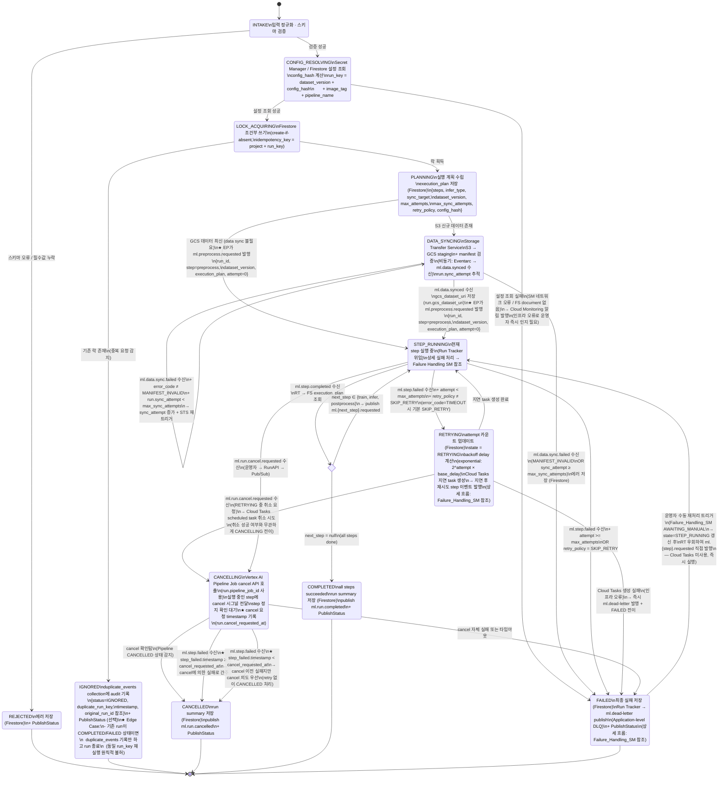

```mermaid
stateDiagram-v2
  [*] --> INTAKE

  state "INTAKE\n입력 정규화 · 스키마 검증" as INTAKE
  INTAKE --> CONFIG_RESOLVING : 검증 성공
  INTAKE --> REJECTED : 스키마 오류 / 필수값 누락

  state "REJECTED\n에러 저장 (Firestore)\n+ PublishStatus" as REJECTED
  REJECTED --> [*]

  state "CONFIG_RESOLVING\nSecret Manager / Firestore 설정 조회\nconfig_hash 계산\nrun_key = dataset_version + config_hash\n       + image_tag + pipeline_name" as CONFIG_RESOLVING
  CONFIG_RESOLVING --> LOCK_ACQUIRING : 설정 조회 성공
  CONFIG_RESOLVING --> FAILED : 설정 조회 실패\n(SM 네트워크 오류 / FS document 없음)\n→ Cloud Monitoring 알림 발행\n(인프라 오류로 운영자 즉시 인지 필요)

  state "LOCK_ACQUIRING\nFirestore 조건부 쓰기\n(create-if-absent,\nidempotency_key = project + run_key)" as LOCK_ACQUIRING
  LOCK_ACQUIRING --> PLANNING : 락 획득
  LOCK_ACQUIRING --> IGNORED : 기존 락 존재\n(중복 요청 감지)

  %% Future Work (O1): FAILED 상태 run 강제 재실행 (force=true)
  %% 완전 구현 필요: RunAPI force 파라미터 추가, lock 해제 로직, 전용 sequence diagram
  state "IGNORED\nduplicate_events collection에 audit 기록\n{status=IGNORED, duplicate_run_key,\ntimestamp, original_run_id 참조}\n+ PublishStatus (선택)\n★ Edge Case:\n- 기존 run이 COMPLETED/FAILED 상태이면\n  duplicate_events 기록만 하고 run 종료\n  (동일 run_key 재실행 원칙적 불허)" as IGNORED
  IGNORED --> [*]

  state "PLANNING\n실행 계획 수립\nexecution_plan 저장 (Firestore)\n{steps, infer_type, sync_target,\ndataset_version, max_attempts,\nmax_sync_attempts, retry_policy, config_hash}" as PLANNING
  PLANNING --> DATA_SYNCING : S3 신규 데이터 존재
  PLANNING --> STEP_RUNNING : GCS 데이터 최신 (data sync 불필요)\n★ EP가 ml.preprocess.requested 발행\n{run_id, step=preprocess,\ndataset_version, execution_plan, attempt=0}

  state "DATA_SYNCING\nStorage Transfer Service\nS3 → GCS staging\n+ manifest 검증\n(비동기: Eventarc → ml.data.synced 수신)\nrun.sync_attempt 추적" as DATA_SYNCING
  DATA_SYNCING --> STEP_RUNNING : ml.data.synced 수신\ngcs_dataset_uri 저장 (run.gcs_dataset_uri)\n★ EP가 ml.preprocess.requested 발행\n{run_id, step=preprocess,\ndataset_version, execution_plan, attempt=0}
  DATA_SYNCING --> DATA_SYNCING : ml.data.sync.failed 수신\n+ error_code ≠ MANIFEST_INVALID\n+ run.sync_attempt < max_sync_attempts\n→ sync_attempt 증가 + STS 재트리거
  DATA_SYNCING --> FAILED : ml.data.sync.failed 수신\n(MANIFEST_INVALID\nOR sync_attempt ≥ max_sync_attempts)\n에러 저장 (Firestore)

  %% ── Step Execution Loop ──
  state "STEP_RUNNING\n현재 step 실행 중\n(Run Tracker 위임)\n상세 실패 처리 → Failure Handling SM 참조" as STEP_RUNNING

  state step_transition <<choice>>

  STEP_RUNNING --> step_transition : ml.step.completed 수신\nRT → FS execution_plan 조회

  step_transition --> STEP_RUNNING : next_step ∈ {train, infer, postprocess}\n→ publish ml.{next_step}.requested
  step_transition --> COMPLETED : next_step = null\n(all steps done)

  STEP_RUNNING --> RETRYING : ml.step.failed 수신\n+ attempt < max_attempts\n+ retry_policy ≠ SKIP_RETRY\n(error_code=TIMEOUT 시 기본 SKIP_RETRY)
  STEP_RUNNING --> FAILED : ml.step.failed 수신\n+ attempt >= max_attempts\nOR retry_policy = SKIP_RETRY

  state "RETRYING\nattempt 카운트 업데이트 (Firestore)\nstate = RETRYING\nbackoff delay 계산\n(exponential: 2^attempt × base_delay)\nCloud Tasks 지연 task 생성\n→ 지연 후 재시도 step 이벤트 발행\n(상세 흐름: Failure_Handling_SM 참조)" as RETRYING
  RETRYING --> STEP_RUNNING : 지연 task 생성 완료
  RETRYING --> FAILED : Cloud Tasks 생성 실패\n(인프라 오류)\n→ 즉시 ml.dead-letter 발행 + FAILED 전이
  RETRYING --> CANCELLING : ml.run.cancel.requested 수신\n(RETRYING 중 취소 요청)\n→ Cloud Tasks scheduled task 취소 시도\n(취소 성공 여부와 무관하게 CANCELLING 전이)

  %% ── Cancel 흐름 ──
  STEP_RUNNING --> CANCELLING : ml.run.cancel.requested 수신\n(운영자 → RunAPI → Pub/Sub)

  state "CANCELLING\nVertex AI Pipeline Job cancel API 호출\n(run.pipeline_job_id 사용)\n실행 중인 step에 cancel 시그널 전달\nstep 정지 확인 대기\n★ cancel 요청 timestamp 기록\n(run.cancel_requested_at)" as CANCELLING
  CANCELLING --> CANCELLED : cancel 확인됨\n(Pipeline CANCELLED 상태 감지)
  CANCELLING --> FAILED : cancel 자체 실패 또는 타임아웃

  %% ── CANCELLING 상태에서 ml.step.failed 수신 Race Condition ──
  %% step_failed.timestamp 비교 기준: run.cancel_requested_at
  %% ★ CANCELLING은 terminal-directed 상태: 모든 ml.step.failed를 CANCELLED로 흡수
  %% (운영자 cancel 의도 우선 — timestamp 무관하게 retry 없이 CANCELLED 처리)
  CANCELLING --> CANCELLED : ml.step.failed 수신\n★ step_failed.timestamp ≥ cancel_requested_at\n→ cancel에 의한 실패로 간주
  CANCELLING --> CANCELLED : ml.step.failed 수신\n★ step_failed.timestamp < cancel_requested_at\n→ cancel 이전 실패지만 cancel 의도 우선\n(retry 없이 CANCELLED 처리)

  state "CANCELLED\nrun summary 저장 (Firestore)\npublish ml.run.cancelled\n+ PublishStatus" as CANCELLED
  CANCELLED --> [*]

  state "COMPLETED\nall steps succeeded\nrun summary 저장 (Firestore)\npublish ml.run.completed\n+ PublishStatus" as COMPLETED
  COMPLETED --> [*]

  state "FAILED\n최종 실패 저장 (Firestore)\nRun Tracker → ml.dead-letter publish\n(Application-level DLQ)\n+ PublishStatus\n(상세 흐름: Failure_Handling_SM 참조)" as FAILED
  FAILED --> [*]
  FAILED --> STEP_RUNNING : 운영자 수동 재처리 트리거\n(Failure_Handling_SM AWAITING_MANUAL\n→ state=STEP_RUNNING 갱신 후\nRT 우회하여 ml.{step}.requested 직접 발행\n— Cloud Tasks 미사용, 즉시 실행)
```
