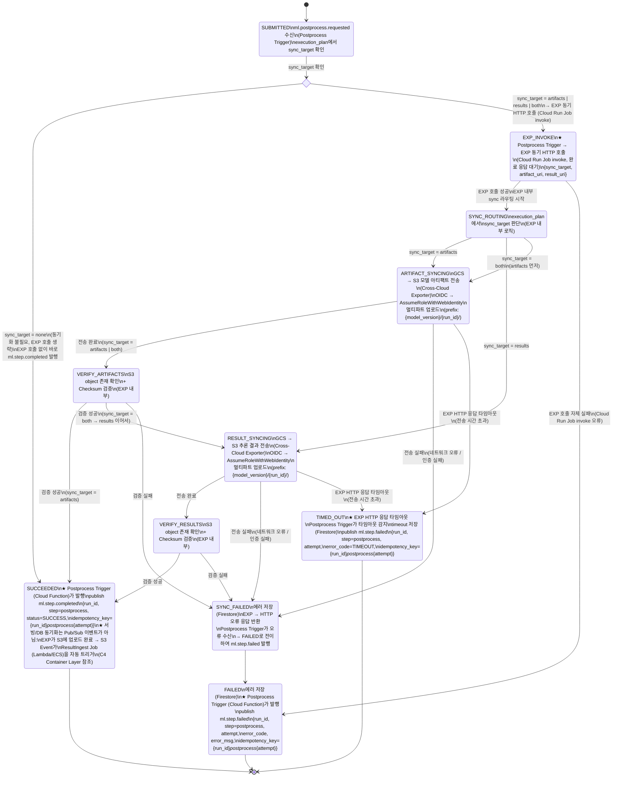

```mermaid
stateDiagram-v2
  [*] --> SUBMITTED

  state "SUBMITTED\nml.postprocess.requested 수신\n(Postprocess Trigger)\nexecution_plan에서 sync_target 확인" as SUBMITTED

  state sync_target_check <<choice>>
  SUBMITTED --> sync_target_check : sync_target 확인

  sync_target_check --> SUCCEEDED : sync_target = none\n(동기화 불필요, EXP 호출 생략)\nEXP 호출 없이 바로 ml.step.completed 발행
  sync_target_check --> EXP_INVOKE : sync_target = artifacts | results | both\n→ EXP 동기 HTTP 호출 (Cloud Run Job invoke)

  state "EXP_INVOKE\n★ Postprocess Trigger → EXP 동기 HTTP 호출\n(Cloud Run Job invoke, 완료 응답 대기)\n{sync_target, artifact_uri, result_uri}" as EXP_INVOKE
  EXP_INVOKE --> SYNC_ROUTING : EXP 호출 성공\nEXP 내부 sync 라우팅 시작
  EXP_INVOKE --> FAILED : EXP 호출 자체 실패\n(Cloud Run Job invoke 오류)

  state "SYNC_ROUTING\nexecution_plan에서\nsync_target 판단\n(EXP 내부 로직)" as SYNC_ROUTING
  SYNC_ROUTING --> ARTIFACT_SYNCING : sync_target = artifacts
  SYNC_ROUTING --> RESULT_SYNCING : sync_target = results
  SYNC_ROUTING --> ARTIFACT_SYNCING : sync_target = both\n(artifacts 먼저)

  state "ARTIFACT_SYNCING\nGCS → S3 모델 아티팩트 전송\n(Cross-Cloud Exporter)\nOIDC → AssumeRoleWithWebIdentity\n멀티파트 업로드\n(prefix: {model_version}/{run_id}/)" as ARTIFACT_SYNCING
  ARTIFACT_SYNCING --> VERIFY_ARTIFACTS : 전송 완료\n(sync_target = artifacts | both)
  ARTIFACT_SYNCING --> SYNC_FAILED : 전송 실패\n(네트워크 오류 / 인증 실패)
  ARTIFACT_SYNCING --> TIMED_OUT : EXP HTTP 응답 타임아웃\n(전송 시간 초과)

  state "VERIFY_ARTIFACTS\nS3 object 존재 확인\n+ Checksum 검증\n(EXP 내부)" as VERIFY_ARTIFACTS
  VERIFY_ARTIFACTS --> SUCCEEDED : 검증 성공\n(sync_target = artifacts)
  VERIFY_ARTIFACTS --> RESULT_SYNCING : 검증 성공\n(sync_target = both → results 이어서)
  VERIFY_ARTIFACTS --> SYNC_FAILED : 검증 실패

  state "RESULT_SYNCING\nGCS → S3 추론 결과 전송\n(Cross-Cloud Exporter)\nOIDC → AssumeRoleWithWebIdentity\n멀티파트 업로드\n(prefix: {model_version}/{run_id}/)" as RESULT_SYNCING
  RESULT_SYNCING --> VERIFY_RESULTS : 전송 완료
  RESULT_SYNCING --> SYNC_FAILED : 전송 실패\n(네트워크 오류 / 인증 실패)
  RESULT_SYNCING --> TIMED_OUT : EXP HTTP 응답 타임아웃\n(전송 시간 초과)

  state "VERIFY_RESULTS\nS3 object 존재 확인\n+ Checksum 검증\n(EXP 내부)" as VERIFY_RESULTS
  VERIFY_RESULTS --> SUCCEEDED : 검증 성공
  VERIFY_RESULTS --> SYNC_FAILED : 검증 실패

  state "SYNC_FAILED\n에러 저장 (Firestore)\nEXP → HTTP 오류 응답 반환\nPostprocess Trigger가 오류 수신\n→ FAILED로 전이하여 ml.step.failed 발행" as SYNC_FAILED
  SYNC_FAILED --> FAILED

  state "TIMED_OUT\n★ EXP HTTP 응답 타임아웃\nPostprocess Trigger가 타임아웃 감지\ntimeout 저장 (Firestore)\npublish ml.step.failed\n{run_id, step=postprocess, attempt,\nerror_code=TIMEOUT,\nidempotency_key={run_id}_postprocess_{attempt}}" as TIMED_OUT
  TIMED_OUT --> [*]

  state "SUCCEEDED\n★ Postprocess Trigger (Cloud Function)가 발행\npublish ml.step.completed\n{run_id, step=postprocess, status=SUCCESS,\nidempotency_key={run_id}_postprocess_{attempt}}\n★ 서빙/DB 동기화는 Pub/Sub 이벤트가 아님:\nEXP가 S3에 업로드 완료 → S3 Event가\nResultIngest Job (Lambda/ECS)을 자동 트리거\n(C4 Container Layer 참조)" as SUCCEEDED
  SUCCEEDED --> [*]

  state "FAILED\n에러 저장 (Firestore)\n★ Postprocess Trigger (Cloud Function)가 발행\npublish ml.step.failed\n{run_id, step=postprocess, attempt,\nerror_code, error_msg,\nidempotency_key={run_id}_postprocess_{attempt}}" as FAILED
  FAILED --> [*]

  %% ※ sync_target = none 케이스:
  %% - EXP 호출 없이 Postprocess Trigger가 바로 SUCCEEDED 전이
  %% - 서빙/DB 동기화도 미수행 (upstream에서 이미 처리되었거나 불필요)
  %%
  %% ※ Postprocess Trigger → EXP 호출 구조 (sync_target ≠ none):
  %% - Postprocess Trigger (Cloud Function)가 EXP (Cloud Run Job)를
  %%   동기 HTTP 호출 (synchronous invoke)
  %% - EXP 완료 응답 수신 후 Postprocess Trigger가
  %%   ml.step.completed 또는 ml.step.failed 발행
  %% - VXP (Vertex AI Pipeline)는 postprocess step에 관여하지 않음
  %%
  %% ※ TIMED_OUT은 EXP HTTP 응답 타임아웃 전용.
  %% RT는 error_code=TIMEOUT 수신 시 SKIP_RETRY를 자체 적용
  %% (Topic_Spec SSOT: ml.step.failed에 retry_policy 필드 포함 안 함).
  %% 타임아웃 전용 retry가 필요하면 execution_plan에
  %% timeout_retry_policy를 별도 정의.
  %%
  %% ※ [개선 권고 I1] Timeout 결합 문제:
  %% CF timeout(60분) 초과 시 EXP Job은 여전히 실행 중.
  %% 단기: EXP 자체 timeout을 CF timeout보다 짧게 설정하여
  %%       EXP가 먼저 오류 응답 반환 → CF 명확한 실패 수신.
  %% 장기: 비동기 패턴 (CF→EXP 트리거→Pub/Sub 콜백) 도입 검토.
```
