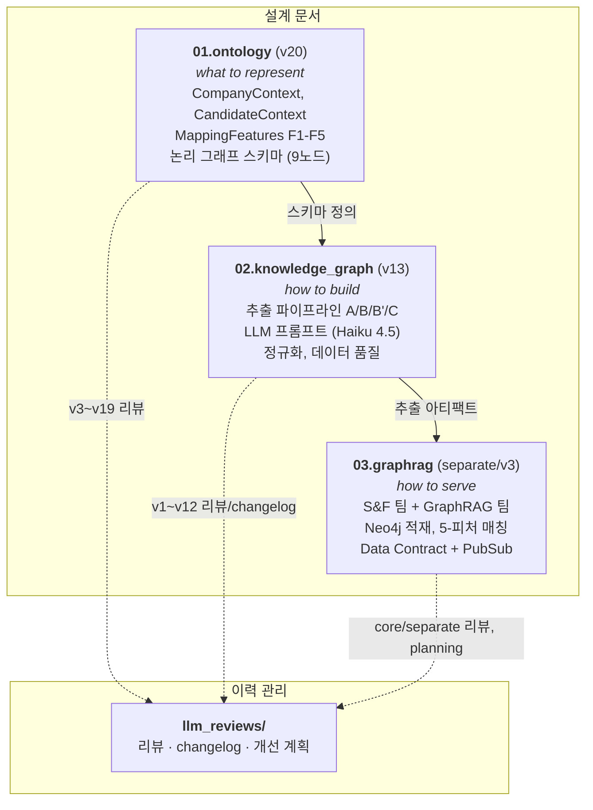

# Knowledge Engineering Documentation

채용 도메인에서 기업-인재 맥락 매칭을 위한 Knowledge Graph 설계/구축/서빙 문서입니다.

- 설계 진행 문서 완료 후 아래 주소로 이동
   - https://git.jobkorea.co.kr/agentic-services/docs/-/tree/master/specs/data/schemas/knowledge-engineering
   - https://www.notion.so/worxphere/GraphRag-daf7d8322b048286965081fce46801b5?source=copy_link

---

## 디렉토리 구조

| 디렉토리 | 정의 | 현재 버전 | 핵심 내용 |
|----------|------|-----------|-----------|
| `01.ontology/` | **what to represent** (순수 스키마) | v20 | CompanyContext, CandidateContext, MappingFeatures(F1-F5), 논리 Graph Schema(9노드) |
| `02.knowledge_graph/` | **how to build** (추출/정규화/품질) | v13 | 4개 파이프라인(A/B/B'/C), LLM 프롬프트, PII 마스킹, 3-Tier 비교, 데이터 품질 |
| `03.graphrag/` | **how to serve** (구현/배포/평가) | separate/v3 | S&F/GraphRAG 2팀 분리 실행, Neo4j 스키마, BigQuery 서빙, 5-피처 매칭, 평가 전략 |
| `llm_reviews/` | 리뷰/변경 이력 | — | 각 디렉토리 대응 리뷰, changelog, 개선 계획 |
| `00.datamodel/` | 데이터 모델 분석 | — | resume-hub/job-hub DB 구조 분석 |
| `10.ml_pipeline/` | ML 파이프라인 | — | GCP ML Platform 설계 (오케스트레이션 플로우) |

---

## 3-Layer 분리 원칙

| 디렉토리 | 포함해야 할 것 | 포함하면 안 되는 것 |
|----------|---------------|-------------------|
| `01.ontology` | 필드 정의, 타입, Taxonomy, JSON 스키마, 매핑 규칙(what maps to what), confidence 모델, 논리적 그래프 구조 | 구현 코드, 기술 스택 선택, 비용, 파이프라인, 흐름, 인프라 |
| `02.knowledge_graph` | 추출 방법, 정규화 로직, LLM 프롬프트, PII 처리, 데이터 품질 메트릭, 파이프라인 흐름 | 서빙 방법, 매칭 알고리즘, Neo4j/BQ 구현 |
| `03.graphrag` | GCP 구현 계획, Neo4j/BQ 스키마, 비용, 평가 실험, 운영 정책, 서빙 인터페이스 | 순수 온톨로지 정의, 추출 프롬프트 설계 |

---

## 문서 간 의존 관계

---

## 읽는 순서

1. **이 README** — 전체 구조 파악
2. **`01.ontology/README.md`** — 온톨로지 스키마 개요 (CompanyContext, CandidateContext, Graph Schema)
3. **`02.knowledge_graph/README.md`** — 추출 파이프라인 개요 (DB-first, LLM 프롬프트, PII)
4. **`03.graphrag/README.md`** — GCP 구현 계획 개요 (2팀 분리, 타임라인, 비용)
